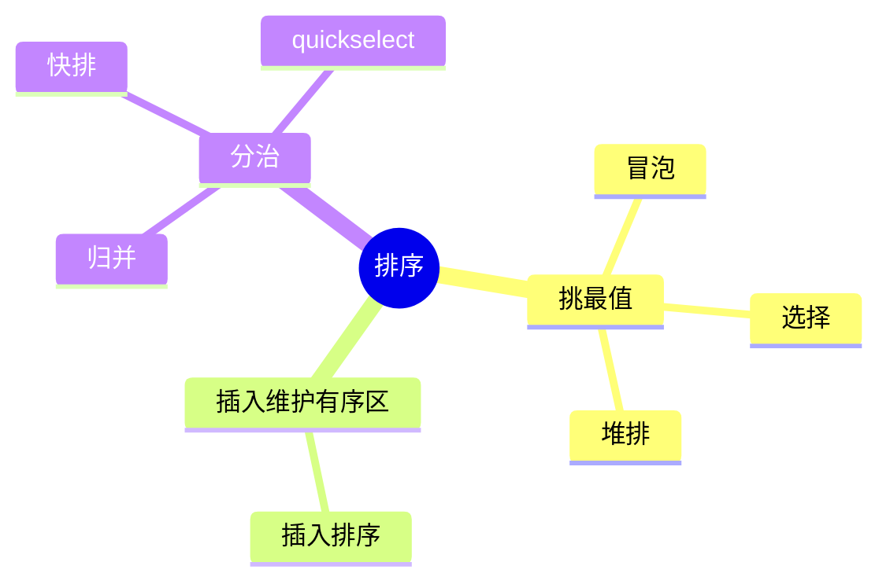
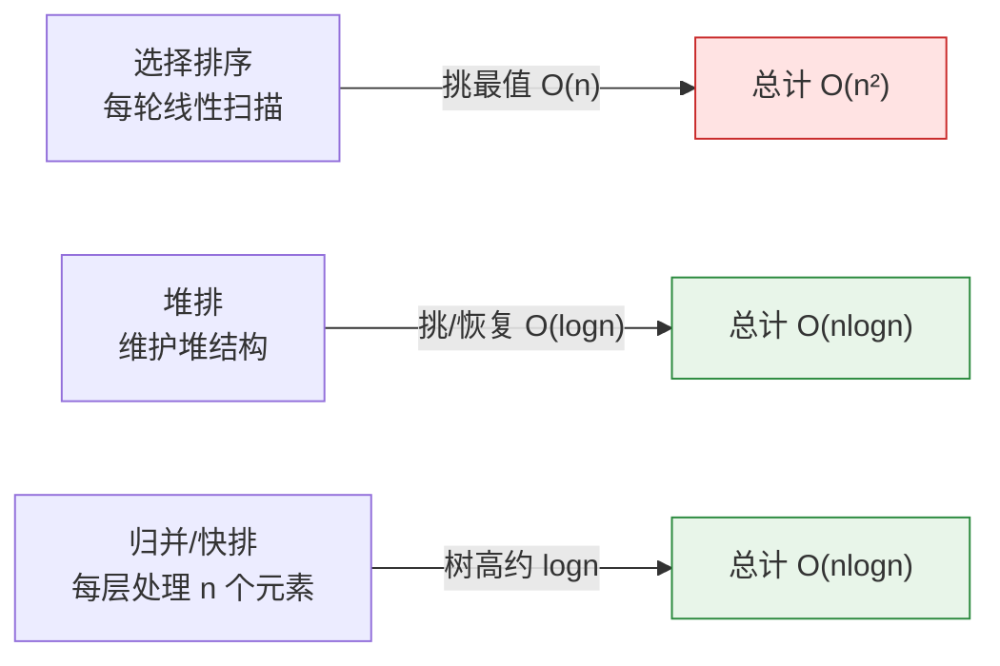
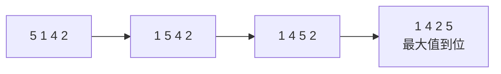
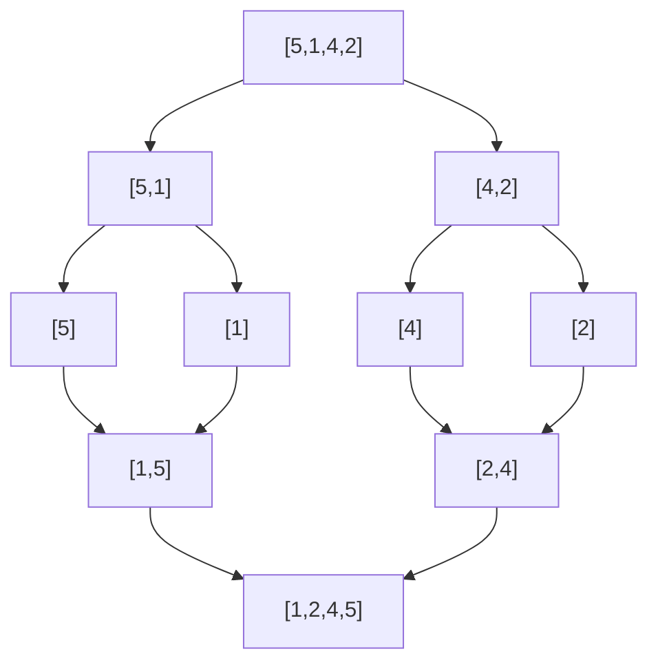
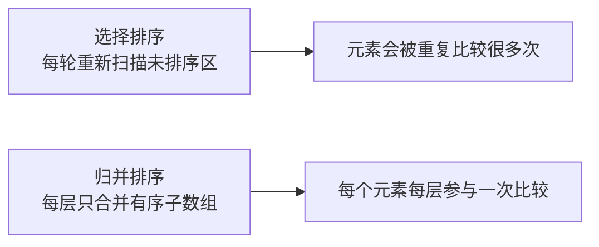
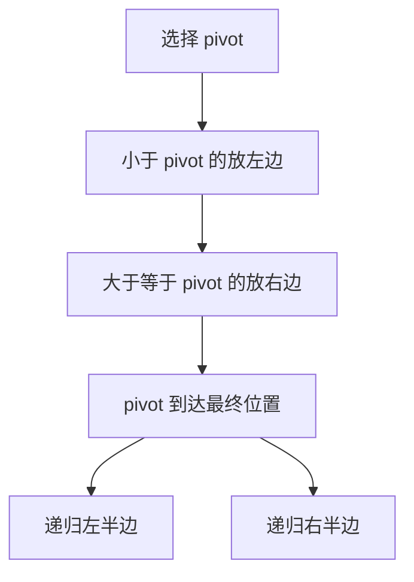
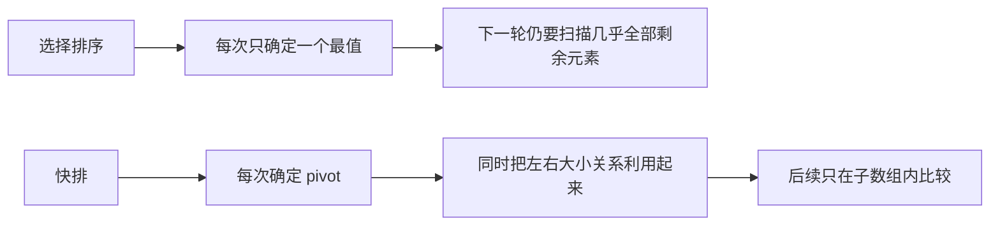
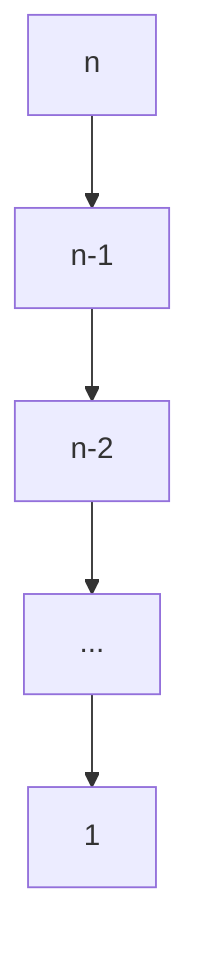
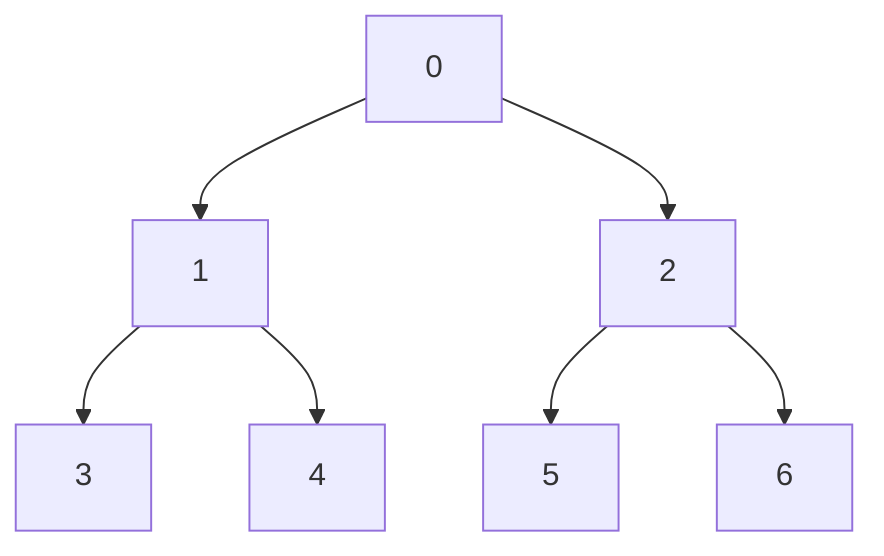
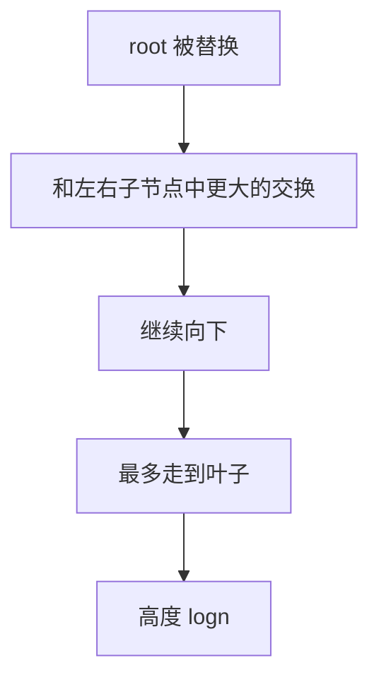

排序算法很重要，一是因为它是最基础的算法，二是不同排序方法展示了不同的经典思路。学会这些思路，对其他问题的思考很有帮助。参考：[十大经典排序算法](https://www.runoob.com/w3cnote/ten-sorting-algorithm.html)。

1. Table of Contents, ordered
{:toc}

# 先看全局

我决定以后的东西尽量倒着写：先写结论，从宏观概述，再深入细节验证这些概述。不然细枝末节太多，很容易陷入不必要的汪洋大海，反倒不能及时把控全局。

排序算法可以先分三类：



核心表：

| 算法 | 平均时间 | 最坏时间 | 额外空间 | 稳定性 | 核心思路 |
|------|----------|----------|----------|--------|----------|
| 冒泡 | O(n²) | O(n²) | O(1) | 稳定 | 相邻交换，把最大值沉底 |
| 选择 | O(n²) | O(n²) | O(1) | 不稳定 | 每轮选最小值放前面 |
| 插入 | O(n²) | O(n²) | O(1) | 稳定 | 维护左侧有序区 |
| 归并 | O(nlogn) | O(nlogn) | O(n) | 稳定 | 先分再合并有序子数组 |
| 快排 | O(nlogn) | O(n²) | O(logn) | 不稳定 | partition 后递归左右 |
| 堆排 | O(nlogn) | O(nlogn) | O(1) | 不稳定 | 用堆把“选最值”降到 O(logn) |

# 复杂度直觉

大部分简单排序的流程是：

1. 挑一个最值。
2. 重复 n 次。

关键在于“挑一个最值”有多快。



## 稳定性

如果相等元素排序前后的相对顺序不变，就是稳定。

- 一个一个挨着换，通常稳定：冒泡、插入、归并。
- 出现非连续元素交换，通常不稳定：选择、堆排、快排。

选择排序“不稳定”的点就在最后那一下远距离交换；快排更不用说，一直跨区交换。

## 最好情况

冒泡和插入对几乎有序数组很友好，优化后可以 O(n)。

快排、归并、堆排平均都是 O(nlogn)，但性质不同：

- 归并：永远二分，稳如老狗。
- 堆排：每次调整堆，稳如另一个老狗。
- 快排：pivot 选得好很快，选得烂就退化成 O(n²)。

快排平均很快，因为常数小、缓存友好。但“平均快”不是“永远快”。

## 原地排序

原地排序指不需要与输入规模同阶的额外数组。

- 原地：冒泡、选择、插入、快排、堆排。
- 非原地：常规归并排序需要辅助数组。

# 冒泡排序

冒泡每轮把当前未排序部分的最大值沉到底部。它的“挑最大值”方式是相邻比较和交换。



```java
public int[] bubbleSort(int[] sourceArray) {
    int[] arr = Arrays.copyOf(sourceArray, sourceArray.length);

    for (int i = 1; i < arr.length; i++) {
        boolean sorted = true;
        for (int j = 0; j < arr.length - i; j++) {
            if (arr[j] > arr[j + 1]) {
                swap(arr, j, j + 1);
                sorted = false;
            }
        }
        if (sorted) {
            break;
        }
    }
    return arr;
}
```

验证点：输入已经有序时，`sorted` 第一轮保持 `true`，直接结束。

# 选择排序

选择排序每轮扫描未排序区，找到最小值，放到当前开头。

它和冒泡的区别是：**冒泡在挑选过程中不断交换；选择排序只记录最小值下标，最后交换一次**。

```java
public int[] selectionSort(int[] sourceArray) {
    int[] arr = Arrays.copyOf(sourceArray, sourceArray.length);

    for (int i = 0; i < arr.length - 1; i++) {
        int min = i;
        for (int j = i + 1; j < arr.length; j++) {
            if (arr[j] < arr[min]) {
                min = j;
            }
        }
        if (i != min) {
            swap(arr, i, min);
        }
    }
    return arr;
}
```

选择排序的比较次数固定，哪怕数组已经有序也没什么优化空间。

# 插入排序

插入排序就是打牌整理手牌：左边保持有序，右边依次拿一张插进去。

> 一直用，却没有意识到这就是插排……

它像“倒着的冒泡”，但更聪明：左边已经有序，不需要一路两两交换，只要把比 `tmp` 大的元素向右挪，最后把 `tmp` 放进去。

```java
public int[] insertionSort(int[] sourceArray) {
    int[] arr = Arrays.copyOf(sourceArray, sourceArray.length);

    for (int i = 1; i < arr.length; i++) {
        int tmp = arr[i];
        int j = i;
        while (j > 0 && tmp < arr[j - 1]) {
            arr[j] = arr[j - 1];
            j--;
        }
        arr[j] = tmp;
    }
    return arr;
}
```

状态变化：

| 步骤 | 左侧有序区 | 待插入 | 结果 |
|------|------------|--------|------|
| 初始 | `[5]` | `1` | `[1,5]` |
| 下一步 | `[1,5]` | `4` | `[1,4,5]` |
| 下一步 | `[1,4,5]` | `2` | `[1,2,4,5]` |

# 归并排序

归并是分治：先分，分到单元素后再合。



## merge

两个有序数组合并时，每次只比较两个当前最小值：

```java
protected int[] merge(int[] left, int[] right) {
    int[] result = new int[left.length + right.length];
    int k = 0, i = 0, j = 0;

    while (i < left.length && j < right.length) {
        if (left[i] <= right[j]) {
            result[k++] = left[i++];
        } else {
            result[k++] = right[j++];
        }
    }
    while (i < left.length) {
        result[k++] = left[i++];
    }
    while (j < right.length) {
        result[k++] = right[j++];
    }
    return result;
}
```

为什么比选择排序少比较？因为每次合并的是两个**已经有序**的子数组。已经确定的局部顺序不会反复比较。



树高是 `logn`，每层处理 `n` 个元素，所以是 O(nlogn)。

## 空间写法

最直观但不推荐的写法是每层都 `copyOfRange`：

```java
public int[] sort(int[] sourceArray) {
    int[] arr = Arrays.copyOf(sourceArray, sourceArray.length);
    if (arr.length < 2) {
        return arr;
    }

    int mid = arr.length / 2;
    int[] left = Arrays.copyOfRange(arr, 0, mid);
    int[] right = Arrays.copyOfRange(arr, mid, arr.length);
    return merge(sort(left), sort(right));
}
```

更好的写法是用索引切分，避免每次创建子数组：

```java
public static int[] mergeSort(int[] arr) {
    return divide(arr, 0, arr.length);
}

private static int[] divide(int[] arr, int start, int end) {
    if (end - start == 1) {
        return new int[] {arr[start]};
    }

    int mid = start + (end - start) / 2;
    return merge(divide(arr, start, mid), divide(arr, mid, end));
}
```

左闭右开 `[start, end)` 很舒服，切成 `[start, mid)` 和 `[mid, end)`，不用纠结 `+1` / `-1`。

常规归并需要 O(n) 辅助空间。原地归并也存在，但复杂得多，参考 [Baeldung 的 in-place merge sort 说明](https://www.baeldung.com/cs/merge-sort-in-place)。

## 外排序

外排序也用归并思想：

1. 每次读取内存能装下的一块数据。
2. 在内存里排序后写入临时文件。
3. 从多个有序临时文件各读一小块，做多路 merge。

关键是：每个临时文件已经有序，所以 merge 时只需要顺序读取，不需要把整个文件载入内存。否则就爆了。

## 合并 k 个升序链表

[合并 k 个升序链表](https://leetcode.cn/problems/merge-k-sorted-lists/description/) 可以直接用归并思想。

如果从左到右反复 merge，前面已经合并过的元素会被后面链表反复比较。分治能减少重复比较：

```java
class Solution {
    public ListNode mergeKLists(ListNode[] lists) {
        return divide(lists, 0, lists.length);
    }

    private ListNode divide(ListNode[] lists, int start, int end) {
        if (start >= end) {
            return null;
        }
        if (end - start == 1) {
            return lists[start];
        }

        int mid = start + (end - start) / 2;
        return mergeTwoLists(divide(lists, start, mid), divide(lists, mid, end));
    }
}
```

# 快速排序

快排也是分治，但和归并的顺序反过来：

- 归并：先递归，再合并。
- 快排：先 partition，再递归。



## partition

假设 pivot 选第一个元素。所有比它小的元素依次放到前面，最后把 pivot 换到中间。

```java
private void quickSort(int[] array, int start, int end) {
    int pivot = partition(array, start, end);
    if (pivot == -1) {
        return;
    }

    quickSort(array, start, pivot);
    quickSort(array, pivot + 1, end);
}

private int partition(int[] array, int start, int end) {
    if (start >= end) {
        return -1;
    }

    int pivotPos = start;
    int nextSwapPos = pivotPos + 1;

    for (int i = nextSwapPos; i < end; i++) {
        if (array[i] < array[pivotPos]) {
            swap(array, i, nextSwapPos);
            nextSwapPos++;
        }
    }

    int pivotPosition = nextSwapPos - 1;
    swap(array, pivotPos, pivotPosition);
    return pivotPosition;
}
```

> 快排不在乎左右两边本身有序。它只保证左边都比 pivot 小，右边都不小于 pivot。废话，左右有序那不就已然排好了嘛……

## 为什么快

如果 pivot 每次比较均匀，递归树高度约为 `logn`。每层 partition 总共处理 n 个元素，所以 O(nlogn)。

和选择排序对比：



## 最坏情况

如果数组已经有序，而 pivot 总选第一个，每次都只能分出一个空区间和一个长度减一的区间，递归树退化成链表。



此时时间复杂度 O(n²)。归并不会这样，因为归并无论数据是什么都强制二分。

# 堆排序

堆排的主流程像选择排序：每次拿一个最值，拿 n 次。

区别是：选择排序每次找最值要 O(n)，堆能把恢复最值结构的成本降到 O(logn)。

## 堆是什么

堆是满足堆序性质的完全二叉树：

- 最大堆：父节点 >= 子节点。
- 最小堆：父节点 <= 子节点。

数组实现时：

| 节点 | 下标 |
|------|------|
| 左子节点 | `2 * i + 1` |
| 右子节点 | `2 * i + 2` |
| 父节点 | `(k - 1) / 2` |



## 我踩过的错误

一开始我以为倒着比较每个节点和它的两个子节点，把局部最大值换上来就行。这样最后 root 确实可能是最大值，但整棵树不一定是堆。

问题是：**堆不只是 root 是最值，每一棵子树的 root 都要满足堆定义**。否则拿走 root 后，无法用 O(logn) 恢复下一个最值。那和选择排序有什么区别……

## heapify

真正的 `heapify` 是：如果 root 不满足，就和更大的子节点交换，然后继续向下调整这一条分支。

```java
private void maxHeapify(int[] array, int i, int heapSize) {
    int left = 2 * i + 1;
    int right = 2 * i + 2;
    int max = i;

    if (left < heapSize && array[left] > array[max]) {
        max = left;
    }
    if (right < heapSize && array[right] > array[max]) {
        max = right;
    }
    if (max != i) {
        swap(array, i, max);
        maxHeapify(array, max, heapSize);
    }
}
```

构建堆：

```java
for (int i = array.length / 2 - 1; i >= 0; i--) {
    maxHeapify(array, i, array.length);
}
```

叶子节点天然是堆，所以从最后一个非叶子节点开始即可。

## 为什么每次恢复是 O(logn)

拿走 root 后，用最后一个元素补到 root。此时只有 root 所在的一条分支可能坏了，其他分支仍然是堆。



所以：

- 获取最值：O(1)。
- 恢复堆：O(logn)。
- 重复 n 次：O(nlogn)。

## PriorityQueue

Java 的 `PriorityQueue` 就是堆。插入时 `siftUp`，删除 root 时 `siftDown`。如果用它排序：

```java
private int[] heapSort(int[] array) {
    PriorityQueue<Integer> pq = new PriorityQueue<>((a, b) -> b - a);

    for (int value : array) {
        pq.offer(value);
    }

    int[] result = new int[pq.size()];
    int i = 0;
    while (!pq.isEmpty()) {
        result[i++] = pq.poll();
    }
    return result;
}
```

> 非尾调用没法轻易优化，因为调用之后还有要执行的步骤，需要保存上下文。尾递归后面反正没啥要执行了，直接续上就行。尾递归就是无限续杯，所以可以优化成 `while`。

# 题型：最小 k 个数

[最小 k 个数](https://leetcode.cn/problems/smallest-k-lcci/description/) 很适合串起排序、堆、快排。

方案对比：

| 方法 | 时间复杂度 | 适合场景 |
|------|------------|----------|
| 完整排序后取前 k | O(nlogn) | 要求结果有序 |
| 选择排序取 k 轮 | O(nk) | k 极小 |
| 大根堆维护 k 个数 | O(nlogk) | k 小于 n 很多 |
| quickselect | 期望 O(n) | 不要求前 k 个有序 |

## 大根堆

维护一个大小为 k 的大根堆。堆顶是当前 k 个最小值里的最大者。新数比堆顶小，才替换。

```java
public int[] smallestK(int[] arr, int k) {
    if (k == 0) {
        return new int[]{};
    }

    PriorityQueue<Integer> pq = new PriorityQueue<>((a, b) -> b - a);
    for (int value : arr) {
        if (pq.size() < k) {
            pq.offer(value);
        } else if (pq.peek() > value) {
            pq.poll();
            pq.offer(value);
        }
    }

    int[] result = new int[k];
    for (int i = 0; i < k; i++) {
        result[i] = pq.poll();
    }
    return result;
}
```

直觉：用长度为 k 的堆保存“当前候选答案”，每个元素只和候选答案里最大的比。这样就利用了之前比较的信息。

## quickselect

快排的 partition 有一个好处：pivot 到位后，左边都比它小，右边都比它大。

如果 pivot 左边正好有 k 个，答案就在左边；如果左边太多，只处理左边；如果左边太少，只在右边补剩余数量。

```java
class Solution {
    public int[] smallestK(int[] arr, int k) {
        quickSelect(arr, 0, arr.length, k);
        return Arrays.copyOfRange(arr, 0, k);
    }

    private void quickSelect(int[] array, int start, int end, int k) {
        int pivot = partition(array, start, end);
        if (pivot == -1) {
            return;
        }

        int length = pivot - start + 1;
        if (length == k || length - 1 == k) {
            return;
        }
        if (length - 1 > k) {
            quickSelect(array, start, pivot, k);
        }
        if (length < k) {
            quickSelect(array, pivot + 1, end, k - length);
        }
    }
}
```

注意这里的 `length` 是当前子数组内的长度，不能直接用 `pivot + 1`，因为递归后 `start` 未必是 0。

> 真是一道好题，加强了堆排的概念，更加强了快排的概念。

# 复习时怎么验收

不用死背每段代码，按下面问题自测：

1. 冒泡和选择都在“挑最值”，区别是什么？
2. 插入排序为什么适合几乎有序数组？
3. 归并为什么每层是 O(n)，树高为什么是 O(logn)？
4. 快排的 pivot 为什么可能导致 O(n²)？
5. 堆为什么能持续贡献最值，而不只是第一轮找到最值？
6. `smallestK` 为什么用大根堆而不是小根堆？
7. quickselect 为什么不用把两边都排完？
