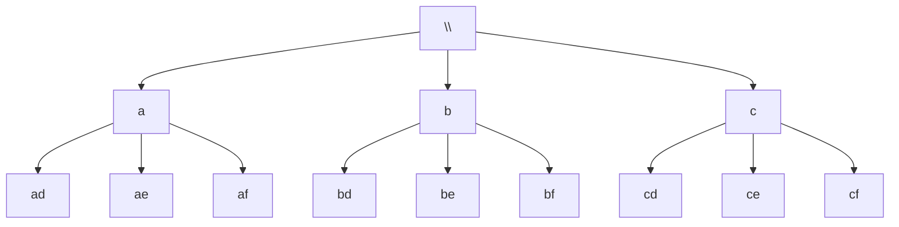
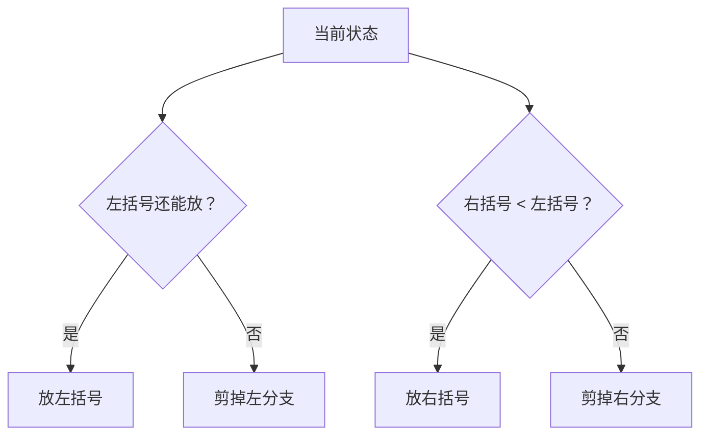
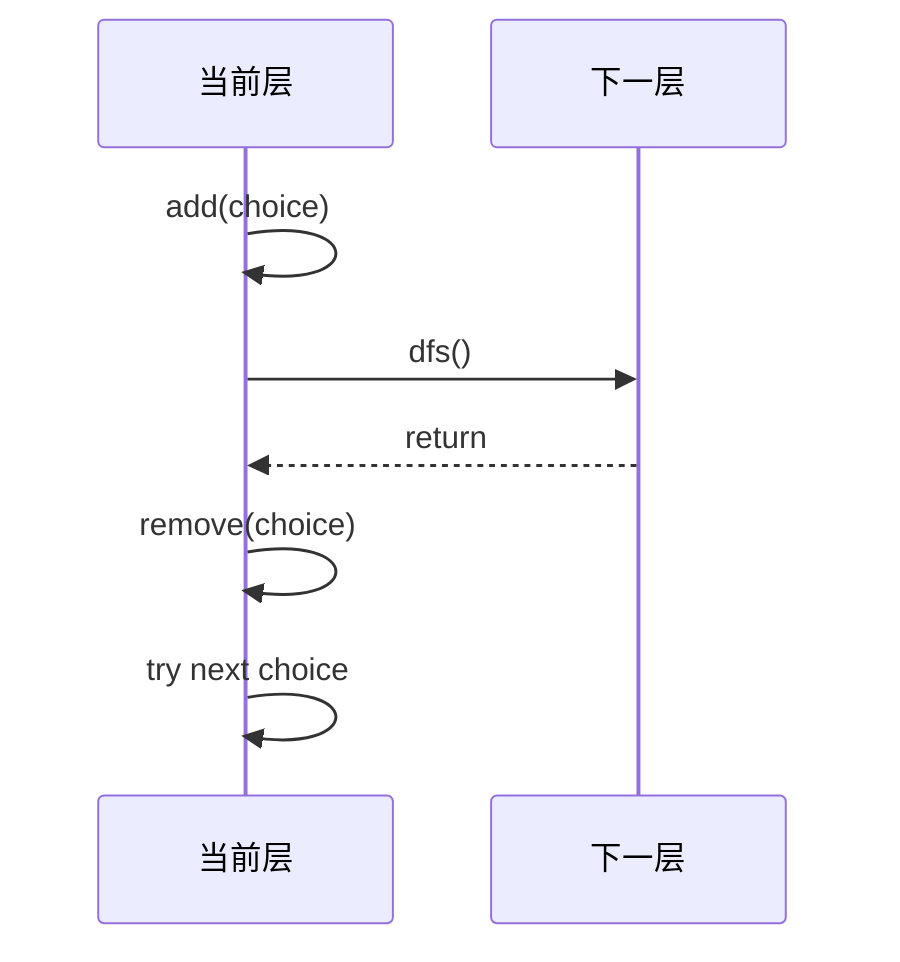
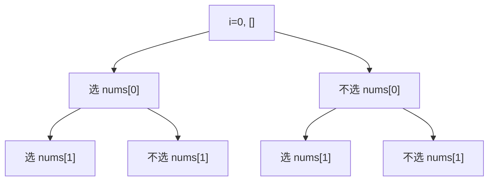
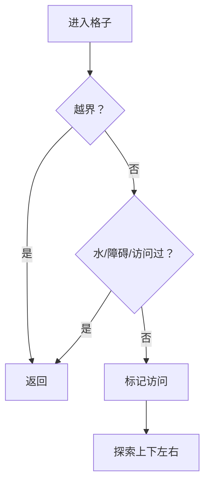
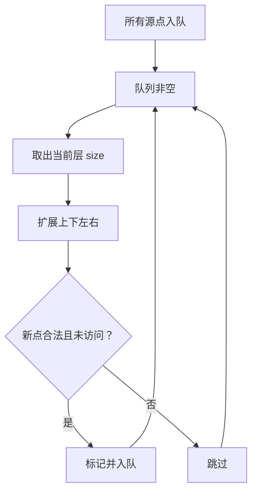

关于普通回溯、树的 DFS/BFS、图的 DFS/BFS。核心就一句话：**心中要有那棵树**。

1. Table of Contents, ordered
{:toc}

# 回溯就是在遍历搜索树

回溯其实就是 DFS。比如[括号生成](https://leetcode.cn/problems/generate-parentheses/solution/gua-hao-sheng-cheng-by-leetcode-solution/)和[电话号码的字母组合](https://leetcode.cn/problems/letter-combinations-of-a-phone-number/solution/dian-hua-hao-ma-de-zi-mu-zu-he-by-leetcode-solutio/)，本质都是：

1. 当前状态和下一种选择组合。
2. 递归进去。
3. 退回来。
4. 换下一种选择。
5. 到达终止条件后收集结果。

把电话号码 `23` 展开，就是一棵搜索树：



无论选择 DFS 还是 BFS，本质都是在考虑如何遍历这棵树：

| 遍历方式 | 数据结构 | 特点 |
|----------|----------|------|
| 递归 DFS | 系统调用栈 | 代码短，最常见 |
| 手写 DFS | 自己维护栈 | 显式控制状态 |
| BFS | 队列 | 层序、最短路径更自然 |

> 所以核心不是背代码，而是脑子里先把搜索树画出来。心中没树，代码就开始乱飞。

# 剪枝

剪枝就是：不要让明显不可能产生答案的分支继续递归。

以括号生成为例：

- 左括号数量不能超过 `n`。
- 右括号数量不能超过左括号数量。
- 长度达到 `2n` 就收集结果。



关于重复元素，一般先排序，再跳过同层重复项。比如[组合总和 II](https://leetcode.cn/problems/combination-sum-ii/)。

> 提前剪枝比最后结果去重要好得多，因为少了无数递归运算。全是 `1` 的长数组就是专门卡“先生成再去重”的。

“提前”不一定表示必须在调用下一层之前剪。进入下一层后立刻 `return` 也算提前剪枝，只是多进了一层函数。

# 恢复现场

回溯的“回”指的是：试探结束后，把当前状态恢复到试探前。



两种常见状态：

| 状态写法 | 是否污染当前层 | 回来后要不要恢复 |
|----------|----------------|------------------|
| `buffer + c` 创建新字符串 | 不污染 | 不需要 |
| `StringBuilder.append(c)` | 污染 | 需要 `deleteCharAt` |
| 修改二维数组标记 | 污染 | 需要 reset |

## 字符串不污染

括号生成可以用新字符串：

```java
class Solution {
    public List<String> generateParenthesis(int n) {
        List<String> result = new ArrayList<>();
        dfs(result, "", n, 0, 0);
        return result;
    }

    private void dfs(List<String> result, String cur, int n, int left, int right) {
        if (cur.length() == n * 2) {
            result.add(cur);
            return;
        }

        if (left < n) {
            dfs(result, cur + "(", n, left + 1, right);
        }
        if (right < left) {
            dfs(result, cur + ")", n, left, right + 1);
        }
    }
}
```

这里 `cur + "("` 是新字符串，当前层 `cur` 没变，所以不用恢复。

## StringBuilder 会污染

电话号码组合使用 `StringBuilder` 时要恢复：

```java
public void backtrack(List<String> result, Map<Character, String> phoneMap,
                      String digits, int index, StringBuilder path) {
    if (index == digits.length()) {
        result.add(path.toString());
        return;
    }

    String letters = phoneMap.get(digits.charAt(index));
    for (int i = 0; i < letters.length(); i++) {
        path.append(letters.charAt(i));
        backtrack(result, phoneMap, digits, index + 1, path);
        path.deleteCharAt(path.length() - 1);
    }
}
```

## 二维数组最后恢复

[不同路径 III](https://leetcode.cn/problems/unique-paths-iii/description/)里，状态是原始二维数组。进入当前格子时标记，四个方向都探索完，返回上层前再恢复。

```java
private int dfs(int[][] grid, int left, int i, int j) {
    if (i < 0 || i >= grid.length || j < 0 || j >= grid[0].length) {
        return 0;
    }
    if (grid[i][j] == -1) {
        return 0;
    }
    if (grid[i][j] == 2) {
        return left == 0 ? 1 : 0;
    }

    int old = grid[i][j];
    grid[i][j] = -1;

    int ans = dfs(grid, left - 1, i + 1, j)
            + dfs(grid, left - 1, i - 1, j)
            + dfs(grid, left - 1, i, j + 1)
            + dfs(grid, left - 1, i, j - 1);

    grid[i][j] = old;
    return ans;
}
```

不要试图帮“下一步”恢复。下一层会恢复它自己的现场。当前层只负责当前格子。

# 回溯模板

通用模板：

```java
void dfs(...) {
    if (不符合条件) {
        return;
    }

    if (到达终止条件) {
        收集结果;
        return;
    }

    for (choice : choices) {
        做选择;
        dfs(...);
        撤销选择;
    }
}
```

参数一般包括：

| 参数 | 作用 |
|------|------|
| `result` | 收集结果 |
| `step/index/start` | 当前走到哪里 |
| `path/context` | 当前生成中的状态 |
| `target/sum/left` | 剩余约束 |
| 原始输入 | 用来获取下一步选择 |

> 建议先写“不符合条件时 return”，再写“满足结果时收集”。不然条件多了以后容易把自己绕进去。

# 什么时候用 for

如果每层选择数量不定，用 `for`。

电话号码组合：每个数字对应 3 或 4 个字母。

```java
String letters = phoneMap.get(digits.charAt(step));
for (int i = 0; i < letters.length(); i++) {
    dfs(result, step + 1, path + letters.charAt(i), digits);
}
```

如果选择数量固定且很小，可以直接枚举。比如二叉树两个方向、网格四个方向。

```java
dfs(root.left);
dfs(root.right);
```

> 结果对了，不代表试探过程有效。乱用 `for` 可能生成很多无效分支，最后靠终止条件过滤掉，当然慢。

# 子集问题

[子集](https://leetcode.cn/problems/subsets/description/)是很好的“心中有树”训练。

每个位置只有两个决策：选或不选。



```java
class Solution {
    public List<List<Integer>> subsets(int[] nums) {
        List<List<Integer>> result = new ArrayList<>();
        dfs(result, 0, new ArrayList<>(), nums);
        return result;
    }

    private void dfs(List<List<Integer>> result, int i, List<Integer> cur, int[] nums) {
        if (i == nums.length) {
            result.add(new ArrayList<>(cur));
            return;
        }

        cur.add(nums[i]);
        dfs(result, i + 1, cur, nums);
        cur.remove(cur.size() - 1);

        dfs(result, i + 1, cur, nums);
    }
}
```

## 子集 II：去重剪枝

[子集 II](https://leetcode.cn/problems/subsets-ii/description/)有重复元素。先排序，然后用“前一个相同元素没选，则当前也不选”剪枝。

```java
private void dfs(List<List<Integer>> result, int i, List<Integer> cur,
                 int[] nums, boolean choosePre) {
    if (i == nums.length) {
        result.add(new ArrayList<>(cur));
        return;
    }

    if (i > 0 && nums[i] == nums[i - 1] && !choosePre) {
        dfs(result, i + 1, cur, nums, false);
        return;
    }

    cur.add(nums[i]);
    dfs(result, i + 1, cur, nums, true);
    cur.remove(cur.size() - 1);

    dfs(result, i + 1, cur, nums, false);
}
```

这和组合总和 II 有点像又不一样：

| 题目 | 每层选择 | 去重规则 |
|------|----------|----------|
| 组合总和 II | 当前层有多个候选 | 同层相同元素只用第一个 |
| 子集 II | 每层选/不选当前元素 | 前一个相同元素没选，当前也不能选 |

如果题目规模很小，暴力生成后用 `Set<List<Integer>>` 去重也可能过。不是最优，但面试时想不出剪枝可以结合数据规模救命。

# 组合总和 II：同层去重

先排序，同层重复元素跳过：

```java
class Solution {
    public List<List<Integer>> combinationSum2(int[] candidates, int target) {
        Arrays.sort(candidates);
        List<List<Integer>> result = new ArrayList<>();
        dfs(result, candidates, target, new ArrayList<>(), 0);
        return result;
    }

    private void dfs(List<List<Integer>> result, int[] candidates, int target,
                     List<Integer> path, int start) {
        if (target == 0) {
            result.add(new ArrayList<>(path));
            return;
        }
        if (target < 0) {
            return;
        }

        for (int i = start; i < candidates.length; i++) {
            if (i > start && candidates[i] == candidates[i - 1]) {
                continue;
            }

            path.add(candidates[i]);
            dfs(result, candidates, target - candidates[i], path, i + 1);
            path.remove(path.size() - 1);
        }
    }
}
```

**同层**指的是：`1, 2, 2, 2` 中，如果这一层已经试过第一个 `2`，后面的 `2` 在同一层不要再试，否则结果重复。但下一层可以用第二个 `2`，因为那表示“用了两个 2”。

# 括号类剪枝

括号题常用一个 `score`：

- `(` 让 `score + 1`。
- `)` 让 `score - 1`。
- 任意前缀 `score` 不能小于 0。
- 最终合法时 `score == 0`。

[删除无效的括号](https://leetcode.cn/problems/remove-invalid-parentheses/description/)中，先算需要删除多少左括号 `rl` 和右括号 `rr`，再 DFS：

```java
private void dfs(Set<String> result, String cur, int rl, int rr,
                 int index, String raw, int score) {
    if (score < 0) {
        return;
    }
    if (rl + rr > raw.length() - index) {
        return;
    }
    if (index == raw.length()) {
        if (rl == 0 && rr == 0 && score == 0) {
            result.add(cur);
        }
        return;
    }

    char c = raw.charAt(index);
    if (c == '(' && rl > 0) {
        dfs(result, cur, rl - 1, rr, index + 1, raw, score);
    }
    if (c == ')' && rr > 0) {
        dfs(result, cur, rl, rr - 1, index + 1, raw, score);
    }

    int nextScore = score + (c == '(' ? 1 : c == ')' ? -1 : 0);
    dfs(result, cur + c, rl, rr, index + 1, raw, nextScore);
}
```

原来不剪枝、只加“剩余字符不够删”剪枝、再加 `score < 0` 剪枝，耗时差距能从几百毫秒降到十几毫秒。剪枝不是装饰，是复杂度。

# 网格 DFS

树天然有向且无环，不会重复走回父节点。网格是无向图，不标记就会走回去。



## 岛屿周长

[岛屿周长](https://leetcode.cn/problems/island-perimeter/solution/tu-jie-jian-ji-er-qiao-miao-de-dfs-fang-fa-java-by/)的转化：

- 从一个陆地 `1` 开始 DFS。
- 如果某个方向越界或遇到水 `0`，这一边贡献 1 条边。
- 访问过的陆地贡献 0。

```java
int dfs(int[][] grid, int r, int c) {
    if (!(0 <= r && r < grid.length && 0 <= c && c < grid[0].length)) {
        return 1;
    }
    if (grid[r][c] == 0) {
        return 1;
    }
    if (grid[r][c] != 1) {
        return 0;
    }

    grid[r][c] = 2;
    return dfs(grid, r - 1, c)
        + dfs(grid, r + 1, c)
        + dfs(grid, r, c - 1)
        + dfs(grid, r, c + 1);
}
```

这里不需要 result list。每个方向返回一个数，最后累加，就像树的高度/叶子数一样。

## 岛屿数量与面积

岛屿问题的难点是转化：

| 题目 | 转化 |
|------|------|
| 岛屿数量 | 每次从一个 `1` 开始 DFS，消掉整个岛，看能消几次 |
| 最大岛屿面积 | DFS 消岛时返回当前岛面积，取 max |
| 岛屿周长 | DFS 时遇到边界/水就贡献一条边 |

面积：

```java
private int dfs(int[][] grid, int x, int y) {
    if (x < 0 || x >= grid.length || y < 0 || y >= grid[0].length) {
        return 0;
    }
    if (grid[x][y] == 0 || grid[x][y] == 2) {
        return 0;
    }

    grid[x][y] = 2;
    return 1 + dfs(grid, x - 1, y)
             + dfs(grid, x + 1, y)
             + dfs(grid, x, y - 1)
             + dfs(grid, x, y + 1);
}
```

# BFS 与网格

BFS 和 DFS 都能遍历所有节点，但 BFS 有两个优势：

1. 层序遍历。
2. 无权图最短路径。

网格 BFS 模板：



[离陆地最远的海洋](https://leetcode.cn/problems/as-far-from-land-as-possible/solution/jian-dan-java-miao-dong-tu-de-bfs-by-sweetiee/)是多源 BFS：所有陆地同时出发，最后扩展到的海洋就是最远海洋。

```java
public int maxDistance(int[][] grid) {
    Deque<int[]> queue = new ArrayDeque<>();
    int row = grid.length, col = grid[0].length;

    for (int i = 0; i < row; i++) {
        for (int j = 0; j < col; j++) {
            if (grid[i][j] == 1) {
                queue.offer(new int[]{i, j});
            }
        }
    }
    if (queue.isEmpty() || queue.size() == row * col) {
        return -1;
    }

    int distance = -1;
    int[] dx = {-1, 1, 0, 0};
    int[] dy = {0, 0, -1, 1};

    while (!queue.isEmpty()) {
        distance++;
        int size = queue.size();
        while (size-- > 0) {
            int[] point = queue.poll();
            for (int i = 0; i < 4; i++) {
                int x = point[0] + dx[i];
                int y = point[1] + dy[i];
                if (x < 0 || x >= row || y < 0 || y >= col || grid[x][y] != 0) {
                    continue;
                }
                grid[x][y] = 1;
                queue.offer(new int[]{x, y});
            }
        }
    }
    return distance;
}
```

多源 BFS 和单源 BFS 本质一样。单源从第二层开始，也变成多个点一起扩散了嘛。

# BFS 与 Dijkstra

BFS 适合**边权相同**的最短路径。如果边权不同，就要用 Dijkstra。

| 场景 | 算法 |
|------|------|
| 每一步成本相同 | BFS |
| 边权不同且非负 | Dijkstra |
| 有负权边 | Bellman-Ford / SPFA 等 |

# DFS 总结

写 DFS/回溯时按这个顺序想：

1. 搜索树是什么？
2. 每层有哪些选择？
3. 终止条件是什么？
4. 哪些分支可以剪掉？
5. 需要哪些参数把状态带下去？
6. 状态会不会污染当前层？回来后怎么恢复？
7. 结果是通过 list 收集，还是通过返回值累加/max？

通用 DFS 多数是前序思维。如果是树，还要考虑是否更适合后序，也就是自底向上。
