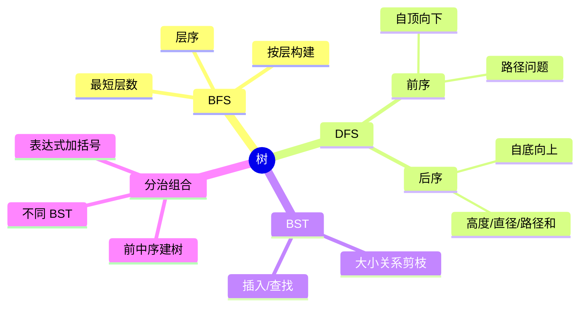
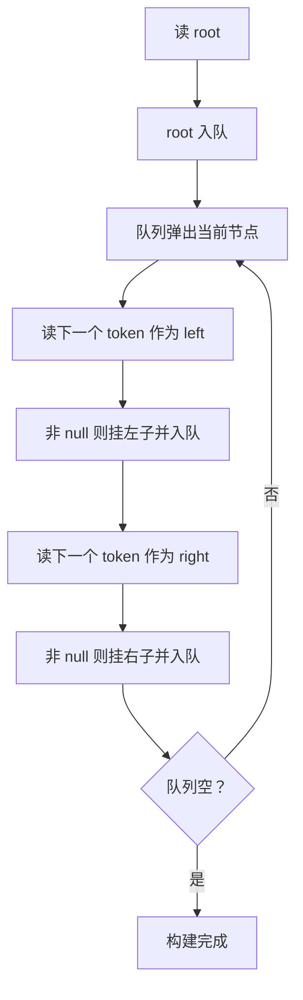
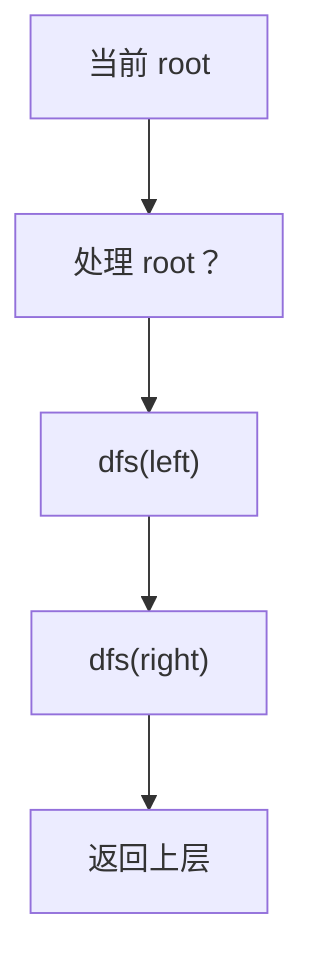
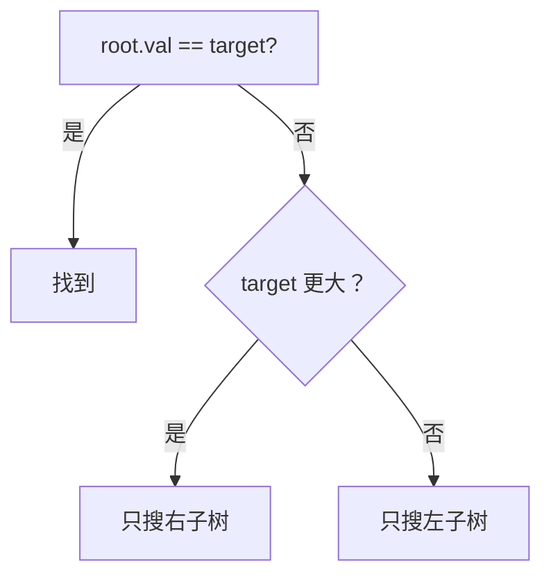
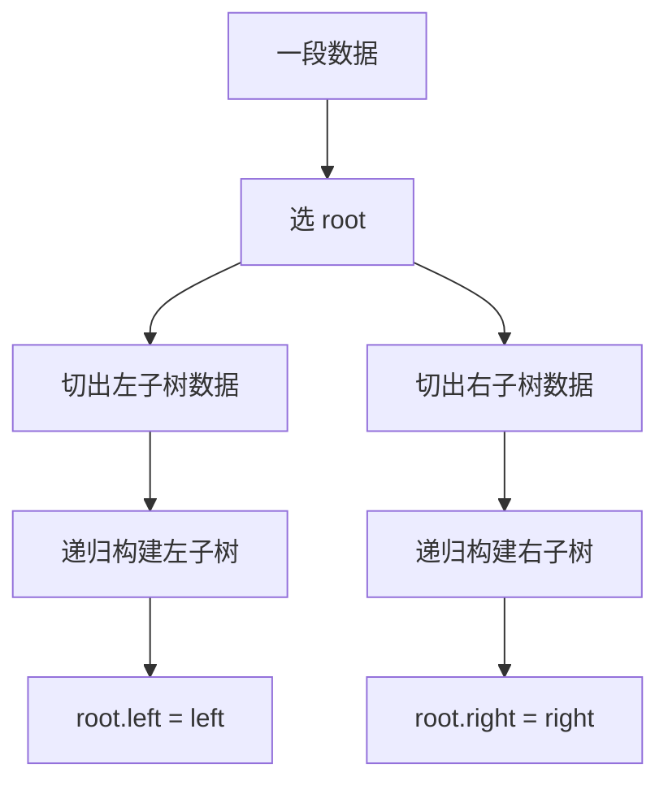
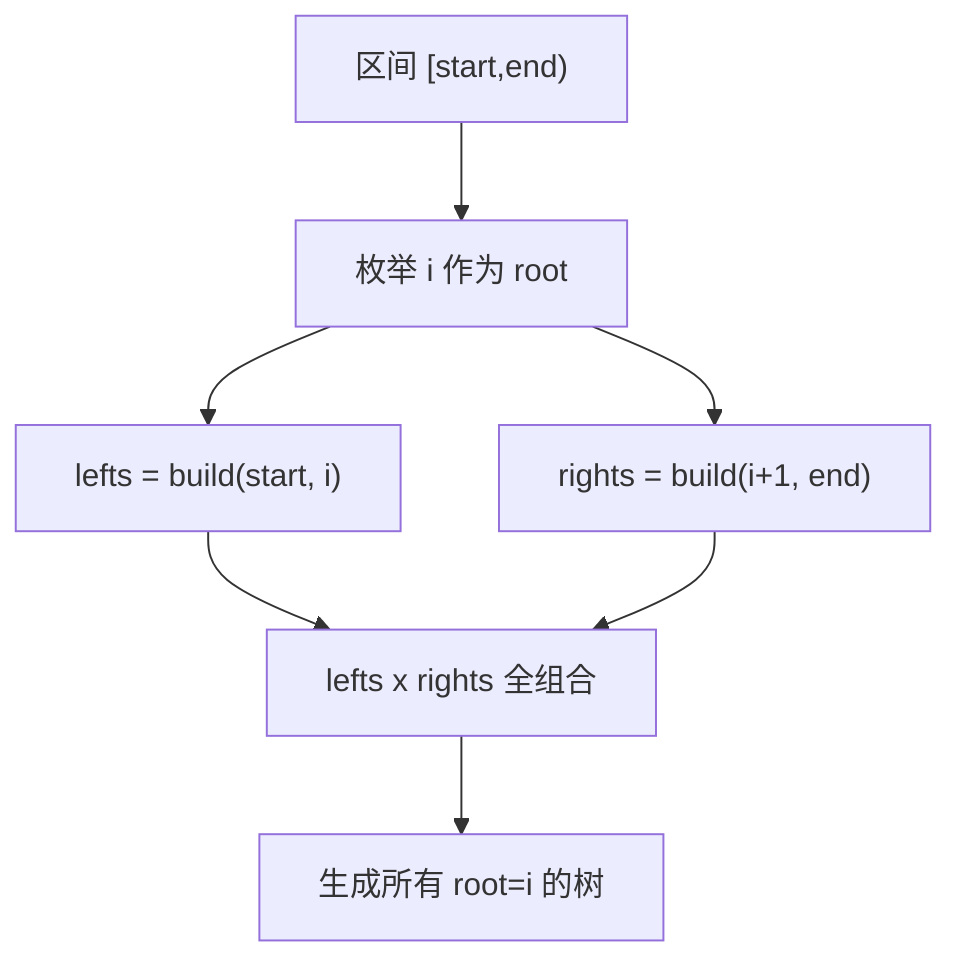
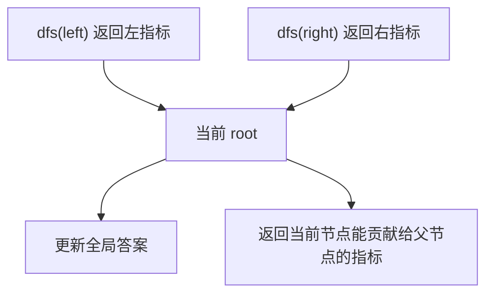

从树的角度，再来看看 DFS 和 BFS。树不是另一个世界，树只是图里最温柔的一种：天然有方向、没有环、每个节点的选择通常很少。

1. Table of Contents, ordered
{:toc}

# 树算法地图



如果从通用 DFS 模板看，树的 DFS 是一个特例：**每个节点通常只有左、右两个选择**。

# 树的 BFS

BFS 更适合层级关系：

- 求某一层。
- 层序遍历。
- 按层构建树。
- 堂兄弟节点这类“同层 + 不同父”问题。

## 从层序输入构建树

如果给出层序遍历，让构建树，显然也该用 BFS。示例输入：

```text
20,null,40,34,70,21,null,55,78
```

构建过程：



代码：

```java
private TreeNode build(String[] tokens) {
    if (tokens.length == 0 || isNull(tokens[0])) {
        return null;
    }

    Queue<TreeNode> queue = new ArrayDeque<>();
    TreeNode root = new TreeNode(Integer.parseInt(tokens[0]));
    queue.offer(root);

    int i = 1;
    while (!queue.isEmpty() && i < tokens.length) {
        TreeNode cur = queue.poll();

        if (i < tokens.length && !isNull(tokens[i])) {
            cur.left = new TreeNode(Integer.parseInt(tokens[i]));
            queue.offer(cur.left);
        }
        i++;

        if (i < tokens.length && !isNull(tokens[i])) {
            cur.right = new TreeNode(Integer.parseInt(tokens[i]));
            queue.offer(cur.right);
        }
        i++;
    }

    return root;
}
```

坑点：叶子节点没有子节点，读 token 时要防止数组越界。

# 树的 DFS

树的 DFS 是通用 DFS 的特例：

```java
void dfs(TreeNode root) {
    if (root == null) {
        return;
    }

    dfs(root.left);
    dfs(root.right);
}
```

不需要 `for`，因为二叉树每层就两个选择。



如果问题是 N 叉树或图，才更自然用 `for (next : children)`。

# BST：做了剪枝的 DFS

BST 的查找就是利用大小关系给普通 DFS 剪枝。

普通二叉树查找：

```java
boolean isInTree(TreeNode root, int target) {
    if (root == null) {
        return false;
    }
    if (root.val == target) {
        return true;
    }
    return isInTree(root.left, target) || isInTree(root.right, target);
}
```

BST 查找：

```java
boolean isInBST(TreeNode root, int target) {
    if (root == null) {
        return false;
    }
    if (root.val == target) {
        return true;
    }
    if (root.val < target) {
        return isInBST(root.right, target);
    }
    return isInBST(root.left, target);
}
```



## 验证 BST

验证 BST 不能只比较 root 和左右子节点。BST 要求：**整个左子树都小于 root，整个右子树都大于 root**。

所以要把上下界作为参数带下去：

```java
class Solution {
    public boolean isValidBST(TreeNode root) {
        return inBoundary(root, Long.MIN_VALUE, Long.MAX_VALUE);
    }

    private boolean inBoundary(TreeNode root, long low, long high) {
        if (root == null) {
            return true;
        }
        if (root.val <= low || root.val >= high) {
            return false;
        }
        return inBoundary(root.left, low, root.val)
            && inBoundary(root.right, root.val, high);
    }
}
```

以前看到“给 DFS 加 min/max 参数”觉得很精妙。现在从通用 DFS 看，不过是参数列表按题意扩展而已。需要就加呗。

# DFS 的返回值

通用回溯常把 `result list` 作为参数传入，返回值是 `void`。树题不一定。

| 目标 | 推荐返回值 |
|------|------------|
| 求数量 | 返回 `int` 后累加 |
| 求高度 | 返回当前子树高度 |
| 求最大值 | 返回局部 metric，配合全局 max |
| 修改树结构 | 返回 `TreeNode` 并接住递归结果 |

## BST 插入

命令式写法：

```java
class Solution {
    public TreeNode insertIntoBST(TreeNode root, int val) {
        if (root == null) {
            return new TreeNode(val);
        }
        dfs(root, val);
        return root;
    }

    private void dfs(TreeNode root, int val) {
        if (val < root.val) {
            if (root.left == null) {
                root.left = new TreeNode(val);
            } else {
                dfs(root.left, val);
            }
        } else if (val > root.val) {
            if (root.right == null) {
                root.right = new TreeNode(val);
            } else {
                dfs(root.right, val);
            }
        }
    }
}
```

更递归的写法：

```java
TreeNode insertIntoBST(TreeNode root, int val) {
    if (root == null) {
        return new TreeNode(val);
    }
    if (root.val < val) {
        root.right = insertIntoBST(root.right, val);
    } else if (root.val > val) {
        root.left = insertIntoBST(root.left, val);
    }
    return root;
}
```

一旦涉及“改树”，函数常常要返回 `TreeNode`，并且要接住递归调用的返回值。

# 左右子树切分与组合

很多树题本质是：

1. 选一个 root。
2. 左边构成左子树。
3. 右边构成右子树。
4. 把左右结果组合起来。



## 前序 + 中序构造二叉树

前序确定 root，中序负责切分左右子树。

```java
class Solution {
    public TreeNode buildTree(int[] preorder, int[] inorder) {
        return build(preorder, 0, inorder, 0, inorder.length - 1);
    }

    private TreeNode build(int[] preorder, int rootIndex,
                           int[] inorder, int start, int end) {
        if (start > end) {
            return null;
        }

        int rootVal = preorder[rootIndex];
        TreeNode root = new TreeNode(rootVal);

        int mid = start;
        while (inorder[mid] != rootVal) {
            mid++;
        }

        int leftSize = mid - start;
        root.left = build(preorder, rootIndex + 1, inorder, start, mid - 1);
        root.right = build(preorder, rootIndex + leftSize + 1, inorder, mid + 1, end);
        return root;
    }
}
```

直觉：

| 数组 | 作用 |
|------|------|
| preorder | 第一个元素是当前 root |
| inorder | root 左边是左子树，右边是右子树 |

## 中序 + 后序构造二叉树

后序最后一个是 root。其余逻辑一样：

```java
private TreeNode build(int[] postorder, int rootIndex,
                       int[] inorder, int start, int end) {
    if (start > end) {
        return null;
    }

    int rootVal = postorder[rootIndex];
    TreeNode root = new TreeNode(rootVal);

    int mid = end;
    while (inorder[mid] != rootVal) {
        mid--;
    }

    int rightSize = end - mid;
    root.right = build(postorder, rootIndex - 1, inorder, mid + 1, end);
    root.left = build(postorder, rootIndex - rightSize - 1, inorder, start, mid - 1);
    return root;
}
```

## 有序数组构造 BST

有序数组构造平衡 BST，就是每次选中点做 root。

```java
class Solution {
    public TreeNode sortedArrayToBST(int[] nums) {
        return build(nums, 0, nums.length);
    }

    private TreeNode build(int[] nums, int left, int right) {
        if (left >= right) {
            return null;
        }

        int mid = left + (right - left) / 2;
        TreeNode root = new TreeNode(nums[mid]);
        root.left = build(nums, left, mid);
        root.right = build(nums, mid + 1, right);
        return root;
    }
}
```

左闭右开依然舒服。

## 有序链表构造 BST

链表没有随机访问，用快慢指针找中点：

```java
class Solution {
    public TreeNode sortedListToBST(ListNode head) {
        return build(head, null);
    }

    private TreeNode build(ListNode left, ListNode right) {
        if (left == right) {
            return null;
        }

        ListNode mid = getMedian(left, right);
        TreeNode root = new TreeNode(mid.val);
        root.left = build(left, mid);
        root.right = build(mid.next, right);
        return root;
    }

    private ListNode getMedian(ListNode left, ListNode right) {
        ListNode fast = left;
        ListNode slow = left;
        while (fast != right && fast.next != right) {
            fast = fast.next.next;
            slow = slow.next;
        }
        return slow;
    }
}
```

# 枚举所有树

[95. 不同的二叉搜索树 II](https://leetcode.cn/problems/unique-binary-search-trees-ii/description/)不要求平衡，所以当前区间内每个点都可以做 root。



```java
class Solution {
    public List<TreeNode> generateTrees(int n) {
        return build(1, n + 1);
    }

    private List<TreeNode> build(int start, int end) {
        if (start >= end) {
            List<TreeNode> result = new ArrayList<>();
            result.add(null);
            return result;
        }

        List<TreeNode> result = new ArrayList<>();
        for (int i = start; i < end; i++) {
            List<TreeNode> lefts = build(start, i);
            List<TreeNode> rights = build(i + 1, end);

            for (TreeNode l : lefts) {
                for (TreeNode r : rights) {
                    TreeNode root = new TreeNode(i);
                    root.left = l;
                    root.right = r;
                    result.add(root);
                }
            }
        }
        return result;
    }
}
```

注意：`null` 是一棵合法的空子树。如果没有这个 `null`，一边为空时就没法参与组合。

[894. 所有可能的真二叉树](https://leetcode.cn/problems/all-possible-full-binary-trees/description/)也是类似思想，只是左右子树节点数都必须是奇数。

> 还真想出来了 :D

# 表达式加括号也是树

[241. 为运算表达式设计优先级](https://leetcode.cn/problems/different-ways-to-add-parentheses/description/)可以把运算符看成 root，左右表达式看成左右子树。

```java
private List<Integer> build(String exp) {
    if (isNumber(exp)) {
        return List.of(Integer.parseInt(exp));
    }

    List<Integer> result = new ArrayList<>();
    for (int i = 0; i < exp.length(); i++) {
        char c = exp.charAt(i);
        if (c == '+' || c == '-' || c == '*') {
            List<Integer> lefts = build(exp.substring(0, i));
            List<Integer> rights = build(exp.substring(i + 1));

            for (int l : lefts) {
                for (int r : rights) {
                    result.add(c == '+' ? l + r : c == '-' ? l - r : l * r);
                }
            }
        }
    }
    return result;
}
```

它和“枚举所有 BST”在结构上完全一样：枚举 root，组合左右。

# 从分治到动态规划

[96. 不同的二叉搜索树](https://leetcode.cn/problems/unique-binary-search-trees/description/)和 95 的区别是：不需要列出所有树，只要数量。

先有分治思路：

```text
以 i 为 root 的树数量 = 左边可构成数量 * 右边可构成数量
```

再转成 DP：

```java
class Solution {
    public int numTrees(int n) {
        int[] dp = new int[n + 1];
        dp[0] = 1;
        dp[1] = 1;

        for (int nodes = 2; nodes <= n; nodes++) {
            for (int left = 0; left <= nodes - 1; left++) {
                int right = nodes - 1 - left;
                dp[nodes] += dp[left] * dp[right];
            }
        }
        return dp[n];
    }
}
```

经常说动态规划重点是转移方程，但转移方程只是“把问题思路缓存起来”的结果。重点是你脑子里得先知道哪种情况由哪几种情况组合出来。

# 路径问题：自顶向下

前序遍历适合自顶向下：先处理 root，再把状态带给子节点。

适合：

- [二叉树的所有路径](https://leetcode.cn/problems/binary-tree-paths/description/)
- [路径总和 II](https://leetcode.cn/problems/path-sum-ii/description/)
- [从叶结点开始的最小字符串](https://leetcode.cn/problems/smallest-string-starting-from-leaf/description/)

模板：

```java
void dfs(TreeNode root, List<Integer> path, int sum) {
    if (root == null) {
        return;
    }

    path.add(root.val);
    sum += root.val;

    if (root.left == null && root.right == null) {
        收集路径;
    } else {
        dfs(root.left, path, sum);
        dfs(root.right, path, sum);
    }

    path.remove(path.size() - 1);
}
```

如果路径不一定从 root 开始，比如[路径总和 III](https://leetcode.cn/problems/path-sum-iii/description/)，要多一层递归：把每个节点都当起点。

```java
class Solution {
    public int pathSum(TreeNode root, int targetSum) {
        if (root == null) {
            return 0;
        }
        return sum(root, targetSum)
             + pathSum(root.left, targetSum)
             + pathSum(root.right, targetSum);
    }

    private int sum(TreeNode root, long target) {
        if (root == null) {
            return 0;
        }

        int ans = root.val == target ? 1 : 0;
        ans += sum(root.left, target - root.val);
        ans += sum(root.right, target - root.val);
        return ans;
    }
}
```

注意：找到一条路径后不一定 return，因为下面可能还有更长路径继续满足。

# 自底向上：后序遍历

如果题目逻辑是“我要知道左右子树的信息，才能决定当前节点”，就是后序遍历。

典型问题：

- 判断平衡二叉树。
- 二叉树直径。
- 最长同值路径。
- 二叉树最大路径和。



## 平衡二叉树

自顶向下会重复算高度，O(n²)。真正的 O(n) 是自底向上：计算高度时顺便判断平衡。

```java
class Solution {
    public boolean isBalanced(TreeNode root) {
        return depth(root) != -1;
    }

    private int depth(TreeNode root) {
        if (root == null) {
            return 0;
        }

        int left = depth(root.left);
        int right = depth(root.right);

        if (left == -1 || right == -1 || Math.abs(left - right) > 1) {
            return -1;
        }
        return 1 + Math.max(left, right);
    }
}
```

## 自底向上套路

很多题都可以这么想：

1. 后序遍历。
2. 定义当前节点要返回给父节点的“高度”或“贡献值”。
3. 用左右贡献值更新全局答案。
4. 返回当前节点能向上继续延伸的贡献值。

注意这里的“高度”未必是物理高度，而是题目需要的 metric。

## 二叉树直径

每个节点的直径候选值是 `leftHeight + rightHeight`。

```java
class Solution {
    int max = 0;

    public int diameterOfBinaryTree(TreeNode root) {
        height(root);
        return max;
    }

    private int height(TreeNode root) {
        if (root == null) {
            return 0;
        }

        int left = height(root.left);
        int right = height(root.right);
        max = Math.max(max, left + right);
        return 1 + Math.max(left, right);
    }
}
```

## 最长同值路径

当前节点能向父节点贡献的，是“和当前节点同值的一条单边路径”。但更新全局答案时，可以把左右两边都加起来。

```java
class Solution {
    int max = 0;

    public int longestUnivaluePath(TreeNode root) {
        height(root);
        return max;
    }

    private int height(TreeNode root) {
        if (root == null) {
            return 0;
        }

        int left = height(root.left);
        int right = height(root.right);

        int adjustLeft = root.left != null && root.left.val == root.val ? left : 0;
        int adjustRight = root.right != null && root.right.val == root.val ? right : 0;

        max = Math.max(max, adjustLeft + adjustRight);
        return 1 + Math.max(adjustLeft, adjustRight);
    }
}
```

## 最大路径和

[二叉树中的最大路径和](https://leetcode.cn/problems/binary-tree-maximum-path-sum/)里，子树贡献如果是负数，就不要。

```java
class Solution {
    int max = Integer.MIN_VALUE;

    public int maxPathSum(TreeNode root) {
        gain(root);
        return max;
    }

    private int gain(TreeNode root) {
        if (root == null) {
            return 0;
        }

        int left = Math.max(gain(root.left), 0);
        int right = Math.max(gain(root.right), 0);

        max = Math.max(max, root.val + left + right);
        return root.val + Math.max(left, right);
    }
}
```

这里返回给父节点的只能是一条单边路径；更新全局答案时，当前节点可以连接左右两边。

# 只是为了遍历一遍

有些题 DFS 只是遍历工具，不需要返回复杂值。比如[二叉树的堂兄弟节点](https://leetcode.cn/problems/cousins-in-binary-tree/description/)：记录两个节点的深度和父节点即可。

```java
class Solution {
    int depthX = -1, depthY = -1;
    int parentX = -1, parentY = -1;

    public boolean isCousins(TreeNode root, int x, int y) {
        dfs(root, x, y, 0, -1);
        return depthX == depthY && parentX != parentY;
    }

    private void dfs(TreeNode root, int x, int y, int depth, int parent) {
        if (root == null) {
            return;
        }

        if (root.val == x) {
            depthX = depth;
            parentX = parent;
        }
        if (root.val == y) {
            depthY = depth;
            parentY = parent;
        }

        dfs(root.left, x, y, depth + 1, root.val);
        dfs(root.right, x, y, depth + 1, root.val);
    }
}
```

这类题前序/后序通常无所谓，因为只是到此一游。

# 复习检查

按这些问题回忆：

1. 树的 DFS 为什么是通用 DFS 的特例？
2. BST 查找相比普通 DFS 剪掉了什么？
3. 验证 BST 为什么要传上下界？
4. 什么时候 DFS 应该返回 `TreeNode`？
5. 前序 + 中序构造树时，哪个数组决定 root，哪个数组切左右？
6. 为什么“空子树 null”也要参与组合？
7. 自顶向下和自底向上的判断标准是什么？
8. 树形后序题里，返回给父节点的 metric 和全局答案为什么可能不是一个东西？
