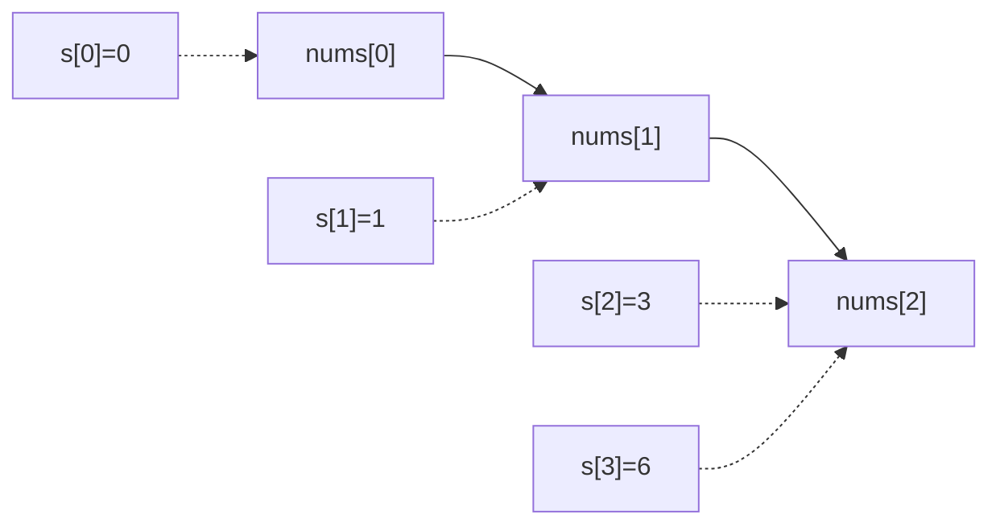
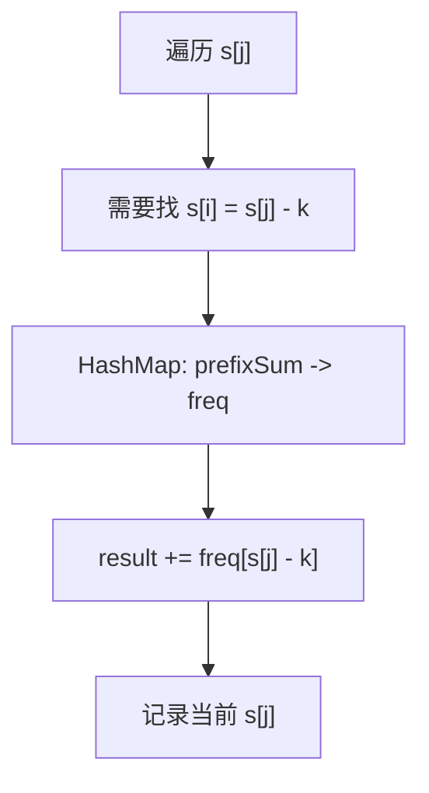
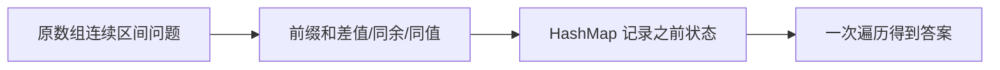
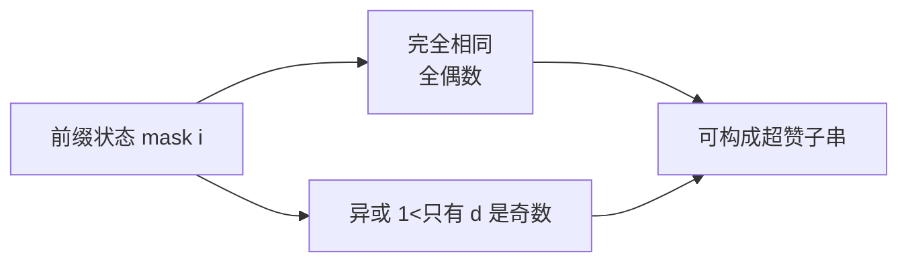
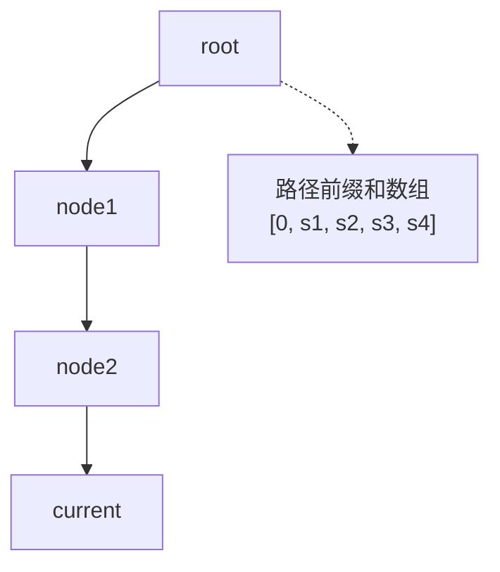
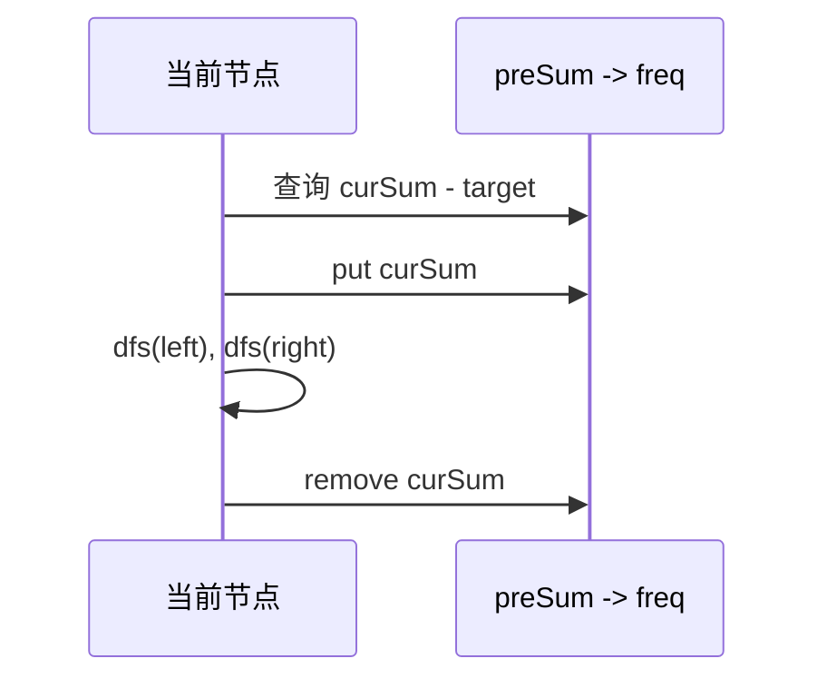
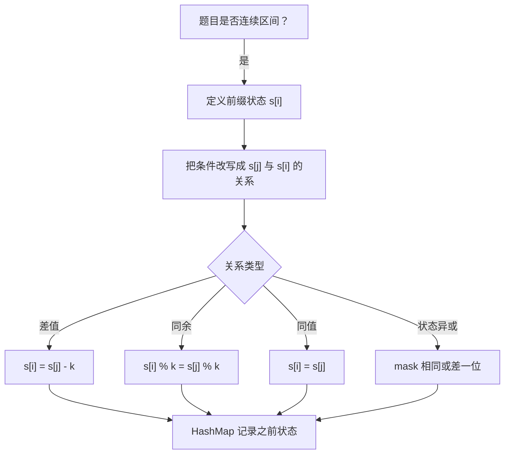

前缀和 + hash 表，用空间换查询速度。核心是：**连续区间的求值问题，很多时候可以转化成两个前缀和之间的关系**。

1. Table of Contents, ordered
{:toc}

# 前缀和是什么

前缀和数组 `s` 比原数组多一个元素：

```text
nums = [1, 2, 3]
s    = [0, 1, 3, 6]
```

`s[i]` 表示原数组 `[0, i)` 的和。于是：

```text
nums[l, r) 的和 = s[r] - s[l]
```



| 原数组区间 | 前缀和表达式 | 值 |
|------------|--------------|----|
| `[0, 1)` | `s[1] - s[0]` | `1` |
| `[1, 3)` | `s[3] - s[1]` | `5` |
| `[0, 3)` | `s[3] - s[0]` | `6` |

为什么要有 `s[0] = 0`？如果子数组从 0 开始，总得有个东西给它减。这个空前缀非常重要，忘了它就会漏解。

# 从暴力到 HashMap

求“和为 K 的子数组”，暴力思路是枚举所有区间：

```java
public int subarraySum(int[] nums, int k) {
    int count = 0;
    for (int start = 0; start < nums.length; start++) {
        int sum = 0;
        for (int end = start; end >= 0; end--) {
            sum += nums[end];
            if (sum == k) {
                count++;
            }
        }
    }
    return count;
}
```

这是 O(n²)。如果直接把每个区间重新求和，还会到 O(n³)。

前缀和转化：

```text
s[j] - s[i] = k
=> s[i] = s[j] - k
```

于是问题变成：遍历每个 `s[j]` 时，之前出现过多少个 `s[j] - k`？



代码：

```java
class Solution {
    public int subarraySum(int[] nums, int k) {
        int n = nums.length;
        int[] sum = new int[n + 1];

        for (int i = 1; i <= n; i++) {
            sum[i] = sum[i - 1] + nums[i - 1];
        }

        int result = 0;
        Map<Integer, Integer> freq = new HashMap<>();
        for (int j = 0; j <= n; j++) {
            result += freq.getOrDefault(sum[j] - k, 0);
            freq.put(sum[j], freq.getOrDefault(sum[j], 0) + 1);
        }
        return result;
    }
}
```

注意顺序：先查之前的，再记录当前的。这样保证 `i < j`。

# 两个关键点

前缀和题目有两个关键点：

1. **转化**：怎么把原问题变成两个前缀和的关系？
2. **撇清关系**：转化后，如果题目不要求返回原区间详情，就专心在前缀和数组里解，不要再纠缠原数组。



# 同余：能被 K 整除

如果子数组和能被 `k` 整除：

```text
(s[j] - s[i]) % k = 0
=> s[j] % k == s[i] % k
```

也就是找两个前缀和同余。

## 连续的子数组和

[连续的子数组和](https://leetcode.cn/problems/continuous-subarray-sum/description/)额外要求长度至少为 2。

转化后：

1. 找两个前缀和同余。
2. 它们下标差至少为 2。

```java
class Solution {
    public boolean checkSubarraySum(int[] nums, int k) {
        int n = nums.length;
        int[] preSum = new int[n + 1];

        for (int i = 1; i <= n; i++) {
            preSum[i] = preSum[i - 1] + nums[i - 1];
        }

        Map<Integer, Integer> firstIndex = new HashMap<>();
        for (int j = 0; j <= n; j++) {
            int mod = preSum[j] % k;
            if (firstIndex.containsKey(mod)) {
                if (j - firstIndex.get(mod) >= 2) {
                    return true;
                }
            } else {
                firstIndex.put(mod, j);
            }
        }
        return false;
    }
}
```

这里 map 保存的是**第一次出现的下标**，因为要让区间尽可能长，满足长度限制。

## 负数取模

[和可被 K 整除的子数组](https://leetcode.cn/problems/subarray-sums-divisible-by-k/description/)中有负数。Java 的 `%` 会保留负余数，Python 则更接近正余数。

比如关于 3：

| 数 | Java `% 3` | 正余数 |
|----|------------|--------|
| `2` | `2` | `2` |
| `-4` | `-1` | `2` |

同余定理用的是正余数，所以 Java 里写：

```java
int mod = (preSum[j] % k + k) % k;
```

代码：

```java
class Solution {
    public int subarraysDivByK(int[] nums, int k) {
        int result = 0;
        int preSum = 0;
        Map<Integer, Integer> freq = new HashMap<>();
        freq.put(0, 1);

        for (int num : nums) {
            preSum += num;
            int mod = (preSum % k + k) % k;
            result += freq.getOrDefault(mod, 0);
            freq.put(mod, freq.getOrDefault(mod, 0) + 1);
        }
        return result;
    }
}
```

# 去掉一段后能整除

[1590. 使数组和能被 P 整除](https://leetcode.cn/problems/make-sum-divisible-by-p/description/)更绕一点。

总和为 `sum`。删除子数组 `[i, j)` 后能被 `p` 整除：

```text
sum - (s[j] - s[i]) ≡ 0 (mod p)
=> s[j] - s[i] ≡ sum (mod p)
=> s[i] ≡ s[j] - sum (mod p)
```

也就是遍历 `s[j]` 时找之前的 `s[i] = s[j] - sum`。

```java
class Solution {
    public int minSubarray(int[] nums, int p) {
        int n = nums.length;
        int pre = 0;
        for (int num : nums) {
            pre = (pre + num) % p;
        }
        int totalMod = pre;
        if (totalMod == 0) {
            return 0;
        }

        int result = n;
        int cur = 0;
        Map<Integer, Integer> lastIndex = new HashMap<>();
        lastIndex.put(0, -1);

        for (int j = 0; j < n; j++) {
            cur = (cur + nums[j]) % p;
            int need = (cur - totalMod + p) % p;
            if (lastIndex.containsKey(need)) {
                result = Math.min(result, j - lastIndex.get(need));
            }
            lastIndex.put(cur, j);
        }

        return result == n ? -1 : result;
    }
}
```

原文里我写过“如果一个不删也符合，要先 put 再计算”。更清晰的实现是先处理 `totalMod == 0`，然后用 `lastIndex.put(0, -1)` 表示空前缀。

# 同值：两类元素数量相等

有些题不是求和，而是求两类元素数量相等。把一种记为 `1`，另一种记为 `-1`，就变成区间和为 0：

```text
s[j] - s[i] = 0
=> s[j] = s[i]
```

## 连续数组

[525. 连续数组](https://leetcode.cn/problems/contiguous-array/description/)：把 `0` 当 `-1`，`1` 当 `1`。

```java
class Solution {
    public int findMaxLength(int[] nums) {
        Map<Integer, Integer> firstIndex = new HashMap<>();
        firstIndex.put(0, -1);

        int preSum = 0;
        int result = 0;
        for (int i = 0; i < nums.length; i++) {
            preSum += nums[i] == 1 ? 1 : -1;
            if (firstIndex.containsKey(preSum)) {
                result = Math.max(result, i - firstIndex.get(preSum));
            } else {
                firstIndex.put(preSum, i);
            }
        }
        return result;
    }
}
```

这里保存第一次出现的位置，因为要最长距离。

## 字母与数字

[面试题 17.05. 字母与数字](https://leetcode.cn/problems/find-longest-subarray-lcci/description/)同理：数字记 `1`，字母记 `-1`。

关键下标关系：

```text
前缀和 s[r] - s[l] 代表原数组 [l, r)
```

所以最终返回：

```java
return Arrays.copyOfRange(array, maxLeft, maxRight);
```

这正好就是 `[l, r)`。

# 状态压缩前缀和

[1542. 找出最长的超赞子字符串](https://leetcode.cn/problems/find-longest-awesome-substring/description/)是前缀和的变体：不是记录和，而是记录 0-9 每个数字出现次数的奇偶状态。

直觉：

- 一个字符串最多允许一个数字出现奇数次，才能重排成回文。
- 用 10 位 bitmask 表示每个数字出现次数的奇偶。
- 两个前缀状态相同，说明中间每个数字都出现偶数次。
- 两个前缀状态只差一位，说明中间只有一个数字出现奇数次。



这也是前缀思想：当前状态减去之前状态，只不过“减法”换成了异或。

# DFS + 前缀和

[路径总和 III](https://leetcode.cn/problems/path-sum-iii/description/)很漂亮：前缀和和 DFS 结合在一起。

树上从 root 到当前节点这一条路径，也可以看成一个数组：



如果每个节点都生成一条前缀和数组再查，会退化。更好的办法是 DFS 时维护一个 map：

- 进入节点：当前前缀和 `curSum` 入 map。
- 查找：之前出现过多少个 `curSum - target`。
- 递归左右子树。
- 离开节点：把 `curSum` 从 map 中撤销。



代码：

```java
class Solution {
    public int pathSum(TreeNode root, int targetSum) {
        Map<Long, Integer> freq = new HashMap<>();
        freq.put(0L, 1);
        return dfs(root, freq, 0L, targetSum);
    }

    private int dfs(TreeNode root, Map<Long, Integer> freq, long preSum, int target) {
        if (root == null) {
            return 0;
        }

        long curSum = preSum + root.val;
        int result = freq.getOrDefault(curSum - target, 0);

        freq.put(curSum, freq.getOrDefault(curSum, 0) + 1);
        result += dfs(root.left, freq, curSum, target);
        result += dfs(root.right, freq, curSum, target);
        freq.put(curSum, freq.get(curSum) - 1);

        return result;
    }
}
```

> 这题卡 `int` 溢出的用例，所以 `sum` 用 `long`，map 的 key 也用 `Long`。

这里只有 map 是有状态的，所以恢复现场只恢复它一个即可。

# 模板总结

前缀和题按这个流程想：



HashMap 存什么取决于目标：

| 目标 | map value |
|------|-----------|
| 计数 | `freq` |
| 最长距离 | 第一次出现下标 |
| 最短距离 | 最近一次出现下标 |
| 是否存在 | 任意一个合法下标 |

最后反复提醒自己：**前缀和数组的 `s[r] - s[l]` 对应原数组 `[l, r)`**。这个下标关系写清楚，很多 off-by-one 就没了。
