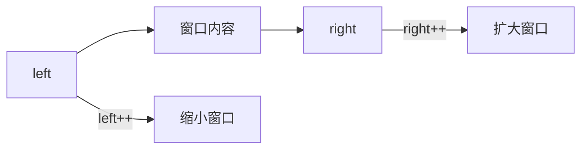
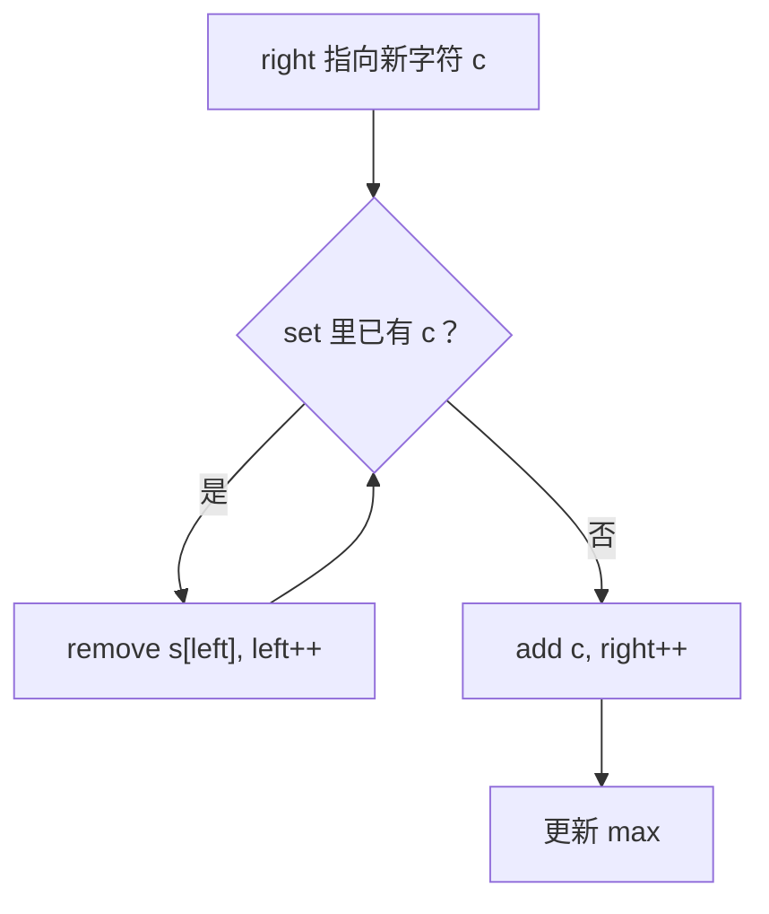
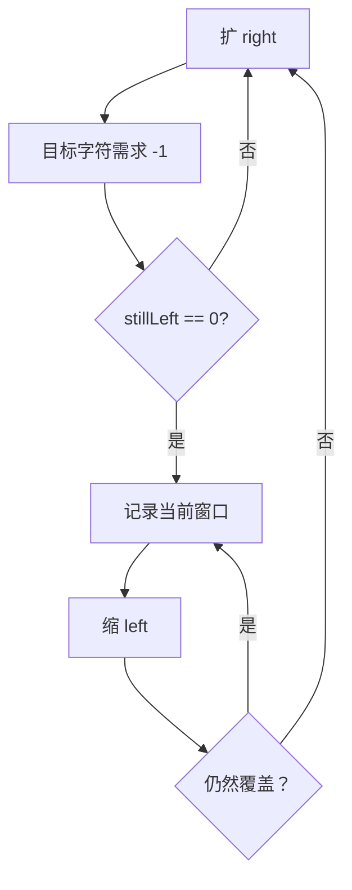
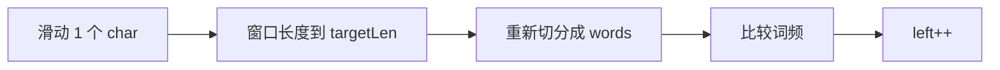
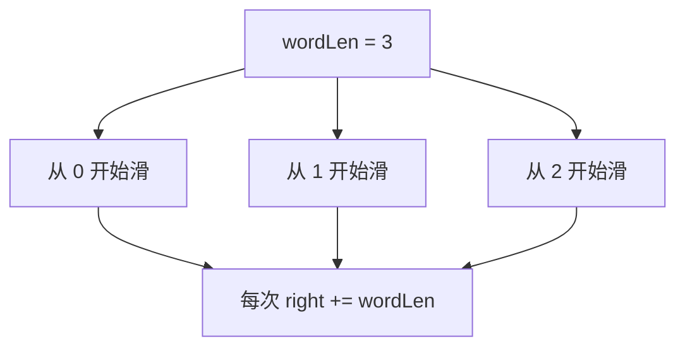
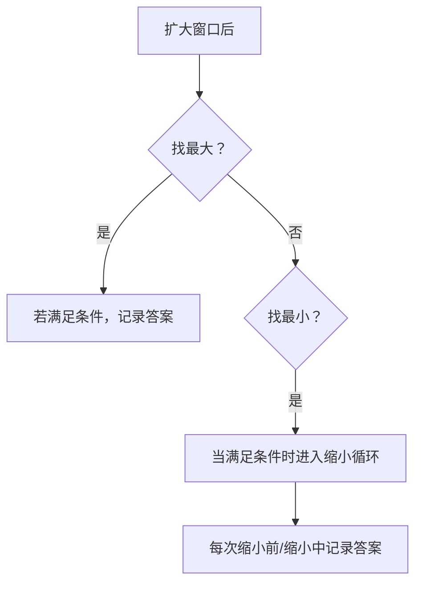

滑动窗口常用来处理字符串子串问题，比如找符合条件的最大/最小子串。窗口用左右指针动态维护，动态过程像在数组或字符串上“滑动”。

1. Table of Contents, ordered
{:toc}

# 核心规则

滑动窗口的核心动作只有两个：

1. 右指针右移，扩大窗口。
2. 左指针右移，缩小窗口。



什么时候缩？看目标：

| 目标 | 策略 | 什么时候缩小窗口 | 什么时候记录答案 |
|------|------|------------------|------------------|
| 最大窗口 | 尽量加 | 不满足条件时缩 | 扩大后且满足时 |
| 最小窗口 | 尽量减 | 满足条件时缩 | 缩小前/缩小过程中 |

> 一句话：找最大，能扩就扩；找最小，能缩就缩。

# 通用模板

更清晰的模板是：外层负责 `right++`，内层负责根据条件 `left++`。

```java
int left = 0, right = 0;
while (right < s.length()) {
    // 扩大窗口
    add(s.charAt(right));
    right++;

    while (需要缩小窗口) {
        // 缩小窗口
        remove(s.charAt(left));
        left++;
    }

    // 按题意记录结果
}
```

关键是把“窗口是否满足条件”的判断集中在一个地方。以前我写过两个 while：一个一直扩，一个一直缩，结果记录点散在两处，逻辑很乱。模板的意义就是减少这种自我折磨。

# 无重复字符的最长子串

[无重复字符的最长子串](https://leetcode.cn/problems/longest-substring-without-repeating-characters/description/)找的是最大窗口。

条件：窗口内字符不重复。

策略：右边尽量扩；如果下一个字符重复，就先缩到不重复。



代码：

```java
class Solution {
    public int lengthOfLongestSubstring(String s) {
        Set<Character> window = new HashSet<>();
        int left = 0, right = 0;
        int max = 0;

        while (right < s.length()) {
            char c = s.charAt(right);

            while (window.contains(c)) {
                window.remove(s.charAt(left));
                left++;
            }

            window.add(c);
            right++;
            max = Math.max(max, right - left);
        }

        return max;
    }
}
```

为什么 `Set` 可以？因为窗口始终维护“不重复”的状态。遇到重复字符时，会先把左边删到不重复，再把当前字符放进去。所以窗口里不会同时存在两个相同字符。

示例 `ccabcabcbb`：

| 步骤 | 新字符 | 缩小前窗口 | 操作 | 缩小后窗口 |
|------|--------|------------|------|------------|
| 1 | `c` | `""` | 加入 | `"c"` |
| 2 | `c` | `"c"` | 删除左侧 `c` | `"c"` |
| 3 | `a` | `"c"` | 加入 | `"ca"` |
| 4 | `b` | `"ca"` | 加入 | `"cab"` |
| 5 | `c` | `"cab"` | 删除到无重复 | `"abc"` |

# 最小覆盖子串

[最小覆盖子串](https://leetcode.cn/problems/minimum-window-substring/description/)找的是最小窗口。

条件：`s` 的当前窗口包含 `t` 的所有字符，且字符频次也要够。

只用 set 不行，因为 `t` 里可能有重复字符。应该用 map 记录所需频次。

直觉是“消消乐”：

- 先统计 `tMap`：每个字符还需要几个。
- 扩窗口遇到目标字符，就让需求减一。
- 如果减掉的是一个仍然需要的字符，则 `stillLeft--`。
- `stillLeft == 0` 表示当前窗口已经覆盖。
- 覆盖后尽量缩小窗口。



为什么用 `stillLeft`？因为“map 里所有 key 的 value 都为 0”需要遍历 map。就像 MySQL 的表级意向锁是为了避免遍历所有行锁一样，这里也用一个整数表示“还差多少有效字符”。

```java
class Solution {
    public String minWindow(String s, String t) {
        Map<Character, Integer> need = new HashMap<>();
        for (char c : t.toCharArray()) {
            need.put(c, need.getOrDefault(c, 0) + 1);
        }

        int left = 0, right = 0;
        int stillLeft = t.length();
        int minLength = Integer.MAX_VALUE;
        int minLeft = -1, minRight = -1;

        while (right < s.length()) {
            char rc = s.charAt(right);
            if (need.containsKey(rc)) {
                int old = need.get(rc);
                if (old > 0) {
                    stillLeft--;
                }
                need.put(rc, old - 1);
            }
            right++;

            while (stillLeft == 0) {
                if (right - left < minLength) {
                    minLength = right - left;
                    minLeft = left;
                    minRight = right;
                }

                char lc = s.charAt(left);
                if (need.containsKey(lc)) {
                    int old = need.get(lc);
                    if (old + 1 > 0) {
                        stillLeft++;
                    }
                    need.put(lc, old + 1);
                }
                left++;
            }
        }

        return minLeft == -1 ? "" : s.substring(minLeft, minRight);
    }
}
```

状态解释：

| `need[c]` | 含义 |
|-----------|------|
| `> 0` | 还缺这个字符 |
| `== 0` | 刚好满足 |
| `< 0` | 窗口里这个字符多了 |

找最小窗口时，答案要在 `while (stillLeft == 0)` 里记录。因为每缩一次，都可能得到更短的合法窗口。

# 串联所有单词的子串

[30. 串联所有单词的子串](https://leetcode.cn/problems/substring-with-concatenation-of-all-words/description/)很有意思。

如果把滑动单位看成 word，它和“无重复字符的最长子串”很像：一个统计 `char`，一个统计 `String`。区别是本题要求 words 完全匹配，并且包括词频。

## 错误但有启发的思路：滑动 char

一开始我傻傻地滑动 char，每次窗口长度够了，再把当前窗口切成 word 数组比较。



这比双重 for 好一些，但每次比较都要重新切分子串，还是慢。

# 以 word 为单位滑动

word 长度固定为 `wordLen`。要覆盖所有对齐方式，需要从 `0` 到 `wordLen - 1` 分别开一轮。



窗口内维护当前词频 `curWordsFreq`，目标词频是 `targetWordsFreq`。当窗口里的 word 数量等于目标数量，就检查是否相等；不管匹配与否，都左移一个 word。

```java
class Solution {
    public List<Integer> findSubstring(String s, String[] words) {
        int wordsNum = words.length;
        int wordLen = words[0].length();
        int targetLen = wordsNum * wordLen;

        if (s.length() < targetLen) {
            return List.of();
        }

        Map<String, Integer> targetWordsFreq = new HashMap<>();
        for (String word : words) {
            targetWordsFreq.put(word, targetWordsFreq.getOrDefault(word, 0) + 1);
        }

        List<Integer> result = new ArrayList<>();

        for (int offset = 0; offset < wordLen; offset++) {
            Map<String, Integer> curWordsFreq = new HashMap<>();
            int curWordsNum = 0;

            int left = offset, right = offset;
            while (right + wordLen <= s.length()) {
                String curWord = s.substring(right, right + wordLen);
                curWordsFreq.put(curWord, curWordsFreq.getOrDefault(curWord, 0) + 1);
                curWordsNum++;

                while (curWordsNum == wordsNum) {
                    if (curWordsFreq.equals(targetWordsFreq)) {
                        result.add(left);
                    }

                    String removedWord = s.substring(left, left + wordLen);
                    int freq = curWordsFreq.get(removedWord);
                    if (freq == 1) {
                        curWordsFreq.remove(removedWord);
                    } else {
                        curWordsFreq.put(removedWord, freq - 1);
                    }

                    left += wordLen;
                    curWordsNum--;
                }

                right += wordLen;
            }
        }

        return result;
    }
}
```

注意：当某个 word 频次变成 0，要从 map 里删掉，否则 `map.equals` 不会为 `true`。

# 何时记录结果

这个点很容易乱，单独拎出来：



示例：

| 题目 | 找最大/最小 | 记录位置 |
|------|-------------|----------|
| 无重复字符最长子串 | 最大 | 加入新字符后 |
| 最小覆盖子串 | 最小 | `while (覆盖)` 内 |
| 串联所有单词 | 固定长度 | 窗口 word 数量达到目标时 |

# 常见坑

| 坑 | 表现 | 处理 |
|----|------|------|
| 不知道何时缩 | while 条件写反 | 先判断是最大还是最小 |
| 结果记录点散乱 | 两个 while 后都记录 | 使用外扩内缩模板 |
| set/map 选错 | 忽略重复字符频次 | 有频次就用 map |
| 右边界含义混乱 | substring 少/多一位 | 统一使用 `[left, right)` |
| map 为 0 不删除 | `equals` 永远 false | 频次归零就 remove |
| 滑动单位错 | 每次重复切分 | 题目是 word 就滑 word |

# 模板复盘

最后把模板翻译成题目语言：

1. 窗口里维护什么状态？
2. 扩窗口时怎么更新状态？
3. 什么条件下要缩窗口？
4. 缩窗口时怎么恢复状态？
5. 何时记录答案？

```java
while (right < n) {
    add(right);
    right++;

    while (shouldShrink()) {
        recordIfNeeded();
        remove(left);
        left++;
    }

    recordIfNeeded();
}
```

真正难的通常不是左右指针，而是“窗口是否满足条件”怎么 O(1) 判断。这个条件想清楚，窗口自然就滑起来了。
