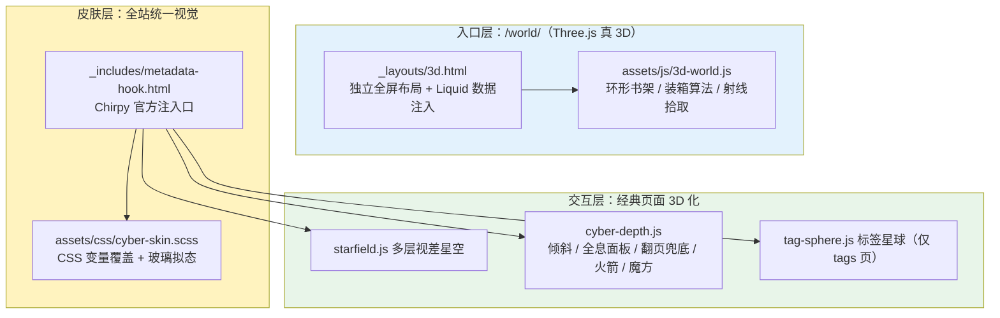
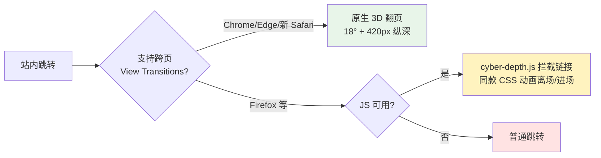

1. Table of Contents, ordered
{:toc}

# 背景：一次 Fable 5 的能力试用

这次改造有个特别的前提需要说清楚：**全部设计、编码、调试和验收都由 Claude Code 完成，驱动它的是 Anthropic 最新发布的 Fable 5 模型**。我（博主）只做了两件事——提需求、看效果。所以这篇文章有双重身份：既是 3D 主题的完整介绍，也是对 Fable 5 这个新模型能力的一次试用和测试记录（文章本身也是它总结生成的）。

最初的需求只有一句话：“把博客改成一个巨炫酷无比的 3D 格式——模仿真实世界，不同分类像书架一样分门别类，里面放着一篇篇具体内容。”需求随后四轮生长：3D 入口页 → 点进文章风格要统一 → 文章页本身也要 3D → 整个站点全面 3D 化。最终落地为 `3d-world` 分支上的一个完整主题：12 个文件、约 1700 行，已合入 master 上线。

# 主题全景：五层 3D 体验

| 层次 | 入口 | 核心体验 |
|------|------|---------|
| 3D 知识图书馆 | `/world/` | Three.js 真 3D：7 个分类是环形发光书架，256 篇文章每篇是一本可抽出、翻开的书 |
| 赛博皮肤 | 全站 | 深空底色 + 玻璃拟态 + 霓虹渐变，与 3D 世界同一套配色 |
| 纵深交互 | 全站 | 多层视差星空、卡片随鼠标 3D 倾斜、滚动透视入场、阅读进度光束 |
| 全息阅读面板 | 文章页 | 正文是悬浮星空中的玻璃板：书页式翻入、随鼠标整体转动、全息扫描线 |
| 收官件 | 各处 | 3D 翻页过渡、`/tags/` 可拖拽标签星球、迷失太空 404、火箭回顶、魔方传送门 |

几个值得展开的细节：

- **书是真的“书”**：书脊用 canvas 实时绘制竖排标题和日期，宽窄高矮随机；悬停滑出发光，点击后飞出旋转、画面淡出、进入文章——和文章页的“书页式翻入”构成同一个隐喻闭环
- **配色贯穿始终**：Tech 蓝 `#4fc3f7`、AI 紫 `#b388ff`、Books 黄 `#ffd54f`……3D 书架、首页集合徽章、分类光晕用的是同一张色表
- **标签星球**：最热 72 个标签按斐波那契均匀分布在球面上，可拖拽、带惯性，近大远小、近亮远暗

# 架构与关键实现

四个关键技术决策：

1. **WebGL 与 CSS 3D 分工**：真 WebGL 只用在专门的展示页（`/world/`），阅读页一律用 CSS 3D（`perspective`/`transform`/View Transitions）。前者追求沉浸，后者必须守住可读性，两者靠统一配色和“书”的隐喻缝合。
2. **数据构建时注入**：3D 图书馆的数据由 Liquid 在构建时把全站 7 个集合、256 篇文章渲染成页面内嵌 JSON，零运行时接口、零后端依赖。
3. **贪心装箱排书**：每本书宽高随机，逐行装满书架、装满五层换下一座；Tech 192 篇自动算出 4 座书架，其余分类各 1 座，全部沿圆弧排开面向圆心。
4. **换肤优于重写**：Chirpy 的样式完全由 CSS 自定义属性驱动（`--main-bg`、`--card-bg`……），所以皮肤主体只是一组变量覆盖，经官方预留的 `metadata-hook.html` 注入——保留主题全部功能（TOC/评论/搜索/归档），不动主题 SCSS。

# 渐进增强：炫酷的安全网

每个效果都有明确的退化路径，这是“敢往猛了做”的前提：

- `prefers-reduced-motion` 下所有动效退化为静态页面；触屏设备自动跳过倾斜类效果
- 全息面板只在桌面精确指针（`pointer: fine` 且 ≥1200px）启用
- 各 JS 对 DOM 钩子都做存在性判断：选择器失配时效果悄悄消失，**页面始终可用**

这套思路同样体现在对**主题升级代价**的控制上：

| 耦合级别 | 文件 | 失败模式 |
|---------|------|---------|
| 零耦合（纯新增） | `3d.html`、`3d-world.js` 等 | 永不受主题升级影响 |
| 官方机制 | `metadata-hook.html`（3 行） | hook 被移除才失效，症状明显 |
| 静默降级 | CSS 变量/选择器、JS DOM 钩子 | 效果消失但页面可用 |
| 真合并债务 | `assets/404.html`（约 20 行） | 升级时 diff 一下即可 |

# 作为模型测试的观察

这部分是“试用 Fable 5”的正题：它在没有人盯梢的情况下怎么干活。

**自主验收，不靠“应该没问题”。** 模型自己装了 Playwright + 无头 Chromium，每轮迭代都实测：截图确认渲染、读 computed transform 断言 3D 矩阵生效、模拟鼠标验证悬停/点击/拖拽、删掉 `PageRevealEvent` 模拟不支持 View Transitions 的浏览器来测兜底路径。每次提交前还跑生产构建 + htmlproofer 双卡点。

**先怀疑环境，再改代码。** 两次“bug”最终都不是逻辑错误：

1. 无头测试中“点击书本不跳转”——逐层加调试钩子后定位为 dev server 全量重建阻塞请求（约 60 秒）+ swiftshader 软渲染导致导航提交慢，功能本身一直是好的
2. 用户反馈“翻页没感觉”——一半原因是动画幅度太保守（7° → 加强到 18°），另一半是 Firefox 根本不支持跨页 View Transitions，于是补了 JS 兜底让全浏览器生效

**接受审美返工。** 第一版标签星球把全站 243 个标签都放上去，糊成毛球，自己截图发现后改为只取最热 72 个；404 页中间的 0 最初用 🪐 emoji，无头测试暴露了无 emoji 字体的环境会变方块，改成纯 CSS 画的带光环土星。

**工程纪律。** 新覆盖文件同步记入项目的覆盖清单（还顺手补上了之前漏记的两个）；commit 拆分清晰，最后按要求 squash 成单个提交；`Gemfile.lock` 这类环境副产物主动隔离在提交之外并说明原因。

# 核心结论

1. **3D 化内容站的正确分层**：沉浸归 WebGL 展示页，阅读归 CSS 3D，统一配色与隐喻负责缝合
2. **换肤优于重写**：CSS 变量驱动的主题，一个注入口 + 一组变量覆盖即可整站改头换面，升级债务接近零
3. **渐进增强是炫酷的安全网**：每个效果都有退化路径，才敢把动画往猛了做
4. **对 Fable 5 的评价**：能把一句模糊的“炫酷 3D”自主分解成可落地的工程方案，全程自我验收、诚实区分环境问题和代码问题——这次全站改造作为新模型的试金石，成色令人满意

# 参考

- [Three.js](https://threejs.org/)——importmap + CDN 引入，OrbitControls + Raycaster
- [View Transitions API（跨文档）](https://developer.mozilla.org/en-US/docs/Web/API/View_Transition_API)——`@view-transition { navigation: auto; }`
- [Chirpy 主题](https://github.com/cotes2020/jekyll-theme-chirpy)——`metadata-hook.html` 注入口与 CSS 变量体系
- 斐波那契球面均匀分布：`phi = acos(1 - 2(i+0.5)/N)`，`theta = π(1+√5)i`
- [Claude Code](https://claude.com/claude-code) + Fable 5——本次改造与本文的实际作者
