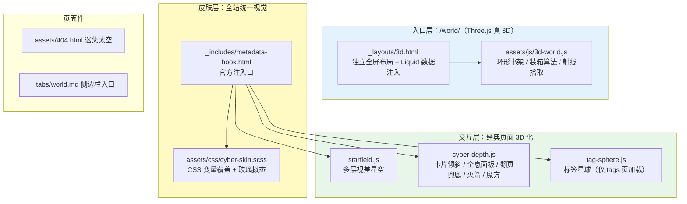

1. Table of Contents, ordered
{:toc}

# 背景与目标

最初的需求只有一句话：“切一个新分支，把博客改成一个巨炫酷无比的 3D 格式——模仿真实世界，不同分类（AI、Tech、Book 等）分门别类，像书架一样，里面放着一篇篇具体内容。”

随着对话推进，需求逐步生长为四轮迭代：

1. 做一个 3D 入口页（书架世界）
2. 点进文章后风格要和 3D 世界统一
3. 文章页本身也要 3D，不能只是换肤
4. 自由发挥，整个站点能 3D 的地方都 3D 化

最终在 `3d-world` 分支落地为一个完整的“深空赛博”主题：12 个文件、+1686 行，合并为单个 commit。

# 主要步骤

## 步骤一：Three.js 3D 知识图书馆（/world/）

核心设计决策：

- **独立 layout 而非改主题**：`_layouts/3d.html` 是完整的标准 HTML 文档，不引用任何 Chirpy 文件，配合 `_tabs/world.md` 挂到侧边栏，得到 `/world/` 路由
- **构建时注入数据**：用 Liquid 把全站 7 个集合、256 篇文章的标题/链接/日期渲染成页面内嵌 JSON（`_includes/world-items.html`），零运行时接口
- **贪心装箱算法排书**：每本书宽高随机，逐行装满书架；Tech 192 篇自动算出 4 座书架，其余分类各 1 座，全部沿圆弧排开、面向圆心

交互上，书脊用 canvas 实时绘制竖排标题，悬停滑出发光 + 浮出标题卡，点击后书飞出旋转、画面淡出、跳转文章。

验收环节有个值得记录的调试故事：无头浏览器（Playwright + swiftshader 软渲染）测试时，点击书本后页面“没有跳转”。逐层加调试钩子后发现两个叠加因素——

1. Jekyll dev server 收到文件变更会触发约 60 秒的全量重建，期间请求被阻塞，导航迟迟不提交
2. swiftshader 软渲染下页面整体很慢，导航提交本身需要 4 秒以上

也就是说**功能一直是好的**，慢的是测试环境。教训：在判定“代码有 bug”之前，先排除观测环境本身的延迟。

## 步骤二：全站风格统一（赛博皮肤）

用户点进文章后跳回了原版 Chirpy 亮色页面，要求风格统一。这里的关键取舍：

- ❌ 重写文章页布局——会丢掉 Chirpy 的 TOC、评论、搜索、归档
- ✅ **保留主题功能，只换皮肤**——固定 `theme_mode: dark`，通过 Chirpy 官方预留的 `metadata-hook.html`（空占位符，专为覆盖设计）注入 `cyber-skin.scss`

Chirpy 的样式完全由 CSS 自定义属性驱动（`--main-bg`、`--card-bg`……），所以皮肤主体就是一组变量覆盖：深空底色、玻璃拟态侧边栏/卡片、霓虹渐变站名、头像光环，配色与 3D 书架一一对应（Tech 蓝 `#4fc3f7`、AI 紫 `#b388ff`……）。

## 步骤三：3D 纵深交互

皮肤仍是“平面的炫酷”，于是加入第一批立体效果：

- 星空升级为**多层视差**：每颗星带深度值，随鼠标和滚动按深度差速漂移
- 首页卡片随鼠标 **3D 倾斜**，带跟随光标的眩光
- 文章元素（标题/图片/代码块/表格）滚动时**从深处带透视旋转浮现**
- 头像悬浮动画、文章页顶部阅读进度光束

## 步骤四：文章页全息阅读面板

用户反馈一针见血：“博客页还是平的，你是不是理解错了？”——前一轮动效太含蓄，文章页读起来仍是一张纸。这轮把**阅读页本身变成 3D 物体**：

- 正文变成一块**悬浮在星空中的玻璃面板**：发光描边、毛玻璃、深影、8 秒一道的全息扫描线
- 打开文章时**书页式翻入**（呼应 3D 世界里“翻开一本书”的隐喻）
- 阅读中整个面板**随鼠标持续 3D 转动**（±2.6°，带惯性插值）——“它不是平面”的最直观证据
- 右侧 TOC 斜立 9° 悬停转正，左侧边栏驾驶舱式微倾

只在桌面精确指针设备启用，移动端与 `prefers-reduced-motion` 退化为平面。

## 步骤五：全站收官五件套

用户放开限制（“越炫酷越好，前提是方便”），于是补齐：

1. **3D 翻页过渡**：站内跳转时旧页旋入深处、新页从另一侧旋出，全站像同一个 3D 空间内的场景切换（View Transitions API，纯 CSS）
2. **标签星球**（/tags/）：标签按斐波那契均匀分布组成可拖拽、带惯性的 3D 球。第一版 243 个标签糊成毛球，修正为只取最热 72 个，扁平标签云保留在下方
3. **迷失太空 404**：故障风渐变数字，中间的 0 原本是 🪐 emoji，无头测试发现无 emoji 字体的环境会变方块，改为**纯 CSS 画的带光环土星**
4. **火箭回顶**：点“回到顶部”按钮蓄力发射冲出屏幕
5. **魔方传送门**：每页右下角旋转霓虹立方体，一键进 /world/

## 步骤六：翻页过渡的二次修复

用户实测“第一处没感觉出来”。两个原因，双管齐下：

- 原 7°/0.28s **幅度太小**，加强到 18° + 420px 纵深、进场 0.55s
- Firefox 等浏览器**不支持跨页 View Transitions**，纯静默退化。新增 JS 兜底：用 `'PageRevealEvent' in window` 探测，不支持时拦截站内链接，用同款 CSS 动画先离场再跳转，落地页播进场动画——全浏览器生效

# 3D 主题架构总览

# 工程设计：耦合控制与升级影响

所有改动按“主题升级时的代价”分级设计：

| 耦合级别 | 文件 | 失败模式 |
|---------|------|---------|
| 零耦合（纯新增） | `3d.html`、`3d-world.js`、`world-items.html`、`world.md` | 永不受主题升级影响 |
| 官方机制 | `metadata-hook.html`（3 行）、`theme_mode` 配置 | hook 被移除才失效，症状明显 |
| 静默降级 | `cyber-skin.scss` 的变量/选择器、各 JS 的 DOM 钩子 | 选择器失配时效果悄悄消失，**页面始终可用** |
| 真合并债务 | `assets/404.html`（约 20 行） | 升级时 diff 一下即可 |

配套约束贯穿始终：

- Chirpy 全部功能（TOC/评论/搜索/归档/RSS）无损
- `prefers-reduced-motion` 下所有动效退化为静态；触屏跳过倾斜类效果
- 每轮迭代都通过 `JEKYLL_ENV=production jekyll build` + `htmlproofer` 双卡点
- 每个效果都用 Playwright + 无头 Chromium 实测（截图、computed transform、类名断言、导航验证），不靠“应该没问题”

# 核心结论

1. **3D 化一个内容站的正确分层**：真 WebGL 只用在专门的展示页（/world/），阅读页用 CSS 3D（perspective/transform/View Transitions）——前者追求沉浸，后者必须守住可读性，两者靠统一配色和隐喻（书→面板）缝合
2. **换肤优于重写**：主题用 CSS 变量驱动时，一个注入口 + 一组变量覆盖就能整站改头换面，且升级债务接近零
3. **渐进增强是“炫酷”的安全网**：每个效果都有明确的退化路径（不支持 VT→JS 兜底→普通跳转；reduced-motion→静态），炫酷才敢往猛了做
4. **验收要怀疑测试环境**：两次“bug”（点击不跳转、翻页没感觉）最终都不是逻辑错误，而是 dev server 重建阻塞、软渲染慢、浏览器特性缺失——先定位环境，再改代码

# 参考

- [Three.js](https://threejs.org/)——importmap + CDN 引入，OrbitControls + Raycaster
- [View Transitions API（跨文档）](https://developer.mozilla.org/en-US/docs/Web/API/View_Transition_API)——`@view-transition { navigation: auto; }`
- [Chirpy 主题](https://github.com/cotes2020/jekyll-theme-chirpy)——`metadata-hook.html` 注入口与 CSS 变量体系
- 斐波那契球面均匀分布：`phi = acos(1 - 2(i+0.5)/N)`，`theta = π(1+√5)i`
