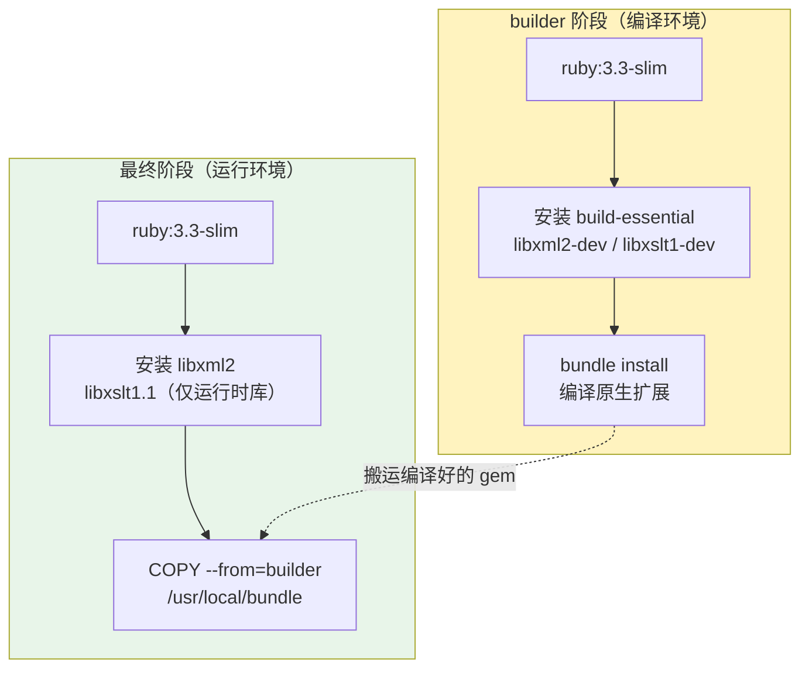

1. Table of Contents, ordered
{:toc}

## 背景：为什么需要 Docker

Jekyll 是 Ruby 生态的静态站点生成器。在 Linux 或 macOS 上，安装 Ruby、Bundler 后一条命令就能跑起来；但在 Windows 上，这套链路处处是坑：

- Bash 启动脚本无法直接执行
- Ruby 环境配置繁琐，版本兼容性差
- `pkill`、`nc`、`nohup` 等命令在 Windows 上不存在

Docker 的解决思路很直接：**把整个运行环境（Ruby、编译工具、gem 依赖）打包成镜像**，Windows 用户只需要安装 Docker Desktop，就能和 Linux/macOS 用户拥有一模一样的开发环境。

## 方案架构

最终形成的文件结构：

```
bin/
├── jekyll-dev.sh        # Linux/Mac 原生启动（保留）
├── jekyll-docker.sh     # Linux/Mac Docker 启动
└── jekyll-docker.ps1    # Windows Docker 启动

Dockerfile               # 多阶段构建
docker-compose.yml       # 编排配置
.dockerignore            # 排除构建上下文
```

两套脚本语义对等，都支持 `start / stop / restart / logs`：

| 脚本 | 平台 | 启动方式 |
|---|---|---|
| `jekyll-dev.sh` | Linux / Mac | 原生 Ruby |
| `jekyll-docker.sh` | Linux / Mac | Docker |
| `jekyll-docker.ps1` | Windows | Docker |

## Dockerfile 完整解析

这是整个方案的核心文件，采用**多阶段构建**：

```dockerfile
# 第一阶段：编译环境 —— 装编译工具、编译所有 gem 的原生扩展
FROM ruby:3.3-slim AS builder

# 更换为国内镜像源，加速 apt 下载
RUN sed -i 's/deb.debian.org/mirrors.tuna.tsinghua.edu.cn/g' /etc/apt/sources.list.d/debian.sources && \
    sed -i 's/security.debian.org/mirrors.tuna.tsinghua.edu.cn/g' /etc/apt/sources.list.d/debian.sources

# 安装编译工具（nokogiri、ffi、eventmachine 等 gem 需要编译原生 C 扩展）
RUN apt-get update && apt-get install -y --no-install-recommends \
    build-essential \
    libxml2-dev \
    libxslt1-dev \
    && rm -rf /var/lib/apt/lists/*

# 把 RubyGems 默认源换成国内镜像
RUN printf -- "---\n:sources:\n- https://gems.ruby-china.com/\n" > ~/.gemrc

WORKDIR /srv/jekyll

# 先单独复制 Gemfile，利用 Docker 缓存层
COPY Gemfile Gemfile.lock ./

# 从 Gemfile.lock 动态读取 BUNDLED WITH 版本并安装对应 Bundler
RUN BUNDLER_VERSION=$(grep -A1 "BUNDLED WITH" Gemfile.lock | tail -n1 | tr -d ' ') && \
    gem install bundler -v "$BUNDLER_VERSION"

RUN bundle install

# 第二阶段：运行时环境 —— 只保留运行时需要的库，编译工具全部丢弃
FROM ruby:3.3-slim

RUN sed -i 's/deb.debian.org/mirrors.tuna.tsinghua.edu.cn/g' /etc/apt/sources.list.d/debian.sources && \
    sed -i 's/security.debian.org/mirrors.tuna.tsinghua.edu.cn/g' /etc/apt/sources.list.d/debian.sources

# 只安装运行时库（nokogiri 编译出的原生扩展动态链接了 libxml2 / libxslt）
RUN apt-get update && apt-get install -y --no-install-recommends \
    libxml2 \
    libxslt1.1 \
    && rm -rf /var/lib/apt/lists/*

# 从 builder 阶段复制 gem 源配置、bundler 和所有已编译的 gem
COPY --from=builder /root/.gemrc /root/.gemrc
COPY --from=builder /usr/local/bundle /usr/local/bundle

WORKDIR /srv/jekyll

EXPOSE 4000 35729

CMD ["bundle", "exec", "jekyll", "serve", "--host", "0.0.0.0", "--livereload"]
```

### 关键指令说明

| 指令 | 作用 |
|---|---|
| `FROM ... AS builder` | 给第一阶段取名 `builder`，后续可用 `COPY --from=builder` 引用 |
| `RUN sed -i ...` | 替换 Debian apt 源为清华镜像，加速系统包下载 |
| `RUN apt-get install ...` | 安装 gcc/g++ 等编译工具（builder 阶段专属） |
| `RUN printf ... > ~/.gemrc` | 直接写 gem 源配置文件，避免 `gem sources` 的网络验证卡顿 |
| `COPY Gemfile Gemfile.lock ./` | **只复制 Gemfile**，利用 Docker 缓存——只要 Gemfile 不变，`bundle install` 就不会重复执行 |
| `RUN gem install bundler ...` | 动态读取 `Gemfile.lock` 里的版本安装 bundler，避免硬编码 |
| `COPY --from=builder ...` | 多阶段构建的灵魂：把第一阶段编译好的 gem "搬运"到最终镜像 |
| `EXPOSE 4000 35729` | 声明镜像会监听 4000（Jekyll）和 35729（LiveReload）端口 |
| `CMD [...]` | 容器启动时的默认命令（可被 docker-compose 的 `command` 覆盖） |

## docker-compose.yml 解析

```yaml
services:
  jekyll:
    build:
      context: .
      dockerfile: Dockerfile
    ports:
      - "${JEKYLL_PORT:-4000}:4000"
      - "35729:35729"
    volumes:
      - .:/srv/jekyll
    environment:
      - JEKYLL_ENV=development
      - LANG=C.UTF-8
    command: >
      sh -c "bundle check >/dev/null 2>&1 || bundle install &&
             bundle exec jekyll serve --host 0.0.0.0 --port 4000 --livereload"
```

### 各字段说明

| 字段 | 作用 |
|---|---|
| `build.context: .` | 构建上下文为项目根目录（Dockerfile 所在位置） |
| `build.dockerfile: Dockerfile` | 指定用哪个 Dockerfile 构建 |
| `ports` | 把容器的 4000 和 35729 端口映射到宿主机 |
| `volumes: - .:/srv/jekyll` | **核心**：把宿主机当前目录挂载到容器内，实现源码实时同步 |
| `environment` | 设置环境变量，`JEKYLL_ENV=development` 关闭生产级压缩 |
| `command` | **覆盖 Dockerfile 的 CMD**，多了 `bundle check \|\| bundle install` 的自检逻辑 |

## 构建优化：速度从 4 分 50 秒到 1 分 31 秒

### 第一层优化：国内源

Docker 镜像默认走国外源，在国内几乎无法使用。做了三层替换：

1. **apt 源**：Debian 官方源 → 清华镜像源
2. **gem 源**：RubyGems 官方源 → ruby-china 镜像源
3. **bundler 版本**：动态读取 `Gemfile.lock` 中的 `BUNDLED WITH`

```dockerfile
# 直接写 ~/.gemrc，跳过 gem sources 的网络验证（否则可能卡住 70+ 秒）
RUN printf -- "---\n:sources:\n- https://gems.ruby-china.com/\n" > ~/.gemrc
```

### 第二层优化：去掉不必要的包

原方案安装了 `git`，但 Gemfile.lock 里没有任何 git 源的依赖。去掉后 apt 包从 86 个减到 59 个，下载量从 101MB 降到 85.5MB。

### 第三层优化：预装 bundler

默认镜像里的 bundler 版本（2.5.22）和 `Gemfile.lock` 要求的版本（2.6.9）不匹配，会导致运行时自动升级，可能卡住。改成动态读取并提前安装：

```dockerfile
RUN BUNDLER_VERSION=$(grep -A1 "BUNDLED WITH" Gemfile.lock | tail -n1 | tr -d ' ') && \
    gem install bundler -v "$BUNDLER_VERSION"
```

## 体积优化：多阶段构建 817MB → 348MB

单阶段构建时，编译工具占了 331MB。但这些工具只在编译 gem 时需要，运行时完全不需要。



- **builder 阶段**：装 300MB+ 编译工具，编译完 gem 后整个阶段被丢弃
- **最终阶段**：只保留 Ruby 运行时 + 两个系统库（4.7MB）+ 编译好的 gem

最终镜像从 **817MB 降到 348MB**（省 57%），构建时间从首次国外源的 4 分 50 秒优化到 **1 分 31 秒**。

## Volume 挂载的关键陷阱

`docker-compose.yml` 里的 `volumes: - .:/srv/jekyll` 是把宿主机目录挂载到容器内。它的一个极易踩坑的设计：**挂载会"遮住"镜像里同路径的文件**。

### 为什么本项目没事？

因为 gem 的安装路径和挂载点是分离的：

| 路径 | 内容 | 是否被挂载覆盖 |
|---|---|---|
| `/srv/jekyll` | 项目源码（Markdown、配置） | ✅ 被宿主机的 `.` 覆盖 |
| `/usr/local/bundle` | 所有 gem 依赖 | ❌ **不受影响** |

如果错误地把 `bundle install` 的 path 设到项目目录内（如 `vendor/bundle`），挂载后这些 gem 就会被宿主机空目录覆盖，容器启动时直接报错。

## CMD vs command：谁说了算？

Dockerfile 里有 `CMD`，docker-compose.yml 里有 `command`，两者同时存在时：

> **docker-compose 的 `command` 覆盖 Dockerfile 的 `CMD`**

本项目里，docker-compose 的 `command` 在 Dockerfile 的基础上多了一层自我保护：

```yaml
command: >
  sh -c "bundle check >/dev/null 2>&1 || bundle install &&
         bundle exec jekyll serve --host 0.0.0.0 --port 4000 --livereload"
```

先执行 `bundle check` 检查依赖完整性，如果 Gemfile 变了就自动补装。不过这只是**临时兜底**——容器删除后补装的 gem 会丢失，**真正的依赖变更必须通过 `docker compose up --build` 重建镜像来固化**。

## 镜像什么时候需要更新？

| 场景 | 是否需要重建 | 原因 |
|---|---|---|
| 修改 Gemfile / Gemfile.lock | ✅ 必须 | 镜像内的 gem 环境过期 |
| 修改 Dockerfile | ✅ 必须 | 镜像构建逻辑变了 |
| 只改 Markdown 文章 | ❌ 不需要 | 源码通过 Volume 实时挂载 |
| 基础镜像发布安全补丁 | ✅ 建议 | 底层系统更新 |

更新命令：

```bash
# 检测到变更后自动重建，然后启动
docker compose up --build -d

# 彻底清理后从零重建
docker compose down --rmi all
docker compose up --build -d
```

## 镜像需要上传到 Registry 吗？

**不需要。** 对于个人博客项目，每个机器自己构建就行。

这个镜像只打包了 gem 依赖，文章和配置是通过 Volume 实时挂载的。因此镜像本身**不绑定具体内容**，只绑定 Gemfile 里的版本。构建时间只有 1 分 31 秒，完全可以接受。

| 方案 | 适合场景 |
|---|---|
| **自己构建（推荐）** | 个人项目；Gemfile 变动频繁；不想维护账号 |
| **上传 Docker Hub / 私有 Registry** | 团队人多；CI/CD 流水线需要秒级拉取；多台电脑共享 |

如果以后确实需要上传，也是一条命令的事：

```bash
# 构建并推送
docker build -t username/repo:tag .
docker push username/repo:tag
```

## .dockerignore：减少构建上下文

`.dockerignore` 的作用和 `.gitignore` 类似，但针对的是 **Docker 构建上下文**：

```
.git/
.idea/
docs/
*.gem
node_modules/
```

执行 `docker build` 时，Docker 会把 `context` 目录的所有文件打包传给 Docker Daemon。`.dockerignore` 排除不需要的文件，从而：

1. **加快构建速度**（传的文件越少越好）
2. **减小镜像**（防止无关文件被意外 `COPY` 进去）
3. **保护安全**（防止敏感文件泄露）

## 为什么用 Docker Compose 而不是裸 Docker？

裸 Docker 命令完全可行，但写起来非常冗长：

```bash
# 裸 Docker：十几行参数
docker run -d -p 4000:4000 -p 35729:35729 \
  -v "$(pwd):/srv/jekyll" -e JEKYLL_ENV=development \
  --network mynetwork myimage:latest sh -c "..."

# Docker Compose：一行搞定
docker compose up --build -d
```

Compose 的本质是**把 `docker build` 和 `docker run` 的参数声明成 YAML 配置**，提升可读性和可维护性。对于项目级开发，它已是业界标准。

## 最终成果

- **跨平台**：Windows 用户不再需要配置 Ruby 环境
- **镜像体积**：348MB（多阶段构建）
- **构建速度**：1 分 31 秒（国内源 + 优化）
- **热重载**：Volume 挂载 + Jekyll Auto-regeneration，本地改文件即时生效
- **HTTP 验证**：`curl localhost:4000` 返回 200，LiveReload 端口 35729 正常
