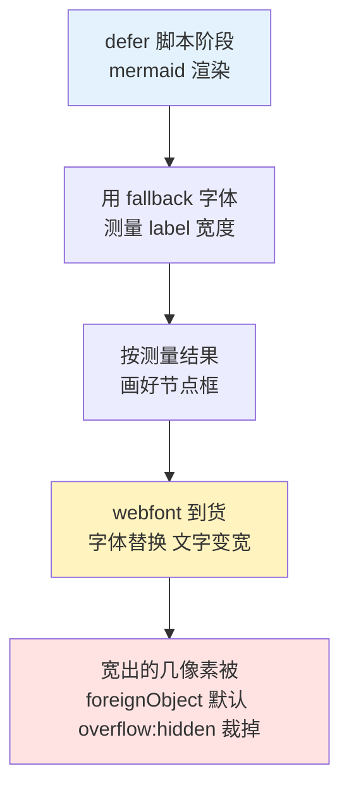
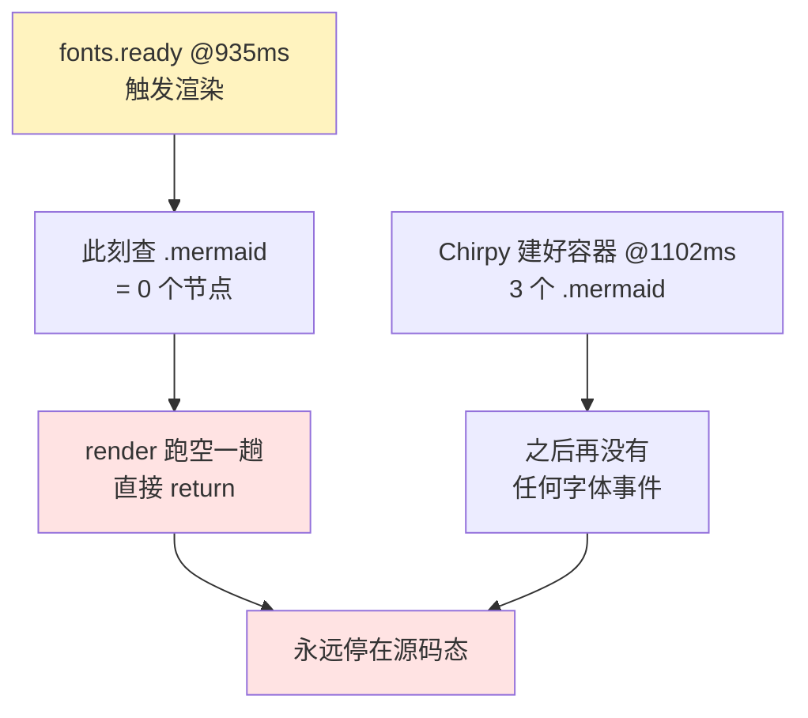
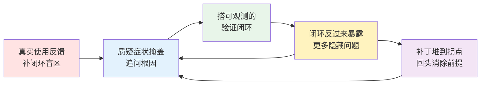

1. Table of Contents, ordered
{:toc}

## 背景：一次“越修越丑”的修复

本博客（Jekyll + Chirpy 主题，固定暗色模式）支持 Mermaid 图。最初的症状是：flowchart 节点里的中英混排文字**右边缘被裁掉几个像素**，显示不全。

第一版修复（由另一个 agent 完成）思路是“给文字更多空间”：调小 `wrappingWidth` 强制提前换行、调大 `padding`/`nodeSpacing`/`rankSpacing`，再用 CSS `overflow-wrap: anywhere; word-break: break-word` 强制断行。结果文字确实不被裁了，但图变得松散，单词和中文在任意字符处断开——**更丑了**。

这是典型的“症状掩盖”：没有回答“为什么文字会被裁”，而是用布局参数把问题盖住。排查从这里重新开始。

## 根因一：Mermaid 的测宽机制与 webfont 时序

Mermaid 画 flowchart 时分两步：先**实测**每个 label 的像素宽度，再按测出的宽度画节点框。所以“文字被裁”本质上只有一种可能：**测量时和最终显示时的文字宽度不一致**。

排查这条链路，两个事实拼出了答案：

1. Chirpy 通过 Google Fonts 加载 webfont，且 `font-display: swap`——页面先用 fallback 字体渲染，webfont 到货后再替换；
2. Mermaid 由 defer 脚本在文档加载早期就初始化渲染，此时 webfont 往往还没到。

于是顺序变成：



其中最后一环是 SVG 规范行为：[`foreignObject` 默认裁剪溢出内容](https://developer.mozilla.org/en-US/docs/Web/SVG/Element/foreignObject)，所以哪怕只宽出 1-2px 也会被硬切。

**修复方向因此非常明确**：让测量和显示用同一套字体——等 [`document.fonts.ready`](https://developer.mozilla.org/en-US/docs/Web/API/FontFaceSet/ready) 之后再渲染。Chirpy 把 `mermaid.initialize({theme})` 写死在打包后的 `post.min.js` 里，所以用一个加载顺序在它之前的 defer 脚本劫持 `initialize`，关掉 `startOnLoad`，改为字体就绪后手动 `mermaid.run()`：

```js
var originalInitialize = mermaid.initialize.bind(mermaid);
mermaid.initialize = function (config) {
  config = config || {};
  config.startOnLoad = false;
  return originalInitialize(config);
};
```

CSS 只保留一条兜底，对付偶发的 1-2px 测量误差：

```scss
.mermaid foreignObject {
  overflow: visible;
}
```

第一版修复里的布局参数和断行 hack 全部删除。需要换行的长标签，在 Mermaid 源码里用 `<br/>` 手动断——断点永远在作者想要的位置，比 `word-break: anywhere` 好看得多。

## 搭一个截图验证闭环：无头 Chromium + CDP

“看起来应该修好了”不算修好。这类视觉问题必须**让机器把渲染结果给你看**。本机没装 Playwright 的 npm 包，但 Playwright 的浏览器缓存还在，里面的 headless shell 可以直接当独立浏览器用：

```bash
~/.cache/ms-playwright/chromium_headless_shell-*/chrome-headless-shell-linux64/chrome-headless-shell \
  --headless --no-sandbox --remote-debugging-port=9333 about:blank &
```

然后用 Node 22 **内置的 WebSocket** 直连 [Chrome DevTools Protocol](https://chromedevtools.github.io/devtools-protocol/)，不需要任何依赖。核心就三步：开 tab、求值、按元素坐标截图：

```js
// PUT /json/new 开 tab，拿到 webSocketDebuggerUrl 后直连
const res = await fetch(`http://127.0.0.1:9333/json/new?about:blank`, { method: 'PUT' });
const ws = new WebSocket((await res.json()).webSocketDebuggerUrl);

// Runtime.evaluate 检查渲染状态
// document.querySelectorAll('.mermaid')      → 元素是否存在
// el.getAttribute('data-processed')          → mermaid 是否真的渲染了
// document.fonts.status                      → 字体加载到什么阶段

// Page.captureScreenshot + clip → 按 getBoundingClientRect 精确截取每张图
```

这个闭环的价值在于把“图好不好看”变成了可观测的问题：`data-processed` 告诉你渲染有没有发生，console/exception 事件告诉你为什么没发生，截图告诉你渲染出来长什么样。后面的两个隐藏问题，都是这个闭环抓出来的。

> 一个小坑：页面有 MathJax 异步排版时，元素坐标会持续漂移，必须在截图前一刻重新测量 `getBoundingClientRect`，否则截到的是错位的区域。
{: .prompt-tip }

## 根因二：截图暴露的对比度问题

第一次按节点区域放大截图时，问题自己跳了出来：修复后的图文字确实完整了，但**浅色填充节点里的字几乎看不清**——浅粉、浅黄底配浅灰字。

原因是两套约定打架：

- 站点固定暗色模式，Mermaid 暗色主题的默认文字是**浅色**；
- 写作规范鼓励用 `style A fill:#fff3bf` 这类**浅色填充**高亮关键节点（这些色板是为亮色背景设计的）。

浅底浅字，每篇带图的文章都会中招。逐篇手补 `color:#1f2937` 不可持续，所以改成在渲染完成后做**自动对比度**：读取每个节点形状的计算填充色，算亮度，浅色填充就把 label 换成深色：

```js
function fixLabelContrast() {
  document.querySelectorAll('.mermaid .node, .mermaid .cluster').forEach(function (node) {
    var shape = node.querySelector('rect, polygon, circle, ellipse, path');
    if (!shape) return;
    var m = getComputedStyle(shape).fill.match(/rgba?\(\s*([\d.]+)[,\s]+([\d.]+)[,\s]+([\d.]+)/);
    if (!m) return;
    var luminance = 0.299 * m[1] + 0.587 * m[2] + 0.114 * m[3];
    if (luminance < 160) return;   // 深色填充：保持主题默认浅色文字
    node.querySelectorAll('.nodeLabel, .label, text, tspan, p, span').forEach(function (label) {
      label.style.color = '#1f2937';
      label.style.fill = '#1f2937';
    });
  });
}
```

亮度公式用的是经典的 [ITU-R BT.601 luma 加权](https://en.wikipedia.org/wiki/Luma_(video))（0.299R + 0.587G + 0.114B）。验证方式同上：对一篇含 8 张图的文章全量截图，确认浅色节点全部变成深字浅底、深色节点不受影响。

## 根因三：fonts.ready 会被慢字体挂起

验证过程中出现了一次诡异的失败：同一个页面，前一次 8 张图全部渲染，后一次全部 `data-processed: null`。用 CDP 分阶段（4s / 8s / 15s）观察 `document.fonts.status` 后真相浮出：**那次 webfont 加载被网络卡住了**，`fonts.ready` 迟迟不 resolve，而渲染在死等它——图就永远出不来。

这是“等字体再渲染”方案的真实缺陷：Google Fonts 在某些网络环境下相当不稳定，不能让图表渲染被它劫持。修复是给等待加上限，超时就先渲染：

```js
function renderWhenReady() {
  var fontsReady = (document.fonts && document.fonts.ready) || Promise.resolve();
  var timeout = new Promise(function (resolve) { setTimeout(resolve, 2500); });
  Promise.race([fontsReady, timeout]).then(function () {
    if (!document.querySelector('.mermaid')) return;
    mermaid.run().catch(console.error).then(fixLabelContrast);
  });
}
```

降级路径是闭环的：字体 2.5 秒内没到就先按 fallback 字体渲染，配合 `foreignObject { overflow: visible }` 这条 CSS 兜底，最坏也只是文字微微出框，而不是整图缺席。

但这套“等 `fonts.ready`、等不到就超时”的方案，本身还压着一个没被验证的假设——`fonts.ready` resolve 的那一刻，字体真的就绪了。文章发出去之后，一次真实使用把这个假设打穿了。

## 根因四：fonts.ready 在冷加载会“假性提前 resolve”

读者反馈了两个症状：**第一次进入文章**时，图常常忽大忽小、偶尔干脆掉回原始 Mermaid 源码；**刷新（尤其强刷）之后才变规整**。这正是根因一本该治好的“测量与显示不一致”，却在“第一次进入”这个最关键的场景下又复发了。

问题就出在那个没说破的假设上。冷加载（字体没缓存）会把它打穿：

1. `fonts.ready` 的语义是“当前正在加载的字体都加载完”，它盯的是浏览器的字体 loading set；
2. 我们挂上等待的那一刻（defer 脚本阶段），还没有任何已渲染的文字去触发这几个 webfont 下载，loading set 是**空的**；
3. 于是 `fonts.ready` 立刻 resolve——可此刻页面仍在用 fallback 字体。

首屏又回到了 fallback 测宽的老路：照 fallback 画好框，swap 字体到货后文字变宽、几何错位。第二次访问之所以正常，是字体已进缓存、同步生效。根因三加的 2.5 秒超时也救不了——超时同样是拿 fallback 渲染。

**修复的关键是不再去赌 `fonts.ready` 的那一个时刻，也不去猜字体名**（站点字体随时可能换）。改成两段式：首屏照旧尽快渲染一版（这一渲染本身会让浏览器请求 webfont），之后监听 `document.fonts` 的 `loadingdone`——任何一次字体真正加载完成，就把已渲染的图**还原成源码、按新字体重渲一遍**。命中缓存时 `loadingdone` 不触发，自然不会多渲。“需要手动刷新”就此变成了自动收敛：

```js
// 首屏：尽快渲染一版（fallback 也行），这一步本身会触发 webfont 请求
Promise.race([fontsReady, timeout]).then(render);

// 自愈：字体真正到货后，把图还原成源码、按新字体重渲一遍
document.fonts.addEventListener('loadingdone', debounce(function () {
  resetProcessed();
  render();
}, 150));
```

`resetProcessed` 要处理一个细节：mermaid 渲染后会在节点上写 `data-processed` 并把源码替换成 SVG，`run()` 之后会跳过这些节点。想重渲就得先把源码还原回去。而源码不必自己存——Chirpy 把被替换的原始代码块作为 `.mermaid` 的 `previousSibling` 保留着（它的暗色/亮色主题切换正是这么复用的），取回来即可：

```js
function resetProcessed() {
  document.querySelectorAll('.mermaid[data-processed]').forEach(function (node) {
    var source = node.previousSibling.children.item(0); // Chirpy 隐藏的原始代码块
    node.textContent = source.textContent;
    node.removeAttribute('data-processed');
  });
}
```

顺带把渲染换成 `mermaid.run({ suppressErrors: true })`：在这之前，一张图抛错会让整批停在源码状态——这正是“偶尔掉回原始 Mermaid 语法”的另一条来路。

验证仍用那套无头闭环，但这次多了关键一步：用 CDP 的 `Network.setCacheDisabled` **禁用缓存，模拟“第一次进入”**。冷加载下对一篇 9 张图的文章全量采样，图从“源码态”收敛到 9/9 全部渲染、节点框大小统一、浅色节点深字——和强刷后的样子一致。

## 根因五：偶发"只显示 Mermaid 源码"——渲染早于容器创建

根因四发出去后，又来了一个新症状：**第一次进文章时，图有时根本不渲染，只把 Mermaid 源码原样打出来；刷新几次又好了**。根因四那套 `loadingdone` 自愈不但没救，反而盖住了真问题。

无头闭环这次抓得很干净——给 `mermaid.run` 计数、用 `MutationObserver` 记录 `.mermaid` 容器的创建时刻、再标注各字体事件，跑到一次失败时时间线如下：



根子在一个一直没说破的事实上：**`.mermaid` 容器不是页面静态 HTML 自带的**。Chirpy 的 `post.min.js`（同样是 defer 脚本）才在运行时把 ` ```mermaid ` 代码块替换成 `<pre class="mermaid">`。于是本脚本、mermaid 库、webfont、`post.min.js` 四者的就绪顺序并不固定——冷加载时 `fonts.ready` / `loadingdone` 经常**早于**容器被建好就触发，此刻 `render()` 查 `.mermaid` 得到 0 个节点直接返回；而 `loadingdone` 自愈也因为触发时 0 节点 early-return。容器随后才出现，却再没有任何事件来补渲。

**修复的关键是认清渲染的真正前置条件是"容器已存在"，不能只赌字体事件**。用 `MutationObserver` 等到至少出现一个 `.mermaid` 节点再渲染（已存在则立即返回），并配超时兜底：

```js
function whenNodesPresent() {
  if (mermaidNodes().length) return Promise.resolve();
  return new Promise(function (resolve) {
    var observer = new MutationObserver(function () {
      if (mermaidNodes().length) { observer.disconnect(); resolve(); }
    });
    observer.observe(document.documentElement, { childList: true, subtree: true });
    setTimeout(resolve, 5000); // 容器始终不出现也不要永远挂起
  });
}

// 首屏渲染必须同时满足：字体就绪（或超时）且 .mermaid 容器已被 Chirpy 建好
Promise.all([Promise.race([fontsReady, timeout]), whenNodesPresent()]).then(render);
```

禁缓存模拟"第一次进入"循环 30 次：从修复前约 1/3 概率掉回源码，变成 30/30 全部渲染。

## 根因六：中文标签"字符越界"——label 字体没有中文字形

紧接着又一个新症状：**部分图的中文标签，字符冲出了节点边框**。注意它和根因一的"被裁"正好相反——根因一加了 `foreignObject { overflow: visible }` 之后，溢出不再被硬切，于是表现成"越界/溢出"。可溢出本身说明：盒子还是测得太窄了。

为什么偏偏中文越界？因为 Mermaid 给 label 写死的字体是 `"trebuchet ms",verdana,arial,sans-serif`——**全是拉丁字体，没有一个有中文字形**。中文只能退到系统 `sans-serif`。于是又回到了那个老根因——"测宽字体 ≠ 绘制字体"：测宽那刻用的中文 fallback，和最终绘制用的系统中文字体不一定一样宽，盒子按窄的定死，中文就溢出。

更糟的是，根因四那套 `loadingdone` 自愈对中文这条路**天生失效**：系统字体不会触发 `loadingdone`（那个事件只为 `@font-face` / webfont 触发）。所以中文越界，没有任何事件来兜底。

第一反应又是打补丁：渲染后用几何探测哪张图越界（文字盒比形状还宽），命中就重渲；还为此把重渲改成 `mermaid.render` 离屏生成 SVG 再整体替换，避免"先还原源码再 run"闪现一帧源码。这套能修，无头闭环也验证了它收敛——但写到这儿，该停下来了。

## 回头看：这一路都在打补丁

数一数为了对齐"测宽字体"和"绘制字体"，前后叠了多少层：劫持 `initialize` 关 `startOnLoad`、等 `fonts.ready`、2.5s 超时、`loadingdone` 重渲、还原源码、几何探测越界、离屏重渲防闪烁……每一层都在**事后补救"几何已经测错了"**这件事，到后来甚至是补丁在给补丁打补丁（离屏重渲是为了补 `loadingdone` 重渲带来的闪烁）。

可这些症状——被裁、忽大忽小、掉回源码、中文越界——追到底是**同一个根因**：

> Mermaid 按"渲染那一刻 DOM 里生效的字体"测每个文字盒的宽度，而这个字体不确定——webfont 会晚到、会假性 resolve，中文会退到不可控的系统字体。

与其没完没了地在事后纠正测错的几何，不如让它**一开始就测不错**。

## 拔根因：把 label 字体钉成系统字体栈

办法其实只有一行配置：用 Mermaid 的 `fontFamily`，把 label 字体钉成一套「本机一定有 + 含中文」的系统字体栈。

```js
var FONT_STACK =
  '-apple-system, "Segoe UI", "PingFang SC", "Microsoft YaHei", ' +
  '"Noto Sans CJK SC", "Noto Sans SC", sans-serif';

mermaid.initialize = function (config) {
  config = config || {};
  config.startOnLoad = false;
  config.fontFamily = FONT_STACK;
  config.themeVariables = config.themeVariables || {};
  config.themeVariables.fontFamily = FONT_STACK;
  return originalInitialize(config);
};
```

系统字体的关键性质是**不存在 webfont 那种 swap**：要么本机就有、立即生效，要么直接退到同样是系统字体的 `sans-serif`。无论哪种，在同一个浏览器里**测宽用的字体 == 绘制用的字体**，几何天然稳定。注意"哪台机器解析到哪个中文字体"不重要——重要的是**同一台机器上测和画用的是同一个**。

于是根因一/三/四/六辛辛苦苦搭起来的那一整套——等字体、超时、`loadingdone` 重渲、还原源码、几何探测越界、离屏重渲——**全部删掉**。脚本从两百多行回到一百出头，只剩三件正经事：


1. 接管 `initialize`：关 `startOnLoad`（自己控制时机）+ 钉死字体——拔掉根因一/三/四/六；
2. 等 Chirpy 建好 `.mermaid` 容器后渲染一次——根因五，这是合理的时序协调，不是补丁；
3. 暗色主题浅色节点文字补深色——根因二，真实的主题取舍。

`foreignObject { overflow: visible }` 这条 CSS 可以留着防极端的 1px 误差，但它不再是主力——主力是"根本不会测错"。一个小取舍：Latin 文字字形从 Trebuchet 变成系统字体（Segoe UI / PingFang 等），观感略变，换来的是"永不越界、永不忽大忽小、不需要任何重渲"。

> 还有更彻底的方向：构建期用 `mermaid-cli` 把图预渲染成静态 SVG，浏览器零运行时、零测宽、零竞态，代价是要改构建 / CI、明暗主题切换得另做取舍。本站停在"字体钉死"这一步——它用一行配置消掉了根因，已经够了。
{: .prompt-tip }

## 插曲：三个假失败

排查中还遇到三次“看起来是 bug，其实不是”的干扰，处理思路值得记录——**在改代码之前，先确认失败信号指向的真是代码**：

| 现象 | 真实原因 | 辨别手段 |
|------|---------|---------|
| 页面突然 404 / 连接拒绝 | Jekyll 容器被 OOM 杀掉（exit 137） | `docker ps -a` 看状态码，而不是怀疑刚改的代码 |
| 截图中途报 “target navigated” | 并发的另一个 agent 在改文件，livereload 触发整页刷新 | `docker logs` 里的 Regenerating 记录 + 文件 mtime |
| 整条命令无输出退出（exit 144） | `pkill -f <端口号>` 匹配到了包裹命令的 shell 自身，连同 node 一起被杀 | 改用记录 PID 再 `kill "$PID"` |

## 总结：方法论比补丁重要

最终落盘的代码一百行出头，但过程上有五条可复用的经验：



1. **修复要回答“为什么”**：“文字被裁”的反义词不是“强制换行”，而是“测量与显示一致”。从机制出发的修复只需要几行；从症状出发的修复会越堆越多。
2. **视觉问题要机器截图验证**：无头 Chromium + CDP 是零依赖的验证手段。对比度问题不是靠想象发现的，是截图放大后自己跳出来的。
3. **闭环会带来意外收获**：fonts.ready 挂起这个缺陷，正是验证闭环偶发失败时顺藤摸瓜抓到的。一次性的“看一眼没问题”给不了这种机会。
4. **连”根因”都可能压着没验证的假设**：根因一的 `fonts.ready` 看着是机制级修复，却从没在冷缓存时序下被真正验证过——这一环最后是真实使用、而不是自动闭环暴露的。自动截图闭环跑在字体已缓存的环境里，复现不了”第一次进入”，这是它的盲区。把盲区交给真实反馈，再用 `Network.setCacheDisabled` 把它收回闭环，是闭环的延伸而非替代。
5. **补丁堆到一定程度，要回头质疑前提本身**：根因一到六，前后叠了七八层”事后补救测错几何”的逻辑，甚至出现补丁补补丁。可它们是同一个根因的不同表现——“测宽字体不确定”。当修复开始互相打补丁，就该停下来问：能不能让问题**不发生**，而不是继续救？这里的答案是一行字体配置，它一次性消掉了四条根因、删掉两百行自愈代码。**消除前提，永远优于补救后果。**
