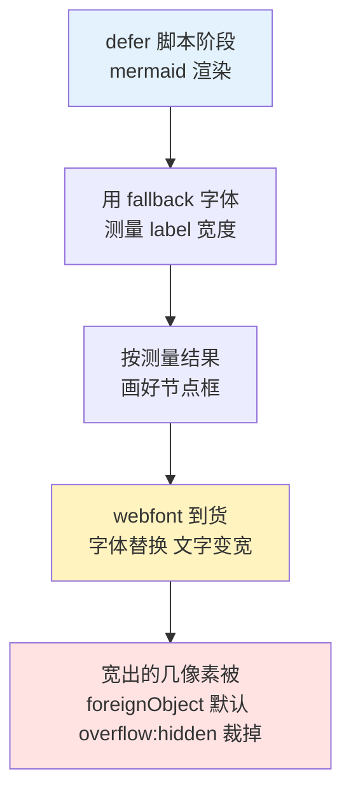
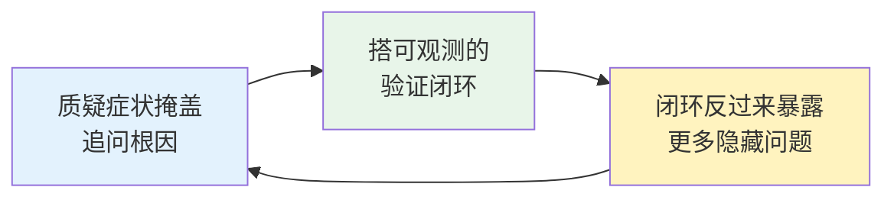

1. Table of Contents, ordered
{:toc}

## 背景：一次“越修越丑”的修复

本博客（Jekyll + Chirpy 主题，固定暗色模式）支持 Mermaid 图。最初的症状是：flowchart 节点里的中英混排文字**右边缘被裁掉几个像素**，显示不全。

第一版修复（由另一个 agent 完成）思路是“给文字更多空间”：调小 `wrappingWidth` 强制提前换行、调大 `padding`/`nodeSpacing`/`rankSpacing`，再用 CSS `overflow-wrap: anywhere; word-break: break-word` 强制断行。结果文字确实不被裁了，但图变得松散，单词和中文在任意字符处断开——**更丑了**。

这是典型的“症状掩盖”：没有回答“为什么文字会被裁”，而是用布局参数把问题盖住。排查从这里重新开始。

## 根因一：Mermaid 的测宽机制与 webfont 时序

Mermaid 画 flowchart 时分两步：先**实测**每个 label 的像素宽度，再按测出的宽度画节点框。所以“文字被裁”本质上只有一种可能：**测量时和最终显示时的文字宽度不一致**。

排查这条链路，两个事实拼出了答案：

1. Chirpy 通过 Google Fonts 加载 webfont，且 `font-display: swap`——页面先用 fallback 字体渲染，webfont 到货后再替换；
2. Mermaid 由 defer 脚本在文档加载早期就初始化渲染，此时 webfont 往往还没到。

于是顺序变成：



其中最后一环是 SVG 规范行为：[`foreignObject` 默认裁剪溢出内容](https://developer.mozilla.org/en-US/docs/Web/SVG/Element/foreignObject)，所以哪怕只宽出 1-2px 也会被硬切。

**修复方向因此非常明确**：让测量和显示用同一套字体——等 [`document.fonts.ready`](https://developer.mozilla.org/en-US/docs/Web/API/FontFaceSet/ready) 之后再渲染。Chirpy 把 `mermaid.initialize({theme})` 写死在打包后的 `post.min.js` 里，所以用一个加载顺序在它之前的 defer 脚本劫持 `initialize`，关掉 `startOnLoad`，改为字体就绪后手动 `mermaid.run()`：

```js
var originalInitialize = mermaid.initialize.bind(mermaid);
mermaid.initialize = function (config) {
  config = config || {};
  config.startOnLoad = false;
  return originalInitialize(config);
};
```

CSS 只保留一条兜底，对付偶发的 1-2px 测量误差：

```scss
.mermaid foreignObject {
  overflow: visible;
}
```

第一版修复里的布局参数和断行 hack 全部删除。需要换行的长标签，在 Mermaid 源码里用 `<br/>` 手动断——断点永远在作者想要的位置，比 `word-break: anywhere` 好看得多。

## 搭一个截图验证闭环：无头 Chromium + CDP

“看起来应该修好了”不算修好。这类视觉问题必须**让机器把渲染结果给你看**。本机没装 Playwright 的 npm 包，但 Playwright 的浏览器缓存还在，里面的 headless shell 可以直接当独立浏览器用：

```bash
~/.cache/ms-playwright/chromium_headless_shell-*/chrome-headless-shell-linux64/chrome-headless-shell \
  --headless --no-sandbox --remote-debugging-port=9333 about:blank &
```

然后用 Node 22 **内置的 WebSocket** 直连 [Chrome DevTools Protocol](https://chromedevtools.github.io/devtools-protocol/)，不需要任何依赖。核心就三步：开 tab、求值、按元素坐标截图：

```js
// PUT /json/new 开 tab，拿到 webSocketDebuggerUrl 后直连
const res = await fetch(`http://127.0.0.1:9333/json/new?about:blank`, { method: 'PUT' });
const ws = new WebSocket((await res.json()).webSocketDebuggerUrl);

// Runtime.evaluate 检查渲染状态
// document.querySelectorAll('.mermaid')      → 元素是否存在
// el.getAttribute('data-processed')          → mermaid 是否真的渲染了
// document.fonts.status                      → 字体加载到什么阶段

// Page.captureScreenshot + clip → 按 getBoundingClientRect 精确截取每张图
```

这个闭环的价值在于把“图好不好看”变成了可观测的问题：`data-processed` 告诉你渲染有没有发生，console/exception 事件告诉你为什么没发生，截图告诉你渲染出来长什么样。后面的两个隐藏问题，都是这个闭环抓出来的。

> 一个小坑：页面有 MathJax 异步排版时，元素坐标会持续漂移，必须在截图前一刻重新测量 `getBoundingClientRect`，否则截到的是错位的区域。
{: .prompt-tip }

## 根因二：截图暴露的对比度问题

第一次按节点区域放大截图时，问题自己跳了出来：修复后的图文字确实完整了，但**浅色填充节点里的字几乎看不清**——浅粉、浅黄底配浅灰字。

原因是两套约定打架：

- 站点固定暗色模式，Mermaid 暗色主题的默认文字是**浅色**；
- 写作规范鼓励用 `style A fill:#fff3bf` 这类**浅色填充**高亮关键节点（这些色板是为亮色背景设计的）。

浅底浅字，每篇带图的文章都会中招。逐篇手补 `color:#1f2937` 不可持续，所以改成在渲染完成后做**自动对比度**：读取每个节点形状的计算填充色，算亮度，浅色填充就把 label 换成深色：

```js
function fixLabelContrast() {
  document.querySelectorAll('.mermaid .node, .mermaid .cluster').forEach(function (node) {
    var shape = node.querySelector('rect, polygon, circle, ellipse, path');
    if (!shape) return;
    var m = getComputedStyle(shape).fill.match(/rgba?\(\s*([\d.]+)[,\s]+([\d.]+)[,\s]+([\d.]+)/);
    if (!m) return;
    var luminance = 0.299 * m[1] + 0.587 * m[2] + 0.114 * m[3];
    if (luminance < 160) return;   // 深色填充：保持主题默认浅色文字
    node.querySelectorAll('.nodeLabel, .label, text, tspan, p, span').forEach(function (label) {
      label.style.color = '#1f2937';
      label.style.fill = '#1f2937';
    });
  });
}
```

亮度公式用的是经典的 [ITU-R BT.601 luma 加权](https://en.wikipedia.org/wiki/Luma_(video))（0.299R + 0.587G + 0.114B）。验证方式同上：对一篇含 8 张图的文章全量截图，确认浅色节点全部变成深字浅底、深色节点不受影响。

## 根因三：fonts.ready 会被慢字体挂起

验证过程中出现了一次诡异的失败：同一个页面，前一次 8 张图全部渲染，后一次全部 `data-processed: null`。用 CDP 分阶段（4s / 8s / 15s）观察 `document.fonts.status` 后真相浮出：**那次 webfont 加载被网络卡住了**，`fonts.ready` 迟迟不 resolve，而渲染在死等它——图就永远出不来。

这是“等字体再渲染”方案的真实缺陷：Google Fonts 在某些网络环境下相当不稳定，不能让图表渲染被它劫持。修复是给等待加上限，超时就先渲染：

```js
function renderWhenReady() {
  var fontsReady = (document.fonts && document.fonts.ready) || Promise.resolve();
  var timeout = new Promise(function (resolve) { setTimeout(resolve, 2500); });
  Promise.race([fontsReady, timeout]).then(function () {
    if (!document.querySelector('.mermaid')) return;
    mermaid.run().catch(console.error).then(fixLabelContrast);
  });
}
```

降级路径是闭环的：字体 2.5 秒内没到就先按 fallback 字体渲染，此时即使个别 label 测宽略小，还有 `foreignObject { overflow: visible }` 这条 CSS 兜底，最坏也只是文字微微出框，而不是整图缺席。

## 插曲：三个假失败

排查中还遇到三次“看起来是 bug，其实不是”的干扰，处理思路值得记录——**在改代码之前，先确认失败信号指向的真是代码**：

| 现象 | 真实原因 | 辨别手段 |
|------|---------|---------|
| 页面突然 404 / 连接拒绝 | Jekyll 容器被 OOM 杀掉（exit 137） | `docker ps -a` 看状态码，而不是怀疑刚改的代码 |
| 截图中途报 “target navigated” | 并发的另一个 agent 在改文件，livereload 触发整页刷新 | `docker logs` 里的 Regenerating 记录 + 文件 mtime |
| 整条命令无输出退出（exit 144） | `pkill -f <端口号>` 匹配到了包裹命令的 shell 自身，连同 node 一起被杀 | 改用记录 PID 再 `kill "$PID"` |

## 总结：方法论比补丁重要

最终落盘的代码不到 60 行，但过程上有三条可复用的经验：



1. **修复要回答“为什么”**：“文字被裁”的反义词不是“强制换行”，而是“测量与显示一致”。从机制出发的修复只需要几行；从症状出发的修复会越堆越多。
2. **视觉问题要机器截图验证**：无头 Chromium + CDP 是零依赖的验证手段。对比度问题不是靠想象发现的，是截图放大后自己跳出来的。
3. **闭环会带来意外收获**：fonts.ready 挂起这个缺陷，正是验证闭环偶发失败时顺藤摸瓜抓到的。一次性的“看一眼没问题”给不了这种机会。
