1. Table of Contents, ordered
{:toc}

## 一、引言

最近重新梳理了一遍资本市场的基础逻辑。越聊越发现，很多看似复杂的金融概念，其实都可以用一个更日常的场景来理解。

这篇文章尝试做三件事：

1. 从最基础的概念出发，讲清楚股票、股本、估值、IPO、增发、回购、退市、OTC（场外市场）到底是什么；
2. 用 **Steam 皮肤交易市场** 做类比，把一级市场、二级市场、券商/交易所的角色对应起来；
3. 最后以一个真实的科技公司案例，串起一家公司从融资、上市、退市到粉单交易的生命周期。

**免责声明**：本文仅为金融知识科普，不构成任何投资建议。

---

## 二、股票的本质：公司所有权的"切片"

### 2.1 果园比喻

把一家公司想象成一片果园，里面种着苹果树。

- 公司成立时，果园里有 100 棵树，每一棵树就是一股股票；
- 谁持有股票，谁就拥有果园里相应比例的树木和果实；
- 如果公司总股本 100 股，你持有 10 股，你就拥有果园 10% 的权益。

#### 老股转让：树在不同人之间换主人

果园还是 100 棵树。你把 2 棵树卖给别人：

- 你：10 股 → 8 股；
- 朋友：0 股 → 2 股；
- 果园总树数：不变，还是 100 棵。

#### 增发新股：果园扩大，种下新树

公司需要资金扩张，于是种下 100 棵新树：

- 果园总树数：100 → 200 棵；
- 你：还是 10 股；
- 你的持股比例：10% → 5%。

你的树没有少，但果园变大了，你占的比例被稀释了。

#### 关键：增发后公司总价值会增加

这是很多人第一次接触股票时没理解的地方。看具体数字：

| 项目 | 增发前 | 增发后 |
|---|---|---|
| 公司总价值 | **100 元** | **200 元** |
| 总股本 | 100 股 | 200 股 |
| 每股价值 | 1 元 | 1 元 |
| 创始人持股 | 100 股 | 100 股 |
| 创始人持股比例 | 100% | 50% |
| 创始人持股价值 | 100 元 | 100 元 |
| 新投资人出资 | 0 | 100 元 |
| 新投资人持股 | 0 | 100 股 |

公司总价值从 100 元变成 200 元，**多出来的 100 元就是新投资人拿真金白银投进来的现金**。

所以：

> **发行新股 = 公司把果园扩大，把新种下的树卖给投资人，换来现金。公司总价值会增加，但老股东的股权比例会被稀释。**

这也是为什么它"有点像印钱"：公司似乎凭空多出了 100 元现金。但它和印钱的本质区别在于——这 100 元是投资人给的，对应着投资人拿到的 100 股新股。公司让渡了所有权，才换到了这笔钱，并不是凭空创造购买力。

### 2.2 授权股本、已发行股本与流通股

公司章程里会规定一个上限，叫 **Authorized Shares（授权股本）**，相当于果园"获批的果树总数上限"。公司可以分批种植（发行），但不能超过这个上限；超过就需要修改章程并经股东大会批准。

- **已发行股本（Issued Shares）**：公司已经实际发出去的股票；
- **流通股（Outstanding Shares）**：市场上实际流通、可以交易的股票；
- **完全稀释股本（Fully Diluted Shares）**：已发行股本 + 员工期权 + 限制性股票 + 可转债可能转股等未来会变成股票的部分。

IPO 定价时，真正要用的是 **完全稀释股本**，而不是当前已发行股本——期权、可转债等未来兑换后会增加股数，如果只看当前股数，算出的每股价格偏高，投资者实际买到的权益会被高估。具体计算见第五章。

### 2.3 发行新股 vs 老股转让

很多初学者会混淆"发行股票"和"卖股票"。其实有两种完全不同的操作：

| 类型 | 俗称 | 谁卖 | 钱进谁口袋 | 总股本变不变 |
|---|---|---|---|---|
| **新股发行** | 一级市场、增发、IPO | 公司 | 公司账户 | **增加** |
| **老股转让** | 老股出售、大股东减持 | 创始人/老股东 | 股东个人口袋 | **不变** |

IPO 通常是公司发行新股融资，而不是创始人卖老股套现。如果 IPO 只是老股转让，公司自己拿不到钱，那就失去了上市融资的意义。

### 2.4 股票是虚拟的，但所有权有明确登记

股票没有实物，不像房子有房产证、黄金有金条。你持有股票，意味着你的名字（或你券商的名义）登记在**中央证券存管机构**的股东名册上。

| 国家/地区 | 中央存管机构 | 券商角色 |
|---|---|---|
| 美国 | **DTC（Depository Trust Company）** | 在 DTC 开总账户，代客持有 |
| 中国 | **中国证券登记结算公司（中证登）** | 在中证登开总账户，代客持有 |

散户通常不直接面对中央存管机构，而是通过券商间接持有。券商会在存管机构开一个"大账户"（Street Name），把所有客户的股票放在里面，再在你的个人账户里记录你持有多少。

所以：

> **证明你持有股票的方式，不是口袋里有一张纸，而是券商账户持仓 + 中央存管机构的登记记录。**

### 2.5 普通股 vs 优先股：权利并不对等

前面的果园比喻有一个隐含假设：所有股东手里的树是一样的。但现实中，**创业公司的股票分为两类，权利差异很大**。

| 对比项 | **普通股（Common Stock）** | **优先股（Preferred Stock）** |
|---|---|---|
| 持有人 | 创始人、员工（期权） | VC、PE 等机构投资人 |
| 清算/收购时分钱顺序 | 最后 | 优先 |
| 分红优先权 | 无 | 有 |
| 投票权 | 有（一股一票） | 通常有，但条款各异 |
| 常见于 | 上市公司普通股 | 一级市场融资轮次 |

**最重要的区别：清算优先权（Liquidation Preference）**

优先股在公司被收购或清算时，有权**优先**收回本金（通常是 1 倍，即 1×Liquidation Preference），剩下的才轮到普通股。

用数字说明：

> 假设 VC 以优先股投入 $500 万，约定 1× 清算优先权。公司最终以 $800 万出售。

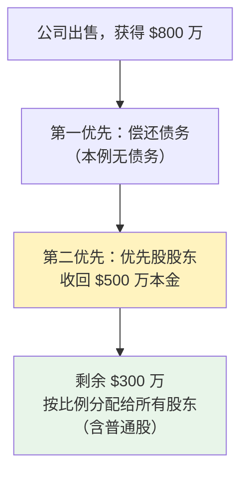

如果公司只卖了 **$300 万**：

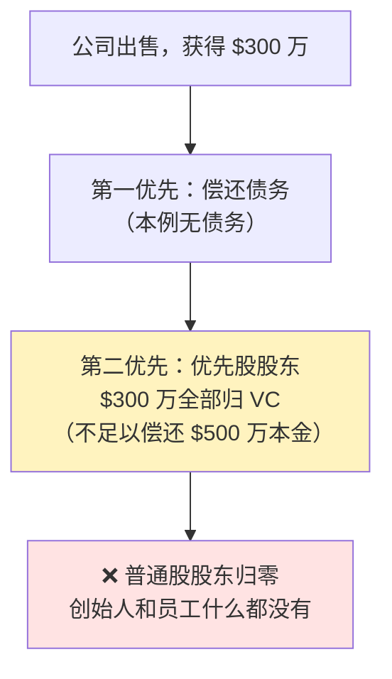

这就是为什么"公司估值 $1 亿、你持股 10%"不等于"公司卖掉你拿 $1000 万"——**优先股先分，普通股分剩下的**。很多初创公司卖掉后，VC 拿回本金，创始人和员工却所得甚微，就是这个原因。

> **关键区别**：A 股和美股港股的**上市公司**通常只有普通股，优先股主要存在于**上市前的一级市场融资轮次**。公司 IPO 时，优先股通常会自动转换为普通股。

### 2.6 双重股权结构：持股比例 ≠ 控制权

前面讲到稀释——创始人每融一轮资，持股比例就下降一点。那么多轮稀释之后，创始人持股可能只剩 15%，公司还是他说了算吗？

答案：**靠 AB 股结构（Dual-class Share Structure）**。

#### 投票权和经济权可以分离

公司可以发行两类股票：

- **A 类股（Class A）**：1 股 1 票，通常卖给外部投资者和公众
- **B 类股（Class B）**：1 股 10 票（或更多），由创始人持有

这样即使创始人经济持股比例很低，投票权却可以牢牢超过 50%。

#### 具体数字示例

| 股东类型 | 持股比例 | 每股投票权 | 实际投票权比例 |
|---|---|---|---|
| 创始人（B 类股） | 15% | 10 票/股 | **约 64%** |
| 机构投资者（A 类股） | 50% | 1 票/股 | 约 21% |
| 公众散户（A 类股） | 35% | 1 票/股 | 约 15% |

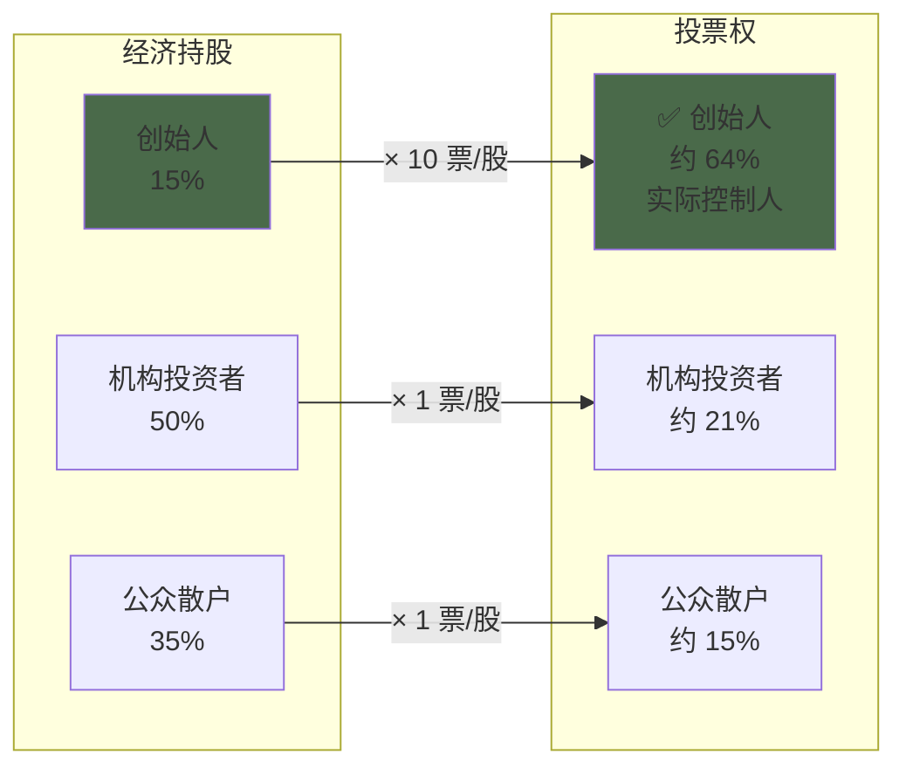

#### 哪些公司在用

Google（Alphabet）、Meta、阿里巴巴、滴滴在 IPO 时均采用双重股权结构，确保创始人在引入外部资本后仍然保持对公司战略的控制权。

这也是投资者买入这类公司股票时需要注意的：**你的投票权相对于你的经济利益而言微乎其微**，公司重大决策基本由创始人决定。

---

## 三、用 Steam 皮肤市场做类比

首先明确两个核心概念：

- **一级市场**：公司直接向投资者**发行新股**的市场，钱从投资者流向公司，股票从无到有被创造出来；
- **二级市场**：投资者之间**互相买卖**已有股票的市场，公司不参与，也拿不到钱。

下面用 Steam 皮肤市场做类比，把这两个概念和其他角色一次性对应起来。

| 金融市场 | Steam 皮肤市场 | 角色 |
|---|---|---|
| **上市公司** | **V社（Valve）** | 创造并出售资产 |
| **股票** | **皮肤/武器箱/饰品** | 被交易的标的 |
| **一级市场** | **V社官方商店/开箱/活动首次销售** | V社卖新皮肤，钱进 V社口袋 |
| **二级市场** | **Steam 社区市场 / 网易 Buff / C5** | 用户之间交易 |
| **交易所/官方撮合平台** | **Steam 社区市场** | 提供集中交易场所 |
| **券商/第三方交易平台** | **网易 Buff / C5** | 代客交易、收手续费 |
| **投资者/散户** | **玩家** | 买卖皮肤/股票 |

### 为什么这个类比有效？

1. **V社官方卖新皮肤 = 公司 IPO 发行新股**
   - 皮肤之前不存在；V社拿到钱；市场上皮肤总量增加。
2. **玩家在社区市场交易 = 二级市场买卖股票**
   - 皮肤已经存在；V社拿不到钱（只收手续费）；价格由供需决定。
3. **Steam/Buff 收手续费 = 券商/交易所赚佣金**
   - 它们不创造皮肤，只撮合交易。

### 类比的不完美之处

| 金融市场 | Steam 皮肤市场 | 差异 |
|---|---|---|
| 股票代表公司所有权 | 皮肤只是虚拟道具 | 股票有分红权、投票权 |
| 股票总数受限 | V社可无限发行皮肤 | 公司授权股本有限 |
| 受 SEC/证监会监管 | V社自定规则 | 股票发行需审批 |
| 价值靠公司盈利 | 价值靠稀缺性和外观 | 基本面驱动不同 |

所以这个类比适合理解**交易结构**，不适合理解**权益属性**。

---

## 四、IPO 链条上都有谁？

一次典型的 IPO 涉及多个角色，它们的位置和关系可以用下图表示。

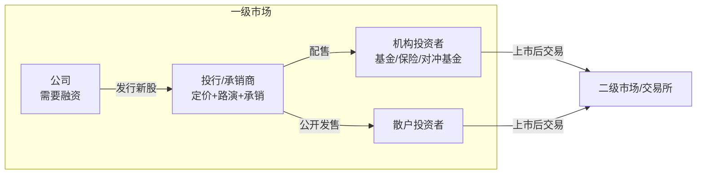

### 4.1 各角色职责

| 角色 | 职责 | 常见例子 |
|---|---|---|
| **公司** | 决定融资规模、资金用途，配合尽职调查 | 滴滴、苹果、腾讯 |
| **投行/承销商** | 帮助定价、撰写招股书、路演、把股票卖给投资者 | 高盛、摩根士丹利、中金公司 |
| **机构投资者** | IPO 主要买家，大额认购 | 贝莱德、先锋基金、软银愿景基金 |
| **散户投资者** | 通过券商参与公开发售，通常份额很少 | 你我这样的普通股民 |
| **交易所** | 提供上市后的交易场所 | 纽交所、纳斯达克、港交所 |
| **券商** | 帮投资者下单，收取佣金 | 富途、盈透、Robinhood、中信证券 |

### 4.2 承销商的两种模式

| 承销方式 | 含义 | 认购不足时 |
|---|---|---|
| **包销（Firm Commitment）** | 投行先买下全部股票，再卖给市场 | 投行自己兜底 |
| **代销（Best Efforts）** | 投行尽力卖，卖不完拉倒 | 发行可能失败 |

大型 IPO 基本都是包销，所以投行会拼命做路演、找机构买家，避免自己被套。

### 4.3 超额配售权（Greenshoe Option）：IPO 后如何稳价

你可能听说过"某公司 IPO 首日破发"。为了防止这种情况，大型 IPO 几乎都会附加一个叫做**超额配售权（Greenshoe Option，也叫绿鞋机制）**的稳价工具。

#### 机制原理

IPO 时，承销商实际向市场销售的股票数量，比公司计划发行量**多出约 15%**。这 15% 叫做"超额配售"，承销商相当于"借"了这些股票来卖。

上市后，根据股价走势，承销商有两种处理方式：

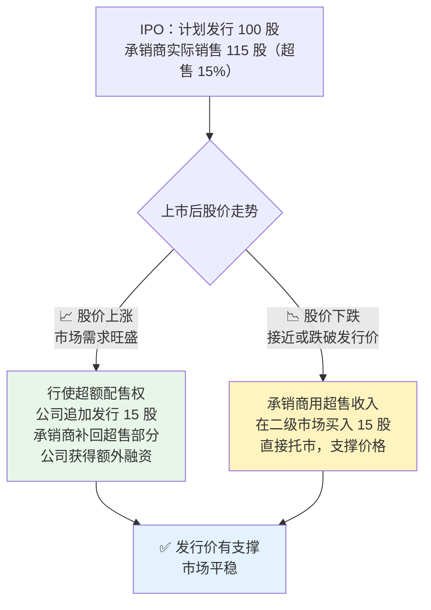

**关键点**：无论股价涨跌，承销商都能从容应对——涨了就追加发行多赚一笔，跌了就用手里的钱托市。这就是为什么大型 IPO 上市后通常不会立刻暴跌。

### 4.4 锁定期（Lock-up Period）：内部人禁售窗口

IPO 后，公司的创始人、高管、早期员工、VC 机构并不能立刻卖出手中的股票。他们需要遵守一段**锁定期（Lock-up Period）**，通常为 **90–180 天**。

#### 为什么需要锁定期？

- 防止内部人 IPO 当天就大量抛售，引发市场恐慌；
- 向市场传递信号：内部人相信公司长期价值，愿意继续持有；
- 保护参与 IPO 的投资者，避免立刻被"接盘"。

#### 锁定期到期的风险

```mermaid
flowchart LR
    A(["📅 Day 0\nIPO 挂牌\n开始交易"]) --> B["🔒 锁定期\n90–180 天\n内部人禁止出售"]
    B --> C(["📅 Day ~180\n锁定期到期"])
    C --> D["📉 大股东可集中减持\n市场常出现抛压\n股价往往承压下跌"]

    style A fill:#4a4a6a
    style C fill:#6a4a4a
    style D fill:#ffe3e3
```

锁定期到期日是散户需要特别关注的时间节点。滴滴 IPO 于 2021 年 6 月 30 日，锁定期到期约在 2021 年 12 月底——但彼时滴滴已在监管风暴中，这一机制对它而言并不是主要矛盾。

### 4.5 券商、交易所与中央存管机构的区别

很多人容易把券商和交易所混为一谈。它们其实是完全不同的角色。

| 角色 | 服务对象 | 核心功能 | 典型例子 |
|---|---|---|---|
| **券商（Broker）** | 投资者 | 代客买卖、托管股票、提供交易软件 | 美股：Charles Schwab、Fidelity、盈透、Robinhood；港股：富途、老虎；A 股：中信证券、华泰证券 |
| **交易所（Exchange）** | 券商、机构、上市公司 | 提供交易场所、撮合买卖、制定上市规则 | 美股：纽交所（NYSE）、纳斯达克（NASDAQ）；港股：港交所（HKEX）；A 股：上交所、深交所 |
| **中央存管机构** | 券商、银行等机构 | 登记股票所有权、保管证券 | 美国：DTC（Depository Trust Company）；中国：中证登（CSDC）；香港：香港中央结算有限公司（HKSCC） |
| **清算机构** | 券商 | 确保交易最终交割 | 美国：NSCC（National Securities Clearing Corporation）；中国：中证登；香港：香港结算所 |

散户投资者**只直接面对券商**，不直接面对交易所和存管机构。

#### 一次完整交易的全流程

两张图互补：结构图看层次和角色，时序图看动作先后。

**层次结构图**（实线 = 主动发起，虚线 = 响应/通知）

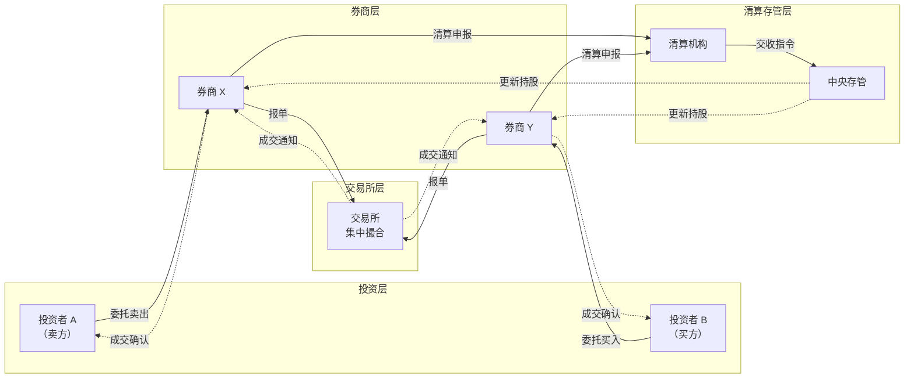

**时序交互图**（看清每一步动作的先后顺序）

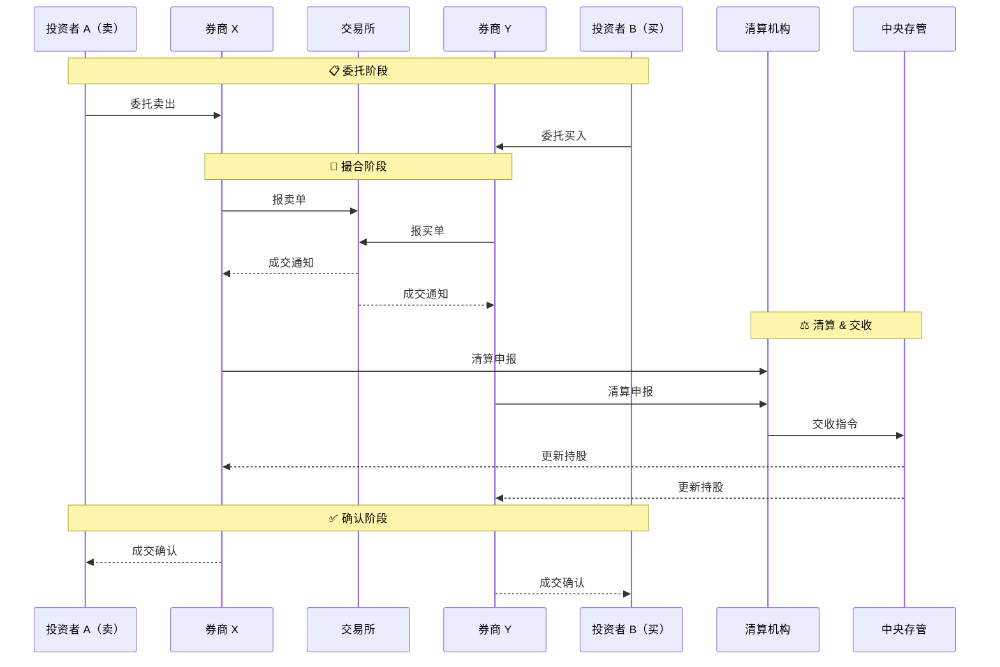

#### 房产交易类比

| 股票市场 | 房产市场 |
|---|---|
| 投资者 | 买房人 / 卖房人 |
| 券商 | **房产中介** |
| 交易所 | **房产交易中心** |
| 中央存管机构 | **房管局/不动产登记中心** |
| 股票 | 房子 |

交易过程也类似：

1. 你找中介（券商）说想买某小区房子（股票）；
2. 中介带你去交易中心（交易所）和卖家谈价；
3. 成交后，房管局（中央存管机构）更新房产证；
4. 中介把钥匙和房产证交给你。

所以：

> **券商是房产中介，帮你买卖、托管、跑腿；交易所是房产交易中心，提供场所、撮合交易、定规则。**

---

## 五、公司如何定价？估值与股本

### 5.1 公司估值怎么来

公司价值不是称出来的，是估出来的。常用方法有三种：

1. **可比公司法（Comps）**
   - 找同行业上市公司，看市盈率（P/E）、市销率（P/S）、市净率（P/B）等倍数；
   - 例如某出行平台 IPO 时会参考 Uber、Lyft、Grab 的估值倍数。

2. **DCF 现金流折现法**
   - 预测公司未来 5–10 年自由现金流，折现到现在；
   - 适合高增长但暂时不盈利的公司。

3. **先例交易法（Precedent Transactions）**
   - 看类似公司最近被收购或融资时的估值。

### 5.2 每股价值 = 估值 ÷ 完全稀释股本

假设投行认为公司价值 **$10 亿**，完全稀释股本 **1 亿股**，则：

> 每股理论价值 = $10 亿 ÷ 1 亿股 = **$10/股**

但 IPO 发行价不一定等于 $10：

- 市场冷淡时，可能打折到 $8；
- 市场狂热时，可能溢价到 $12；
- 这就是发行价与市场价的区别。

### 5.3 发行价 vs 市场价

- **发行价**：IPO 时公司和投行定的初始价格；
- **市场价**：上市后由买卖双方实时撮合形成的价格。

> 公司可以决定"卖多少钱一股"，但卖完之后股票在二级市场值多少钱，是市场说了算。

如果发行价高于市场认可的价格，就会出现 **破发**（上市后股价跌破发行价）。

---

## 六、融资、增发与回购：稀释与价值变化

### 6.1 股权稀释

每次发行新股，老股东的持股比例都会被摊薄。现实中的公司通常经历多轮融资，股权稀释是逐步发生的：

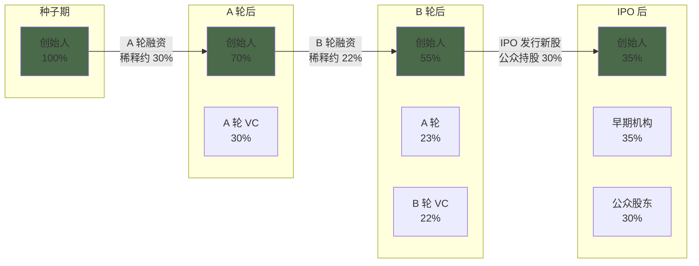

| 阶段 | 总股本 | 创始人持股 | 持股比例 |
|---|---|---|---|
| 初始 | 100 股 | 100 股 | 100% |
| 增发 100 股（A 轮） | 200 股 | 100 股 | 50% |
| 再增发 200 股（B 轮） | 400 股 | 100 股 | 25% |

### 6.2 稀释不一定是坏事

如果融到的钱能创造更高价值，老股东虽然持股比例下降，但持股总价值可能上升。

例如：公司估值 $100，创始人 100 股。增发 100 股融资 $100，公司用这笔钱把估值做到 $300。创始人持股比例从 100% 降到 50%，但持股价值从 $100 涨到 $150。

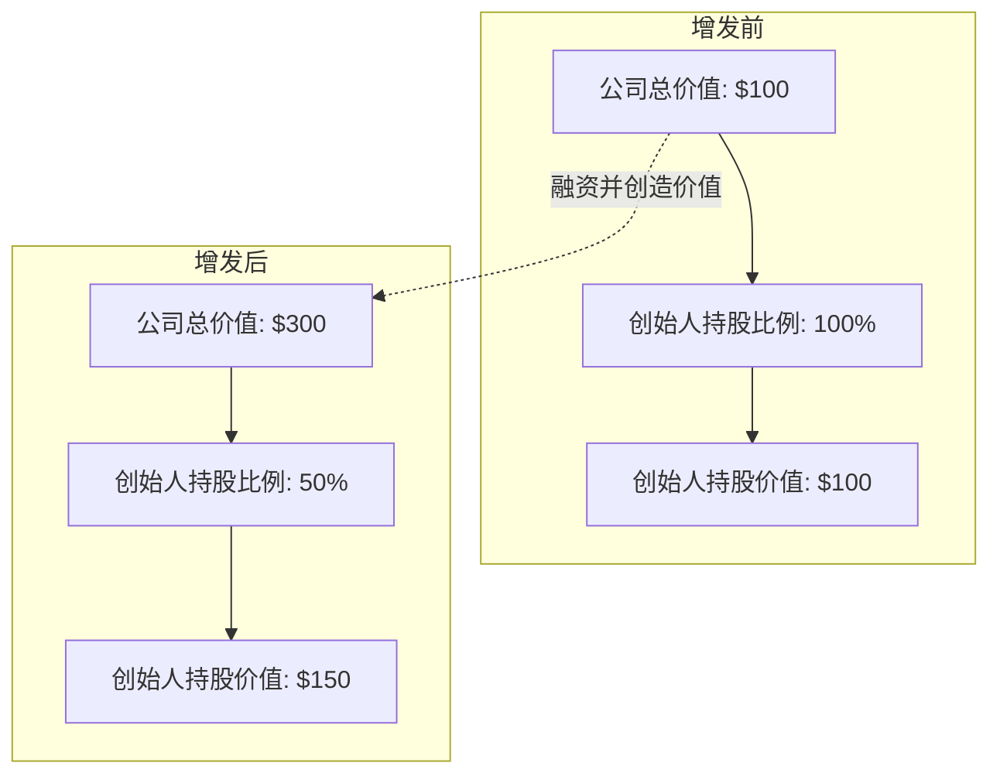

### 6.3 回购是反向操作

公司用现金从市场买回股票，通常注销，总股本减少。

假设公司市值 $100，100 股，每股 $1，账上现金 $30。公司花 $10 回购 10 股：

注：**企业价值（EV，Enterprise Value）= 市值 + 债务 - 现金**，衡量收购整个公司的实际代价。本例假设无债务，故 EV = 市值 - 现金 = $70。

| 项目 | 回购前 | 回购后 |
|---|---|---|
| 总股本 | 100 股 | 90 股 |
| 现金 | $30 | $20 |
| 市值 | $100 | $90 |
| 企业价值 EV | $70 | $70 |
| 每股价格 | $1 | $1 |

回购后：

- 总股本减少 ✅
- 股权市值下降 ✅
- 企业价值 EV 不变 ⚠️
- 每股价值理论上不变 ⚠️

但现实中回购往往推高股价，因为：

1. 向市场传递"管理层认为股价被低估"的信号；
2. 流通股减少，每股收益（EPS）提升；
3. 避免现金闲置，提高资本效率。

### 6.4 分红：持股的另一种收益

持有股票可以获得两种类型的回报：

- **资本增值**：股价上涨，卖出时赚差价；
- **分红（Dividends）**：公司将部分利润以现金形式直接发给股东。

#### 不是所有公司都分红

| 类型 | 代表公司 | 分红策略 | 原因 |
|---|---|---|---|
| **成熟型公司** | 可口可乐、工商银行、中国电信 | 定期分红，股息率稳定 | 增长空间有限，现金充裕 |
| **高增长科技公司** | 亚马逊、谷歌、滴滴 | 不分红 | 利润优先用于再投资，维持高增长 |
| **过渡期公司** | 苹果、微软 | 少量分红 + 大量回购 | 已成熟但保持弹性 |

#### 分红 vs 回购：两种还钱方式

| 对比项 | **分红** | **回购** |
|---|---|---|
| 方式 | 公司直接向股东发现金 | 公司从市场买回自己的股票 |
| 股东所得 | 直接拿到现金 | 持股比例上升，每股更值钱 |
| 税务（美国） | 立刻按股息税率征税 | 卖出时才按资本利得税率征税 |
| 弹性 | 减少分红信号很负面 | 回购可随时停止，更灵活 |
| 常见于 | 成熟、稳定的传统公司 | 高增长科技公司 |

> **苹果公司的选择**：苹果从 2012 年重启分红，同时进行大规模回购（年均超 $800 亿）。这既安抚了希望获得现金回报的机构投资者，又通过回购提升了每股价值，兼顾了两类股东的需求。

#### 除息日（Ex-dividend Date）

如果公司宣布分红，有一个关键日期：**除息日（Ex-dividend Date）**。只有在除息日**之前**持有股票的股东，才能获得这次分红。除息日当天，股价通常会下跌约等于分红金额的幅度——因为这部分价值已经"派出去"了，不再体现在股价里。

---

## 七、证券品种与跨市场交易

### 7.1 股票、证券与上市证券

日常口语里，我们把在交易所买卖的东西都叫"股票"。但严格来说，"股票"只是"证券"的一种，而"上市证券"又比"股票"更具体。

| 术语 | 含义 | 例子 |
|---|---|---|
| **证券（Security）** | 可交易金融工具的统称 | 股票、债券、期权、存托凭证 |
| **股票（Stock / Share）** | 证券的一种，代表公司所有权 | 普通股、优先股 |
| **上市证券（Listed Security）** | 在某个交易所挂牌的具体证券 | 纽交所的 DIDI、港股的 9988.HK |

所以：

> **"股票"是统称。严格来说，你在不同市场买卖的是不同的"上市证券"。它们可能代表同一家公司的同一种底层权益，但法律形式、交易场所、代码、货币都可能不同。**

### 7.2 ADR/ADS：让外国股票像本地股票一样交易

很多中概股在美国交易的不是普通股，而是 **ADR（American Depositary Receipt，美国存托凭证）** 或 **ADS（American Depositary Shares，美国存托股份）**。

#### ADR 的本质是"代持凭证"

想象你想投资一套**美国纽约的公寓**，但你自己没法去美国办手续。于是你找了一家**信托公司**：

- 信托公司在美国买下公寓，房产证写在信托公司名下；
- 信托公司给你一张凭证，证明你拥有这套公寓的权益；
- 你可以在中国把这张凭证卖给其他人。

**这张凭证就是 ADR。**

#### 具体机制

以阿里巴巴为例：

| 市场 | 代码 | 证券类型 | 说明 |
|---|---|---|---|
| 香港 | **9988.HK** | 普通股 | 阿里巴巴真正的上市股票 |
| 美国 | **BABA** | ADR | 美国存托银行发行的代持凭证 |

流程：

1. 摩根大通在香港市场买入 9988.HK 普通股；
2. 把这些普通股"存起来"；
3. 在美国发行对应的 BABA ADR；
4. 美国投资者买 BABA，实际上是间接持有底层的港股普通股。

通常 **1 股 BABA ADR = 8 股 9988.HK 普通股**。BABA 的价格会和 9988.HK 按汇率和比例联动。

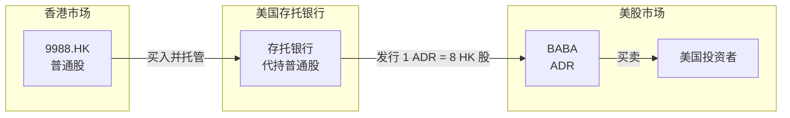

#### 为什么要有 ADR？

| 问题 | ADR 解决方式 |
|---|---|
| 美国投资者想买中国公司 | 不用开港股账户，直接在美国买 |
| 交易货币不同 | ADR 用美元交易 |
| 交易时间不同 | ADR 按美股时间交易 |
| 法律管辖不同 | ADR 在美国监管框架下 |

#### ADR 的底层股份来自哪里？

ADR 的底层不一定是港股普通股，它可以是任何外国公司的普通股。

| 公司 | 注册地 | 在美国交易的证券 | 底层股份来源 |
|---|---|---|---|
| **阿里巴巴** | 开曼群岛 | BABA（ADR） | 港股 9988.HK 普通股（因为阿里同时在港股上市） |
| **滴滴** | 开曼群岛 | DIDIY（ADS/ADR） | 开曼群岛公司普通股（滴滴没有港股） |
| **拼多多** | 开曼群岛 | PDD（ADR） | 开曼群岛公司普通股 |
| **蔚来** | 开曼群岛 | NIO（ADR） | 开曼群岛公司普通股 |

大多数中概股的典型结构是：

1. **在中国境内有运营实体**（真正做生意的公司）；
2. **在开曼群岛/BVI 设立上市主体**（壳公司）；
3. 通过 **VIE 架构** 把境内利润转移到境外上市主体；
4. 在美国发行 **ADR/ADS**，代表开曼上市主体的普通股。

> **VIE 架构（Variable Interest Entity，可变利益实体）**：中国法规限制外资直接持有互联网、教育等行业的中国公司股权。为了既能在境外上市融资、又能在中国合规经营，中概股普遍采用 VIE 架构——境外上市主体（开曼公司）不直接持有中国运营公司的股权，而是通过一系列合同协议在经济上"控制"它，让境内利润可以流向境外。因此，投资者买 DIDIY、PDD 等，持有的是对合同权益的控制，而非境内运营公司的直接股权。

所以，你买 DIDIY、PDD、NIO，本质上持有的是**开曼群岛注册公司的股份**，不是中国境内运营公司的直接股权。

> **阿里巴巴是特例**：它同时在港股上市，所以美股 BABA 的底层是港股普通股。**滴滴才是更典型的中概股**：注册在开曼群岛，没有港股，美股/OTC 交易的 ADS 底层就是开曼公司普通股。

### 7.3 双重上市与二次上市：股本不是被切分，而是动态"抽水"

一家公司可以在多个市场上市，常见两种形式：

| 形式 | 说明 | 例子 |
|---|---|---|
| **双重主要上市（Dual Primary Listing）** | 两个市场都是"主要上市地"，公司同时满足两地监管 | 阿里巴巴港股 |
| **二次上市（Secondary Listing）** | 一个主要上市地，一个第二上市地 | 早期阿里巴巴只在美股上市，后在港股二次上市 |

#### 股本不是被"切分"

很多人误以为：公司把 1/3 股票放港股，2/3 股票放美股。

实际上：

> **公司只有一个总股本池子。存托银行可以根据市场需求，把普通股从香港"借走"包装成 ADR 在美国交易，也可以反向注销把普通股还回去。**

#### 用"两个连通水池"比喻

想象公司总股本是一池水，存托银行把这一池水分到两个连通的水池里：

- **水池 A = 港股市场**：里面流动的是普通股；
- **水池 B = 美股 ADR 市场**：里面流动的是 ADR；
- **存托银行 = 控制水闸的调度员**：负责把水从一个池子调到另一个池子。

当美股需求旺时，存托银行打开水闸，把一部分普通股从港股池子抽到美国池子，包装成 ADR（创建 ADR）；
当美股需求弱时，再把一部分 ADR 注销，水回流到港股池子（注销 ADR）。

**两个水池里的水加起来，始终等于原来那一池水的总量。同一时刻，一股普通股要么在港股池子里流通，要么被调到美股池子里包装成 ADR，不能同时在两个地方流通。**

### 7.4 为什么代码看起来"绑定"交易所？

虽然底层权益不绑定交易所，但**上市证券的代码确实由交易所分配**，只在那个交易所有效：

| 交易所 | 代码形式 | 例子 |
|---|---|---|
| 纽交所 | 英文字母 | BABA、DIDI |
| 纳斯达克 | 英文字母 | AAPL、TSLA、MSFT |
| 港交所 | 数字 | 0700、9988 |
| 上交所 | 数字 | 600519 |

所以：

- 某中概股在纽交所上市时代码为 **XXX**；
- 退市后，这个代码在纽交所被撤销；
- 股权转到 OTC 市场，重新以 **XXX.PK** 或 **XXX.Y** 代码交易；
- 底层权益没变，只是"上市证券的身份标识"变了。

---

## 八、退市与 OTC 粉单市场

### 8.1 退市的类型与三种命运

退市分为**主动退市**和**被动退市**，两者性质差异很大：

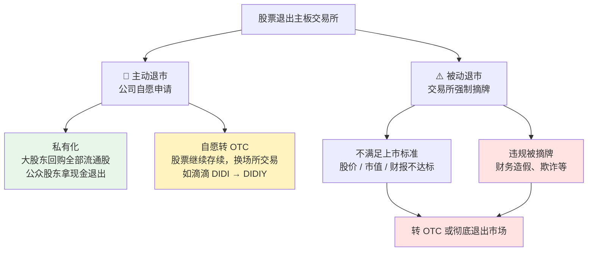

退市后股票的三种最终命运：

| 情况 | 含义 | 股票还能交易吗 |
|---|---|---|
| **破产清算** | 公司资不抵债，进入破产程序 | 不能，股东基本归零 |
| **私有化** | 公司/大股东回购所有流通股 | 不能，股东拿钱走人 |
| **摘牌转 OTC** | 从交易所退市，转到场外市场 | **能**，在粉单市场交易 |

很多中概股属于第三种：从纽交所退市后，股票代码从主板代码变成 OTC（Over-the-Counter，场外交易）代码，在 OTC Pink 继续交易。

> **滴滴属于主动退市**：不是因为不符合纽交所上市标准被踢出去，而是在监管压力下主动申请摘牌。这和因财务造假被强制退市的公司有本质区别，公司仍在正常经营。

### 8.2 粉单市场（OTC）是什么？

严格来说，粉单市场不是"交易所"，而是**场外市场**——没有集中撮合，而是由分散的做市商网络提供双边报价。但日常理解中，你可以把它当成一个**低阶交易所**，因为它确实承担了交易撮合功能。

#### 做市商（Market Maker）：OTC 的核心机制

正规交易所用**订单簿（Order Book）**撮合：所有买单和卖单集中在一个系统里，自动按价格优先原则匹配成交，你的买单可以直接对接别人的卖单。

OTC 市场没有统一订单簿。**做市商**是一些持续为特定股票"提供流动性"的机构，它们同时报出两个价格：

- **买价（Bid）**：做市商愿意以这个价格**买入**你的股票；
- **卖价（Ask）**：做市商愿意以这个价格**卖给**你股票。

```mermaid
flowchart LR
    A["你想卖出\n1 股 DIDIY"] -->|"只能以 Bid 价\n例如 $3.45 成交"| M["做市商"]
    B["你想买入\n1 股 DIDIY"] -->|"只能以 Ask 价\n例如 $3.65 成交"| M
    M --> S["买卖价差（Spread）\n= $3.65 − $3.45 = $0.20\n做市商的利润\n= 你的隐性交易成本"]

    style M fill:#4a4a6a
    style S fill:#fff3bf
```

在 OTC Pink 市场，做市商数量少，每次交易量也小，**买卖价差可能高达 5–10%**。这意味着你买入股票的瞬间，账面就已经亏损了 5–10%——不是因为股价下跌，只是因为你必须付出这个价差成本。这是 OTC 市场"流动性差"最直接的体现。

#### 正规交易所 vs 粉单市场

| 对比项 | 正规交易所 | 粉单市场 |
|---|---|---|
| 例子 | 纽交所、纳斯达克、港交所 | OTC Markets Group 运营的 OTCQX / OTCQB / Pink |
| 撮合机制 | 集中订单簿，自动撮合 | 分散的做市商网络双边报价 |
| 上市标准 | 严格（盈利、市值、治理等） | 几乎没有 |
| 信息披露 | 强制季报/年报 | 基本不强制 |
| 监管 | SEC/证监会直接监管 | 自律为主，监管较松 |
| 买卖价差 | 通常极小（分钱级别） | 可高达 5–10% |
| 投资者保护 | 强 | 弱 |

OTC 市场内部也分三个层级，监管和信息披露要求递减：

| 层级 | 类比 | 披露要求 | 典型公司 |
|---|---|---|---|
| 纽交所 / 纳斯达克 / 港交所 | 山姆会员店 / 高端商超 | — | 大型上市公司 |
| OTCQX | 精品生鲜店 | 最高 | 大型外国公司（如部分欧洲知名企业） |
| OTCQB | 普通菜市场 | 中等 | 小型成长公司 |
| **OTC Pink 粉单市场** | **野生大集 / 夜市地摊** | **基本不强制** | **退市公司、低价股、壳公司** |

### 8.3 为什么退市后还能交易？

> **退市只是从交易所摘牌，不等于公司破产或股票消失。**

公司仍然存续、仍然经营、仍然有股东和股票。股票只是换了一个监管更松、流动性更差的场所继续交易。

### 8.4 退市后股票怎么处理？

很多投资者会误以为：退市后要去粉单市场开个新账户，把股票转过去。

**其实通常不需要。**

以某中概股为例：

| 阶段 | 你的券商账户显示 |
|---|---|
| 退市前 | XXX，100 股 |
| 退市后 | 自动变为 XXX.PK / XXX.Y，100 股 |

因为：

- 股票本身没有消失；
- 只是交易场所从纽交所变成了 OTC Pink；
- 你的券商会收到通知，自动帮你把代码从 DIDI 改成 DIDIY；
- 持仓数量不变。

只有当你的券商**不支持 OTC 交易**时，你才需要把持仓转移到支持 OTC 的券商。

### 8.5 粉单市场的风险

- 流动性差，买卖价差大（见 8.2 节做市商说明）；
- 信息披露弱，财务数据难以核实；
- 容易被坐庄操纵（低价、低市值、无监管）；
- 机构参与度低，估值普遍折价；
- 部分券商（如 Robinhood）不支持 OTC 交易。

---

## 九、完整案例：滴滴的生命周期

把前面的知识串起来，看看滴滴从成立到退市再到 OTC 的完整路径。

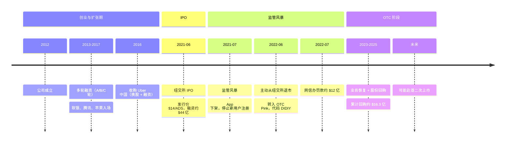

### 9.1 融资阶段：股权不断稀释

滴滴从 2012 年成立到 IPO，经历了多轮融资。每次融资都发行新股，创始人股权被不断稀释。

| 阶段 | 主要投资人 | 作用 |
|---|---|---|
| 天使/A 轮 | 王刚、腾讯等 | 早期扩张 |
| B/C 轮 | 阿里、软银等 | 补贴大战 |
| 2016 年 | 苹果等 | 收购 Uber 中国 |
| 2017 年 | 软银 | 巨额融资，估值 $560 亿 |

### 9.2 IPO：融资与部分老股转让

2021 年 6 月 30 日，滴滴在纽交所 IPO：

- 发行价 **$14/ADS**；
- 发行约 **3.17 亿股 ADS**；
- 融资总额约 **$44.4 亿**。

其中：

- 约 **$40 亿** 来自公司发行新股，进入滴滴公司账户；
- 约 **$4.4 亿** 来自老股东出售老股，进入老股东口袋。

创始人程维、柳青在 IPO 时没有大规模套现，因为：

1. 有 6–12 个月锁定期；
2. 创始人大量减持会被市场解读为不看好公司；
3. 当时股价还有上涨预期。

### 9.3 监管风暴与退市

IPO 后仅两天，中国网络安全审查办公室对滴滴启动审查：

- 2021 年 7 月：滴滴 App 下架，停止新用户注册；
- 2022 年 6 月：滴滴从纽交所退市；
- 2022 年 7 月：网信办罚款约 **$12 亿**。

滴滴没有选择私有化退市，原因是：

- 私有化需要巨额现金回购流通股；
- 当时滴滴账上现金要用于业务恢复和国际扩张；
- 转 OTC 是最低成本、最保留选项的方案。

#### 为什么退市了还能在 OTC 交易？

这是很多人的直觉困惑：既然中国政府不让滴滴在美国上市，为什么退到粉单市场就可以了？

**核心区别不在于"美国人能不能看到滴滴的财务数据"，而在于美国监管机构对滴滴负有哪些法定强制权力。**

正式上市公司在纽交所挂牌，意味着持续承担两类法律义务：

1. **向 SEC 强制披露**：必须定期提交 20-F（年报）、6-K（中期报告）等文件，格式和内容均由 SEC 规定；
2. **接受 PCAOB 审计底稿核查**：PCAOB（美国上市公司会计监督委员会）有权核查审计师的工作底稿。底稿里不只有财务数字，还可能涉及路径数据、用户行为、运营合同等敏感信息。

第二条是监管矛盾的核心。中国政府担心的正是这条通道——美方通过合法程序强制要求审查底稿，等于给了美国监管机构一把可能触及中国公民数据的钥匙。网信办在滴滴 IPO 后两天就启动审查，正是因为滴滴绕过网络安全审查直接上市，触了这条红线。

相比之下，在 OTC Pink 交易的公司没有上述法定义务：

| | 纽交所上市 | OTC Pink 交易 |
|---|---|---|
| 向美国公众主动募资 | ✅ | ❌（存量股东之间交易） |
| SEC 强制信息披露 | ✅ | ❌（不强制） |
| PCAOB 审计底稿核查 | ✅ | ❌（不强制） |

退市切断了这些法定强制权力的制度通道。至于滴滴现在仍然定期发布财报，那是**主动选择**（维系股东信心、为港股上市铺路），不是法律义务——主动公开利润数字，和被迫接受审计底稿核查，是两件完全不同的事。

### 9.4 OTC 阶段：DIDIY

退市后，滴滴股票在 OTC Pink 市场交易，代码 **DIDIY**。

截至 2026 年中：

- 股价约 **$3.50–$3.60**；
- 市值约 **$160 亿美元**；
- 52 周区间 **$3.35–$6.99**；
- 分析师目标价平均约 **$6.06**；
- 2025 年全年营收 RMB 2267 亿，净利润 RMB 10 亿；
- 2023–2025 年累计回购约 **$16.3 亿美元**。

### 9.5 未来：港股二次上市是最可能路径

滴滴未来最可能的路径是**赴港二次上市**。

**为什么港股合理？**

- 香港是中国公司熟悉的资本市场；
- 国际投资者可以自由参与；
- 允许 VIE 架构；
- 符合中概股"回归亚洲"的趋势。

**障碍是什么？**

- **数据安全审查**：网信办的审查是否彻底通过仍是未知数；
- **美股股东集体诉讼（Securities Class Action）**：滴滴 IPO 后因信息披露问题，遭到多起证券集体诉讼——美国法律允许在 IPO 前后因信息虚假陈述而受损的投资者，联合起诉公司。投资者主张滴滴在 IPO 时未充分披露即将到来的监管风险，导致他们以虚高价格买入。这类诉讼通常需要以数亿美元的和解金了结，是港股上市前必须处理的法律障碍；
- **公司治理与合规整改**：监管要求完成内部整改；
- **港股市场环境**：港股整体流动性和估值倍数偏低。

如果成功回港，DIDIY 的估值折价有望修复，流动性和机构参与度都会大幅提升。

---

## 十、总结

1. **股票是公司所有权的切片**。发行新股是公司融资，老股转让是股东套现。
2. **普通股 vs 优先股**：VC/PE 拿的通常是优先股，清算时优先分钱；创始人和员工持有的普通股排在最后。公司 IPO 时优先股通常自动转为普通股。
3. **双重股权结构（AB 股）**：投票权和经济权可以分离，创始人以少量股份持有多数投票权，稀释之后仍可控制公司。
4. **一级市场**是公司"生"股票、卖股票、拿钱的地方；**二级市场**是投资者之间互相买卖的地方。
5. **IPO 定价**由公司估值和完全稀释股本决定，但发行价会根据市场情绪浮动；上市后股价由二级市场供需决定。超额配售权（Greenshoe）是大型 IPO 稳定价格的核心机制。
6. **锁定期（90–180 天）**限制内部人在 IPO 后立刻减持；到期日常伴随集中抛压，是散户需关注的时间节点。
7. **增发会稀释老股东**，但如果融到的钱能创造更高价值，稀释未必是坏事；**回购**是反向操作，把现金返还给股东；**分红**是另一种返还方式，成熟公司更常用，高增长科技公司通常不分红。
8. **ADR/ADS 是代持凭证**，让外国公司股票可以像本地股票一样在另一个市场交易；中概股普遍通过 VIE 架构实现境外上市。
9. **退市分主动和被动**：私有化和自愿转 OTC 是主动退市，滴滴属于后者；财务造假被踢出是被动退市。退市不等于股票消失。
10. **粉单市场（OTC Pink）合法但风险高**：做市商制度导致买卖价差大，流动性远低于正规交易所，机构参与度低，估值普遍折价。
11. **滴滴最可能的未来是港股二次上市**，但需先解决美股集体诉讼和监管合规问题。

最后用 Steam 类比做收尾：

> **V社官方卖新皮肤是一级市场，玩家在 Steam 社区市场交易是二级市场，Steam 社区市场对应交易所，网易 Buff / C5 等第三方平台对应券商。公司发股票、IPO、退市、转 OTC，本质上都和皮肤市场的生产、流通、下架、转二手市场一样，只是股票背后还多了一层公司所有权和监管规则。**

---

**参考资料**

- [DiDi Global Inc. Fourth Quarter and Full Year 2025 Earnings Release](https://ir.didiglobal.com/static-files/893cd576-17a8-4e80-b158-0f2b44e131a2)
- [DiDi Global Inc. SEC Filings](https://ir.didiglobal.com/financials/sec-filings)
- [DiDi Global Inc. F-1 Registration Statement (IPO Prospectus, June 2021)](https://ir.didiglobal.com/static-files/65f45071-6c27-40ea-9825-bfc9b2f7f3f6)
- [Yahoo Finance: DIDIY Quote](https://sg.finance.yahoo.com/quote/DIDIY/)
- [财新：滴滴被罚 80.26 亿元及监管时间线](https://www.caixin.com/2024-05-19/102197978.html)
- [财新：滴滴 2022 年年报与退市后财务数据](https://www.caixin.com/2023-04-29/102041478.html)
- [中国新闻网：国家网信办对滴滴处以 80.26 亿元罚款及 16 项违法事实](https://www.chinanews.com/cj/2022/07-21/9808616.shtml)
