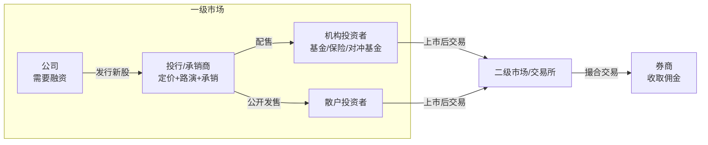
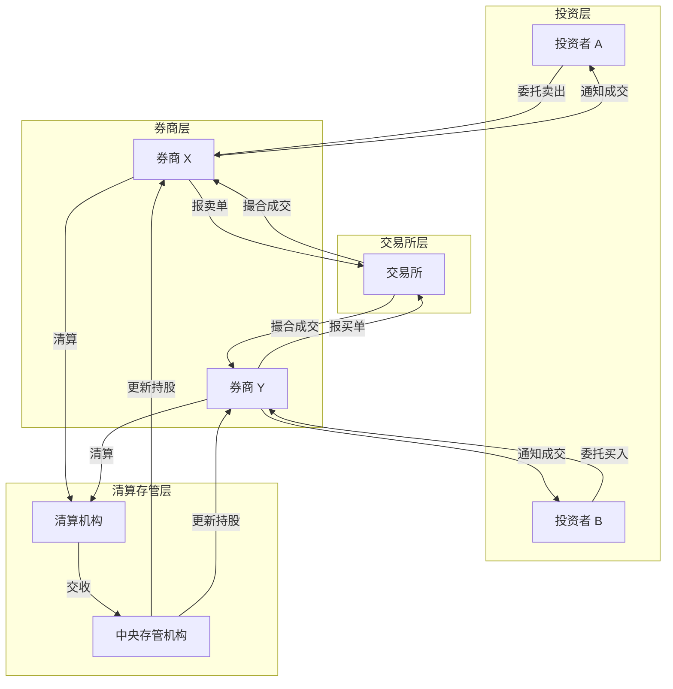
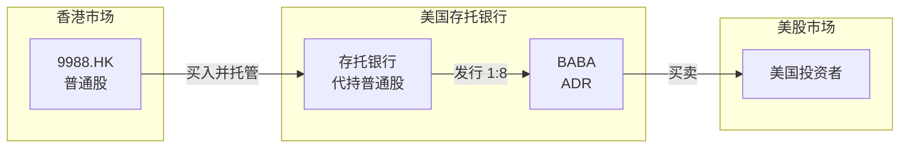
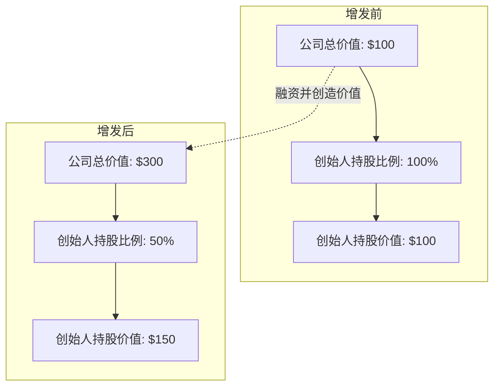

1. Table of Contents, ordered
{:toc}

## 一、引言

最近重新梳理了一遍资本市场的基础逻辑。越聊越发现，很多看似复杂的金融概念，其实都可以用一个更日常的场景来理解。

这篇文章尝试做三件事：

1. 从最基础的概念出发，讲清楚股票、股本、估值、IPO、增发、回购、退市、OTC 到底是什么；
2. 用 **Steam 皮肤交易市场** 做类比，把一级市场、二级市场、券商/交易所的角色对应起来；
3. 最后以一个真实的科技公司案例，串起一家公司从融资、上市、退市到粉单交易的生命周期。

**免责声明**：本文仅为金融知识科普，不构成任何投资建议。

---

## 二、股票的本质：公司所有权的“切片”

### 2.1 果园比喻

把一家公司想象成一片果园，里面种着苹果树。

- 公司成立时，果园里有 100 棵树，每一棵树就是一股股票；
- 谁持有股票，谁就拥有果园里相应比例的树木和果实；
- 如果公司总股本 100 股，你持有 10 股，你就拥有果园 10% 的权益。

#### 老股转让：树在不同人之间换主人

果园还是 100 棵树。你把 2 棵树卖给别人：

- 你：10 股 → 8 股；
- 朋友：0 股 → 2 股；
- 果园总树数：不变，还是 100 棵。

#### 增发新股：果园扩大，种下新树

公司需要资金扩张，于是种下 100 棵新树：

- 果园总树数：100 → 200 棵；
- 你：还是 10 股；
- 你的持股比例：10% → 5%。

你的树没有少，但果园变大了，你占的比例被稀释了。

#### 关键：增发后公司总价值会增加

这是很多人第一次接触股票时没理解的地方。看具体数字：

| 项目 | 增发前 | 增发后 |
|---|---|---|
| 公司总价值 | **100 元** | **200 元** |
| 总股本 | 100 股 | 200 股 |
| 每股价值 | 1 元 | 1 元 |
| 创始人持股 | 100 股 | 100 股 |
| 创始人持股比例 | 100% | 50% |
| 创始人持股价值 | 100 元 | 100 元 |
| 新投资人出资 | 0 | 100 元 |
| 新投资人持股 | 0 | 100 股 |

公司总价值从 100 元变成 200 元，**多出来的 100 元就是新投资人拿真金白银投进来的现金**。

所以：

> **发行新股 = 公司把果园扩大，把新种下的树卖给投资人，换来现金。公司总价值会增加，但老股东的股权比例会被稀释。**

这也是为什么它“有点像印钱”：公司似乎凭空多出了 100 元现金。但它和印钱的本质区别在于——这 100 元是投资人给的，对应着投资人拿到的 100 股新股。公司让渡了所有权，才换到了这笔钱，并不是凭空创造购买力。

### 2.2 授权股本、已发行股本与流通股

公司章程里会规定一个上限，叫 **Authorized Shares（授权股本）**，相当于果园“获批的果树总数上限”。公司可以分批种植（发行），但不能超过这个上限；超过就需要修改章程并经股东大会批准。

- **已发行股本（Issued Shares）**：公司已经实际发出去的股票；
- **流通股（Outstanding Shares）**：市场上实际流通、可以交易的股票；
- **完全稀释股本（Fully Diluted Shares）**：已发行股本 + 员工期权 + 限制性股票 + 可转债可能转股等未来会变成股票的部分。

IPO 定价时，真正要用的是 **完全稀释股本**，否则估值会被高估。

### 2.3 发行新股 vs 老股转让

很多初学者会混淆“发行股票”和“卖股票”。其实有两种完全不同的操作：

| 类型 | 俗称 | 谁卖 | 钱进谁口袋 | 总股本变不变 |
|---|---|---|---|---|
| **新股发行** | 一级市场、增发、IPO | 公司 | 公司账户 | **增加** |
| **老股转让** | 老股出售、大股东减持 | 创始人/老股东 | 股东个人口袋 | **不变** |

IPO 通常是公司发行新股融资，而不是创始人卖老股套现。如果 IPO 只是老股转让，公司自己拿不到钱，那就失去了上市融资的意义。

### 2.4 股票是虚拟的，但所有权有明确登记

股票没有实物，不像房子有房产证、黄金有金条。你持有股票，意味着你的名字（或你券商的名义）登记在**中央证券存管机构**的股东名册上。

| 国家/地区 | 中央存管机构 | 券商角色 |
|---|---|---|
| 美国 | **DTC（Depository Trust Company）** | 在 DTC 开总账户，代客持有 |
| 中国 | **中国证券登记结算公司（中证登）** | 在中证登开总账户，代客持有 |

散户通常不直接面对中央存管机构，而是通过券商间接持有。券商会在存管机构开一个“大账户”（Street Name），把所有客户的股票放在里面，再在你的个人账户里记录你持有多少。

所以：

> **证明你持有股票的方式，不是口袋里有一张纸，而是券商账户持仓 + 中央存管机构的登记记录。**

---

## 三、用 Steam 皮肤市场做类比

这个类比非常形象，也帮助我把一级市场、二级市场、券商/交易所的角色一次性讲清楚。

| 金融市场 | Steam 皮肤市场 | 角色 |
|---|---|---|
| **上市公司** | **V社（Valve）** | 创造并出售资产 |
| **股票** | **皮肤/武器箱/饰品** | 被交易的标的 |
| **一级市场** | **V社官方商店/开箱/活动首次销售** | V社卖新皮肤，钱进 V社口袋 |
| **二级市场** | **Steam 社区市场 / 网易 Buff / C5** | 用户之间交易 |
| **交易所/官方撮合平台** | **Steam 社区市场** | 提供集中交易场所 |
| **券商/第三方交易平台** | **网易 Buff / C5** | 代客交易、收手续费 |
| **投资者/散户** | **玩家** | 买卖皮肤/股票 |

### 为什么这个类比有效？

1. **V社官方卖新皮肤 = 公司 IPO 发行新股**
   - 皮肤之前不存在；V社拿到钱；市场上皮肤总量增加。
2. **玩家在社区市场交易 = 二级市场买卖股票**
   - 皮肤已经存在；V社拿不到钱（只收手续费）；价格由供需决定。
3. **Steam/Buff 收手续费 = 券商/交易所赚佣金**
   - 它们不创造皮肤，只撮合交易。

### 类比的不完美之处

| 金融市场 | Steam 皮肤市场 | 差异 |
|---|---|---|
| 股票代表公司所有权 | 皮肤只是虚拟道具 | 股票有分红权、投票权 |
| 股票总数受限 | V社可无限发行皮肤 | 公司授权股本有限 |
| 受 SEC/证监会监管 | V社自定规则 | 股票发行需审批 |
| 价值靠公司盈利 | 价值靠稀缺性和外观 | 基本面驱动不同 |

所以这个类比适合理解**交易结构**，不适合理解**权益属性**。

---

## 四、IPO 链条上都有谁？

一次典型的 IPO 涉及多个角色，它们的位置和关系可以用下图表示。

### 各角色职责

| 角色 | 职责 | 常见例子 |
|---|---|---|
| **公司** | 决定融资规模、资金用途，配合尽职调查 | 滴滴、苹果、腾讯 |
| **投行/承销商** | 帮助定价、撰写招股书、路演、把股票卖给投资者 | 高盛、摩根士丹利、中金公司 |
| **机构投资者** | IPO 主要买家，大额认购 | 贝莱德、先锋基金、软银愿景基金 |
| **散户投资者** | 通过券商参与公开发售，通常份额很少 | 你我这样的普通股民 |
| **交易所** | 提供上市后的交易场所 | 纽交所、纳斯达克、港交所 |
| **券商** | 帮投资者下单，收取佣金 | 富途、盈透、Robinhood、中信证券 |

### 承销商的两种模式

| 承销方式 | 含义 | 认购不足时 |
|---|---|---|
| **包销（Firm Commitment）** | 投行先买下全部股票，再卖给市场 | 投行自己兜底 |
| **代销（Best Efforts）** | 投行尽力卖，卖不完拉倒 | 发行可能失败 |

大型 IPO 基本都是包销，所以投行会拼命做路演、找机构买家，避免自己被套。

### 4.4 券商、交易所与中央存管机构的区别

很多人容易把券商和交易所混为一谈。它们其实是完全不同的角色。

| 角色 | 服务对象 | 核心功能 | 典型例子 |
|---|---|---|---|
| **券商（Broker）** | 投资者 | 代客买卖、托管股票、提供交易软件 | 美股：Charles Schwab、Fidelity、盈透、Robinhood；港股：富途、老虎；A 股：中信证券、华泰证券 |
| **交易所（Exchange）** | 券商、机构、上市公司 | 提供交易场所、撮合买卖、制定上市规则 | 美股：纽交所（NYSE）、纳斯达克（NASDAQ）；港股：港交所（HKEX）；A 股：上交所、深交所 |
| **中央存管机构** | 券商、银行等机构 | 登记股票所有权、保管证券 | 美国：DTC（Depository Trust Company）；中国：中证登（CSDC）；香港：香港中央结算有限公司（HKSCC） |
| **清算机构** | 券商 | 确保交易最终交割 | 美国：NSCC（National Securities Clearing Corporation）；中国：中证登；香港：香港结算所 |

散户投资者**只直接面对券商**，不直接面对交易所和存管机构。

#### 一次完整交易的全流程

#### 房产交易类比

| 股票市场 | 房产市场 |
|---|---|
| 投资者 | 买房人 / 卖房人 |
| 券商 | **房产中介** |
| 交易所 | **房产交易中心** |
| 中央存管机构 | **房管局/不动产登记中心** |
| 股票 | 房子 |

交易过程也类似：

1. 你找中介（券商）说想买某小区房子（股票）；
2. 中介带你去交易中心（交易所）和卖家谈价；
3. 成交后，房管局（中央存管机构）更新房产证；
4. 中介把钥匙和房产证交给你。

所以：

> **券商是房产中介，帮你买卖、托管、跑腿；交易所是房产交易中心，提供场所、撮合交易、定规则。**

---

## 五、公司如何定价？估值与股本

### 5.1 公司估值怎么来

公司价值不是称出来的，是估出来的。常用方法有三种：

1. **可比公司法（Comps）**
   - 找同行业上市公司，看市盈率（P/E）、市销率（P/S）、市净率（P/B）等倍数；
   - 例如某出行平台 IPO 时会参考 Uber、Lyft、Grab 的估值倍数。

2. **DCF 现金流折现法**
   - 预测公司未来 5–10 年自由现金流，折现到现在；
   - 适合高增长但暂时不盈利的公司。

3. **Precedent transactions**
   - 看类似公司最近被收购或融资时的估值。

### 5.2 每股价值 = 估值 ÷ 完全稀释股本

假设投行认为公司价值 **$10 亿**，完全稀释股本 **1 亿股**，则：

> 每股理论价值 = $10 亿 ÷ 1 亿股 = **$10/股**

但 IPO 发行价不一定等于 $10：

- 市场冷淡时，可能打折到 $8；
- 市场狂热时，可能溢价到 $12；
- 这就是发行价与市场价的区别。

### 5.3 发行价 vs 市场价

- **发行价**：IPO 时公司和投行定的初始价格；
- **市场价**：上市后由买卖双方实时撮合形成的价格。

> 公司可以决定“卖多少钱一股”，但卖完之后股票在二级市场值多少钱，是市场说了算。

如果发行价高于市场认可的价格，就会出现 **破发**（上市后股价跌破发行价）。

---

## 六、证券品种与跨市场交易

### 6.1 股票、证券与上市证券

日常口语里，我们把在交易所买卖的东西都叫“股票”。但严格来说，“股票”只是“证券”的一种，而“上市证券”又比“股票”更具体。

| 术语 | 含义 | 例子 |
|---|---|---|
| **证券（Security）** | 可交易金融工具的统称 | 股票、债券、期权、存托凭证 |
| **股票（Stock / Share）** | 证券的一种，代表公司所有权 | 普通股、优先股 |
| **上市证券（Listed Security）** | 在某个交易所挂牌的具体证券 | 纽交所的 DIDI、港股的 9988.HK |

所以：

> **“股票”是统称。严格来说，你在不同市场买卖的是不同的“上市证券”。它们可能代表同一家公司的同一种底层权益，但法律形式、交易场所、代码、货币都可能不同。**

### 6.2 ADR/ADS：让外国股票像本地股票一样交易

很多中概股在美国交易的不是普通股，而是 **ADR（American Depositary Receipt，美国存托凭证）** 或 **ADS（American Depositary Shares，美国存托股份）**。

#### ADR 的本质是“代持凭证”

想象你想投资一套**美国纽约的公寓**，但你自己没法去美国办手续。于是你找了一家**信托公司**：

- 信托公司在美国买下公寓，房产证写在信托公司名下；
- 信托公司给你一张凭证，证明你拥有这套公寓的权益；
- 你可以在中国把这张凭证卖给其他人。

**这张凭证就是 ADR。**

#### 具体机制

以阿里巴巴为例：

| 市场 | 代码 | 证券类型 | 说明 |
|---|---|---|---|
| 香港 | **9988.HK** | 普通股 | 阿里巴巴真正的上市股票 |
| 美国 | **BABA** | ADR | 美国存托银行发行的代持凭证 |

流程：

1. 摩根大通在香港市场买入 9988.HK 普通股；
2. 把这些普通股“存起来”；
3. 在美国发行对应的 BABA ADR；
4. 美国投资者买 BABA，实际上是间接持有底层的港股普通股。

通常 **1 股 BABA ADR = 8 股 9988.HK 普通股**。BABA 的价格会和 9988.HK 按汇率和比例联动。

#### 为什么要有 ADR？

| 问题 | ADR 解决方式 |
|---|---|
| 美国投资者想买中国公司 | 不用开港股账户，直接在美国买 |
| 交易货币不同 | ADR 用美元交易 |
| 交易时间不同 | ADR 按美股时间交易 |
| 法律管辖不同 | ADR 在美国监管框架下 |

#### ADR 的底层股份来自哪里？

ADR 的底层不一定是港股普通股，它可以是任何外国公司的普通股。

| 公司 | 注册地 | 在美国交易的证券 | 底层股份来源 |
|---|---|---|---|
| **阿里巴巴** | 开曼群岛 | BABA（ADR） | 港股 9988.HK 普通股（因为阿里同时在港股上市） |
| **滴滴** | 开曼群岛 | DIDIY（ADS/ADR） | 开曼群岛公司普通股（滴滴没有港股） |
| **拼多多** | 开曼群岛 | PDD（ADR） | 开曼群岛公司普通股 |
| **蔚来** | 开曼群岛 | NIO（ADR） | 开曼群岛公司普通股 |

大多数中概股的典型结构是：

1. **在中国境内有运营实体**（真正做生意的公司）；
2. **在开曼群岛/BVI 设立上市主体**（壳公司）；
3. 通过 **VIE 架构** 把境内利润转移到境外上市主体；
4. 在美国发行 **ADR/ADS**，代表开曼上市主体的普通股。

所以，你买 DIDIY、PDD、NIO，本质上持有的是**开曼群岛注册公司的股份**，不是中国境内运营公司的直接股权。

> **阿里巴巴是特例**：它同时在港股上市，所以美股 BABA 的底层是港股普通股。**滴滴才是更典型的中概股**：注册在开曼群岛，没有港股，美股/OTC 交易的 ADS 底层就是开曼公司普通股。

### 6.3 双重上市与二次上市：股本不是被切分，而是动态“抽水”

一家公司可以在多个市场上市，常见两种形式：

| 形式 | 说明 | 例子 |
|---|---|---|
| **双重主要上市（Dual Primary Listing）** | 两个市场都是“主要上市地”，公司同时满足两地监管 | 阿里巴巴港股 |
| **二次上市（Secondary Listing）** | 一个主要上市地，一个第二上市地 | 早期阿里巴巴只在美股上市，后在港股二次上市 |

#### 股本不是被“切分”

很多人误以为：公司把 1/3 股票放港股，2/3 股票放美股。

实际上：

> **公司只有一个总股本池子。存托银行可以根据市场需求，把普通股从香港“借走”包装成 ADR 在美国交易，也可以反向注销把普通股还回去。**

#### 用“两个连通水池”比喻

想象公司总股本是一池水，存托银行把这一池水分到两个连通的水池里：

- **水池 A = 港股市场**：里面流动的是普通股；
- **水池 B = 美股 ADR 市场**：里面流动的是 ADR；
- **存托银行 = 控制水闸的调度员**：负责把水从一个池子调到另一个池子。

当美股需求旺时，存托银行打开水闸，把一部分普通股从港股池子抽到美国池子，包装成 ADR（创建 ADR）；
当美股需求弱时，再把一部分 ADR 注销，水回流到港股池子（注销 ADR）。

**两个水池里的水加起来，始终等于原来那一池水的总量。同一时刻，一股普通股要么在港股池子里流通，要么被调到美股池子里包装成 ADR，不能同时在两个地方流通。**

### 6.4 为什么代码看起来“绑定”交易所？

虽然底层权益不绑定交易所，但**上市证券的代码确实由交易所分配**，只在那个交易所有效：

| 交易所 | 代码形式 | 例子 |
|---|---|---|
| 纽交所 | 英文字母 | AAPL、BABA、DIDI |
| 纳斯达克 | 英文字母 | TSLA、MSFT |
| 港交所 | 数字 | 0700、9988 |
| 上交所 | 数字 | 600519 |

所以：

- 某中概股在纽交所上市时代码为 **XXX**；
- 退市后，这个代码在纽交所被撤销；
- 股权转到 OTC 市场，重新以 **XXX.PK** 或 **XXX.Y** 代码交易；
- 底层权益没变，只是“上市证券的身份标识”变了。

---

## 七、融资、增发与回购：稀释与价值变化

### 7.1 股权稀释

每次发行新股，老股东的持股比例都会被摊薄。

| 阶段 | 总股本 | 创始人持股 | 持股比例 |
|---|---|---|---|
| 初始 | 100 股 | 100 股 | 100% |
| 增发 100 股 | 200 股 | 100 股 | 50% |
| 再增发 200 股 | 400 股 | 100 股 | 25% |

### 7.2 稀释不一定是坏事

如果融到的钱能创造更高价值，老股东虽然持股比例下降，但持股总价值可能上升。

例如：公司估值 $100，创始人 100 股。增发 100 股融资 $100，公司用这笔钱把估值做到 $300。创始人持股比例从 100% 降到 50%，但持股价值从 $100 涨到 $150。

### 7.3 回购是反向操作

公司用现金从市场买回股票，通常注销，总股本减少。

假设公司市值 $100，100 股，每股 $1，账上现金 $30。公司花 $10 回购 10 股：

| 项目 | 回购前 | 回购后 |
|---|---|---|
| 总股本 | 100 股 | 90 股 |
| 现金 | $30 | $20 |
| 市值 | $100 | $90 |
| 企业价值 EV | $70 | $70 |
| 每股价格 | $1 | $1 |

回购后：

- 总股本减少 ✅
- 股权市值下降 ✅
- 企业价值 EV 不变 ⚠️
- 每股价值理论上不变 ⚠️

但现实中回购往往推高股价，因为：

1. 向市场传递“管理层认为股价被低估”的信号；
2. 流通股减少，每股收益（EPS）提升；
3. 避免现金闲置，提高资本效率。

---

## 八、退市与 OTC 粉单市场

### 8.1 退市后股票的三种命运

| 情况 | 含义 | 股票还能交易吗 |
|---|---|---|
| **破产清算** | 公司资不抵债，进入破产程序 | 不能，股东基本归零 |
| **私有化** | 公司/大股东回购所有流通股 | 不能，股东拿钱走人 |
| **摘牌转 OTC** | 从交易所退市，转到场外市场 | **能**，在粉单市场交易 |

很多中概股属于第三种：从纽交所退市后，股票代码从主板代码变成 OTC 代码，在 OTC Pink 继续交易。

### 8.2 粉单市场不是严格意义上的交易所

严格来说，粉单市场不是“交易所”，而是**场外市场（OTC，Over-the-Counter）**。但日常理解中，你可以把它当成一个**低阶交易所**，因为它确实承担了交易撮合功能。

| 对比项 | 正规交易所 | 粉单市场 |
|---|---|---|
| 例子 | 纽交所、纳斯达克、港交所 | OTC Markets Group 运营的 OTCQX / OTCQB / Pink |
| 集中撮合 | 所有买卖单集中撮合 | 分散的做市商网络双边报价 |
| 上市标准 | 严格（盈利、市值、治理等） | 几乎没有 |
| 信息披露 | 强制季报/年报 | 基本不强制 |
| 监管 | SEC/证监会直接监管 | 自律为主，监管较松 |
| 投资者保护 | 强 | 弱 |

用菜市场类比：

| 市场层级 | 类比 |
|---|---|
| 纽交所 / 纳斯达克 / 港交所 | 山姆会员店 / 高端商超 |
| OTCQX | 精品生鲜店 |
| OTCQB | 普通菜市场 |
| **OTC Pink 粉单市场** | **野生大集 / 夜市地摊** |

### 8.3 什么是粉单市场？

粉单市场（Pink Sheets / OTC Pink）是美国场外交易市场的一部分，由 OTC Markets Group 运营，不是正规交易所。

| 层级 | 披露要求 | 典型公司 |
|---|---|---|
| OTCQX | 最高 | 大型外国公司（如部分欧洲知名企业） |
| OTCQB | 中等 | 小型成长公司 |
| **OTC Pink** | **基本不强制披露** | **退市公司、低价股、壳公司** |

### 8.4 为什么退市后还能交易？

> **退市只是从交易所摘牌，不等于公司破产或股票消失。**

公司仍然存续、仍然经营、仍然有股东和股票。股票只是换了一个监管更松、流动性更差的场所继续交易。

### 8.5 退市后股票怎么处理？

很多投资者会误以为：退市后要去粉单市场开个新账户，把股票转过去。

**其实通常不需要。**

以某中概股为例：

| 阶段 | 你的券商账户显示 |
|---|---|
| 退市前 | XXX，100 股 |
| 退市后 | 自动变为 XXX.PK / XXX.Y，100 股 |

因为：

- 股票本身没有消失；
- 只是交易场所从纽交所变成了 OTC Pink；
- 你的券商会收到通知，自动帮你把代码从 DIDI 改成 DIDIY；
- 持仓数量不变。

只有当你的券商**不支持 OTC 交易**时，你才需要把持仓转移到支持 OTC 的券商。

### 8.6 粉单市场的风险

- 流动性差，买卖价差大；
- 信息披露弱；
- 容易被操纵；
- 机构参与度低，估值普遍折价。

---

## 九、完整案例：滴滴的生命周期

把前面的知识串起来，看看滴滴从成立到退市再到 OTC 的完整路径。

```mermaid
flowchart TD
    A[2012<br/>公司成立] --> B[2013-2017<br/>多轮融资 A/B/C 轮<br/>软银、腾讯、苹果入场]
    B --> C[2018<br/>收购 Uber 中国<br/>换股 + 融资]
    C --> D[2021-06<br/>纽交所 IPO<br/>$14/ADS, 融资约 $44 亿]
    D --> E[2021-07<br/>监管风暴<br/>App 下架, 停止新用户注册]
    E --> F[2022-06<br/>从纽交所退市<br/>转入 OTC Pink, 代码 DIDIY]
    F --> G[2022-07<br/>网信办罚款约 $12 亿]
    G --> H[2023-2025<br/>业务恢复 + 股份回购<br/>累计回购约 $16.3 亿]
    H --> I[未来<br/>可能赴港二次上市]

    style D fill:#4a4a6a
    style E fill:#6a4a4a
    style I fill:#4a6a4a
```

### 9.1 融资阶段：股权不断稀释

滴滴从 2012 年成立到 IPO，经历了多轮融资。每次融资都发行新股，创始人股权被不断稀释。

| 阶段 | 主要投资人 | 作用 |
|---|---|---|
| 天使/A 轮 | 王刚、腾讯等 | 早期扩张 |
| B/C 轮 | 阿里、软银等 | 补贴大战 |
| 2016 年 | 苹果、软银等 | 收购 Uber 中国 |
| 2017 年 | 软银 | 巨额融资，估值 $560 亿 |

### 9.2 IPO：融资与部分老股转让

2021 年 6 月 30 日，滴滴在纽交所 IPO：

- 发行价 **$14/ADS**；
- 发行约 **3.17 亿股 ADS**；
- 融资总额约 **$44.4 亿**。

其中：

- 约 **$40 亿** 来自公司发行新股，进入滴滴公司账户；
- 约 **$4.4 亿** 来自老股东出售老股，进入老股东口袋。

创始人程维、柳青在 IPO 时没有大规模套现，因为：

1. 有 6–12 个月锁定期；
2. 创始人大量减持会被市场解读为不看好公司；
3. 当时股价还有上涨预期。

### 9.3 监管风暴与退市

IPO 后仅两天，中国网络安全审查办公室对滴滴启动审查：

- 2021 年 7 月：滴滴 App 下架，停止新用户注册；
- 2022 年 6 月：滴滴从纽交所退市；
- 2022 年 7 月：网信办罚款约 **$12 亿**。

滴滴没有选择私有化退市，原因是：

- 私有化需要巨额现金回购流通股；
- 当时滴滴账上现金要用于业务恢复和国际扩张；
- 转 OTC 是最低成本、最保留选项的方案。

### 9.4 OTC 阶段：DIDIY

退市后，滴滴股票在 OTC Pink 市场交易，代码 **DIDIY**。

截至 2026 年中：

- 股价约 **$3.50–$3.60**；
- 市值约 **$160 亿美元**；
- 52 周区间 **$3.35–$6.99**；
- 分析师目标价平均约 **$6.06**；
- 2025 年全年营收 RMB 2267 亿，净利润 RMB 10 亿；
- 2023–2025 年累计回购约 **$16.3 亿美元**。

### 9.5 未来：港股二次上市是最可能路径

滴滴未来最可能的路径是**赴港二次上市**。

**为什么港股合理？**

- 香港是中国公司熟悉的资本市场；
- 国际投资者可以自由参与；
- 允许 VIE 架构；
- 符合中概股“回归亚洲”的趋势。

**障碍是什么？**

- 数据安全审查；
- 美股股东集体诉讼；
- 公司治理与合规整改；
- 港股市场环境。

如果成功回港，DIDIY 的估值折价有望修复，流动性和机构参与度都会大幅提升。

---

## 十、总结

1. **股票是公司所有权的切片**。发行新股是公司融资，老股转让是股东套现。
2. **一级市场**是公司“生”股票、卖股票、拿钱的地方；**二级市场**是投资者之间互相买卖的地方。
3. **IPO 定价**由公司估值和完全稀释股本决定，但发行价会根据市场情绪浮动；上市后股价由二级市场供需决定。
4. **增发会稀释老股东**，但如果融到的钱能创造更高价值，稀释未必是坏事；**回购**是反向操作，把现金返还给股东。
5. **“股票”是统称**，严格来说你在不同市场买卖的是不同的**上市证券**，代码由交易所分配。
6. **ADR/ADS 是代持凭证**，让外国公司股票可以像本地股票一样在另一个市场交易。
7. **双重上市/二次上市不是把股本切分**，而是存托银行根据市场需求在两个市场之间动态“抽水”。
8. **退市不等于股票消失**。破产清算、私有化、转 OTC 是三种不同结局。滴滴属于转 OTC，股票以 DIDIY 代码继续交易。
9. **粉单市场合法但风险高**：流动性差、披露弱、估值折价。
10. **滴滴最可能的未来是港股二次上市**，如果成功将显著改善流动性和估值。

最后用 Steam 类比做收尾：

> **V社官方卖新皮肤是一级市场，玩家在 Steam 社区市场交易是二级市场，Steam 社区市场对应交易所，网易 Buff / C5 等第三方平台对应券商。公司发股票、IPO、退市、转 OTC，本质上都和皮肤市场的生产、流通、下架、转二手市场一样，只是股票背后还多了一层公司所有权和监管规则。**

---

**参考资料**

- DiDi Global Inc. 2025 Q4 and Full Year 2025 Earnings Release
- Yahoo Finance, Morningstar, Robinhood DIDIY quote data
- SEC Filing: DiDi Global Inc. F-1 (IPO Prospectus)
- 公开新闻报道：滴滴自动驾驶 R2 交付、北京/广州路测牌照、港股上市传闻
