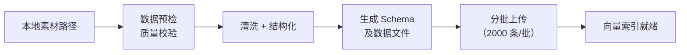
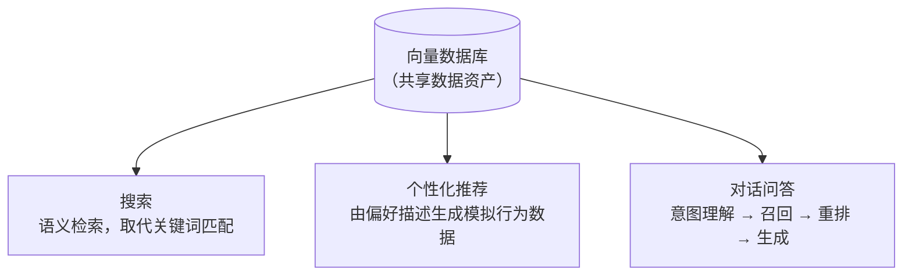
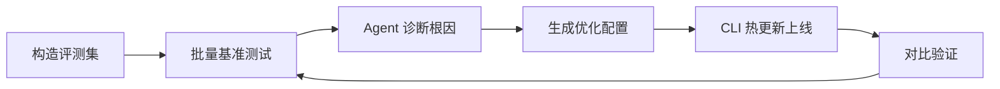

1. Table of Contents, ordered
{:toc}

> 原文：[Viking AI 搜索 CLI 正式发布：会说话，就能做搜索推荐](https://mp.weixin.qq.com/s?__biz=MzI1MzYzMjE0MQ==&mid=2247520074&idx=1&sn=3eed7d763e69903e7c29cbe894a0f156&chksm=e81611f4cb10804cc3ae69af570c19c25fd05891a9d8c66c54332c464c7f6ea9c23452caaa1d)

搭一套搜索推荐系统，传统路径有多长？数据清洗、Embedding 选型、向量索引构建、召回策略配置、效果评测、参数微调……每一步都需要算法经验和工程投入，缺一不可。这条路不只漫长，更是对没有技术背景的人几乎完全关闭的。

Viking（火山引擎旗下向量搜索服务）发布的 SearchCLI 想解决的就是这个问题：通过基础设施即代码（IaC，Infrastructure as Code）的范式，把上述整条链路封装进一组 CLI 命令，再由 Agent 来理解意图、调用命令、处理结果。用户只需在对话框里说人话，Agent 替你完成剩下所有事。

# 核心定位：把数据从"放着"变成"用起来"

文章用一个独立设计师"小 V"的场景把问题具象化。

小 V 用 Seedream 生成了上万张素材，但越积越多，反而越难找。文件名靠不住，标签没打全，想找一张"暖色调带木纹质感的背景图"，只能在缩略图里一张张翻。想自己搭一套搜索系统？光是向量索引和 Embedding 选型就足以劝退没有编程基础的人。

SearchCLI 的答案是：让 Agent 替她完成全链路，从数据入库到搜推问答策略生成，再到效果评测和自动化调优，一步不落。

# 上手流程：四步搭完整套系统

## 第一步：安装与授权

先把一条 prompt 发给支持的 AI Agent（文章举例的有 Trae、OpenClaw、Claude Code、Codex 等）：

> "帮我下载这个 CLI：https://github.com/volcengine/SearchCLI ，并告知我是否运行成功。"

Agent 自动完成下载和配置。然后去火山引擎控制台获取 AK/SK（鉴权凭据），按 Agent 指示输入，授权配置就完成了。整个过程几乎不需要手动操作。

## 第二步：智能数据预处理与导入

传统做法：自己写脚本遍历文件夹、提取图片特征、逐条调用上传 API。对没有编程基础的人，这是一道无法逾越的门槛。

有了 SearchCLI，直接把本地素材路径告诉 Agent，CLI 内置的数据预检流程会先做质量校验，确认无误后自动完成数据清洗和结构化，产出可直接入库的 Schema 和数据文件，最后完成上传入库。

文章里有一个细节值得注意：面对 10000 条数据的写入，Agent 没有一股脑全量推送，而是自动识别了接口的并发限制，写出切片脚本，把数据分为 5 批（每批 2000 条），并在批次间加入平滑休眠。这不是用户配置的，而是 Agent 分析场景后自主决策的。

## 第三步：搜推问答策略自动生成

数据进库之后，CLI 提供三种能力，可以同时配置：

**搜索**：CLI 内嵌多模态检索配置（文本 + 图像），搜索能力立即可用。用语义理解取代关键词硬匹配——搜"白雪皑皑的自然景观"，召回的是语义匹配而不是文件名匹配。

**个性化推荐与相似物品推荐**：推荐系统通常依赖用户行为数据。小 V 没有行为日志，她直接告诉 Agent 自己的偏好："我喜欢暖色调、自然质感、极简风格的素材，对卡通和赛博朋克风格不感兴趣。" Agent 根据这段描述自动生成了一份符合她审美的模拟行为数据集并完成上传，CLI 自动完成事件类型映射，创建了"首页推荐"和"相关推荐"两个场景。

**对话式问答**：支持自然语言提问，系统自动完成意图理解、搜索召回、结果重排和答案生成。输入"帮我找一些色彩丰富的水彩画素材"，返回按类别整理过的素材建议——素材库从"等人来搜"变成了"主动引导提问"。

## 第四步：效果评测与自动化调优

搜推问答跑起来了，效果好不好还是个未知数。SearchCLI 提供了一套自动化测试调优闭环：

1. **构造评测集**：小 V 没有现成的测试数据，CLI 提供了专门构造评测集的命令。Agent 调用命令生成了包含多种意图的 Query 集——"阳光落满的房间""极简风格木画架"等，执行批量基准测试。

2. **诊断问题**：第一轮测试结果：搜索场景的 Top-5 平均相关性得分只有 0.5244。Agent 分析后定位到根因：文本权重配置偏低，导致包含明确物体特征的查询召回了太多语义相近但实体不匹配的长尾数据；另外，新注册的无行为用户获取不到推荐内容。

3. **热更新策略**：明确问题后，Agent 直接将优化建议转为配置文件，通过 CLI 完成线上策略热更新——调整语义检索和关键词检索的权重至合适值，改完即生效，不需要改代码、不需要提工单。

4. **对比验证**：更新后再次跑测试集，具象 Query 的匹配精准度明显改善，抽象 Query 稳中有升。

# CLI 的三层核心价值

文章末尾做了一个"省流版总结"，把 SearchCLI 的能力归纳为三层：

**数据入库**：提供 `vs item profile`、`plan`、`apply` 三位一体的入库流程——先 profile 摸清数据结构，再 plan 制定方案，最后 apply 执行入库。避免传统的粗放式导入，数据质量有保障。

**搜推问答一体化**：一键拉起具备搜索、推荐、对话问答三合一能力的 AI 应用。三个场景底层共享同一份数据资产，不需要分别维护三套系统。

**AI 驱动的策略调优**：传统场景里，一个"搜不准"的问题可能需要算法专家数天的排查和参数微调。SearchCLI 把这个过程自动化：Agent 读取评测结果、定位原因、生成配置、热更新上线，闭环跑通不需要人介入。

# 泛化到更多场景

文章把 SearchCLI 的适用范围延伸到了几个垂直行业：

- **电商平台**：把海量商品库一键资产化，支持搜索召回和个性化推荐。
- **社交/内容平台**：让图文内容不再沉寂在库里，通过相似推荐激活长尾内容。
- **企业知识库**：把跨部门知识入库，打造全天候的内部专家 Agent，员工问问题不再需要找人、翻文档。

---

# 核心

SearchCLI 的本质是把「工程师才能做的事」包装成「会说话就能做的事」。它做对了一件事：不是用 AI 替代某个工具，而是用 AI 串联整条工程链路，把原本需要多个角色（数据工程师、算法工程师、运维）协同才能完成的流程，压缩进一个会说话的接口后面。

IaC 这个切入点选得精准。把基础设施变成可声明、可版本化、可自动执行的代码，本来就是 DevOps 的主流趋势；SearchCLI 把这个思路延伸到了 AI 应用层——把搜推问答的策略配置也变成了可由 Agent 自动生成和更新的"代码"。

文章里那个自动切片分批上传的细节是最有说服力的例子：这不是 CLI 预先写死的逻辑，而是 Agent 分析场景后自主决策的结果。这代表了一种质的不同——工具在执行之前先想了一下。

# 评价

文章整体是产品推广稿，技术深度有限，但几个值得追问的点没有展开：

**行为数据的质量问题**。文章对"用描述偏好生成模拟行为数据"这一步轻描淡写，但这其实是整个推荐系统最脆弱的地方。模拟数据和真实用户行为数据之间存在系统性偏差，冷启动时用这种方式填充行为日志，推荐效果能稳定吗？生产环境里有多少企业真的没有任何历史行为日志可用？

**评测指标的说服力**。文章提到"Top-5 平均相关性得分从 0.5244 提升到更高"，但没有给出基线对比（随机召回是多少？行业水位是多少？），没有给出调优后的具体数字，也没有说明这个指标是怎么算的——Query 是 Agent 自动生成的，没有人工标注的 ground truth，相关性分很可能也是 LLM 自己打的。如果评测集、打分、诊断、调参全部由同一个 Agent 闭环完成，整个链路缺乏外部锚点，很难判断优化的是真实搜索质量，还是「让自己打出更高分」。

**调优推理链断裂**。文章给出的诊断是「文本权重配置偏低，导致含明确物体特征的查询召回了太多语义相近但实体不匹配的长尾数据」，执行的操作是「调整语义检索和关键词检索的权重比例」。但「文本权重偏低」和「语义/关键词检索权重失衡」是不是同一件事？为什么调大关键词权重能解决实体不匹配的召回问题？这一步推导完全缺失。读者看到的是：黑盒进去，参数出来，分数变了——Agent 如何从诊断推导出具体调参方向，文章没有交代。

**热更新的边界**。"改完即生效"听起来很爽，但线上策略热更新在高并发场景下是否安全？配置错误如何回滚？文章没有提及任何防护机制。

**定价与规模上限**。文章提到"首月 9.9 元体验版"，但企业真正关心的是大规模使用时的成本模型。10 万条、100 万条数据的成本曲线是什么样的？

**和 RAG 的定位区别**。SearchCLI 的问答能力和常规的 RAG（检索增强生成）系统有什么本质区别？文章没有回答这个问题，而这对企业选型来说是关键判断点。

整体而言，SearchCLI 解决的是一个真实存在的痛点——数据资产激活的门槛太高。但文章的论证方式更接近于演示稿而非技术分析，适合作为产品探索的起点，不适合直接作为生产决策的依据。
