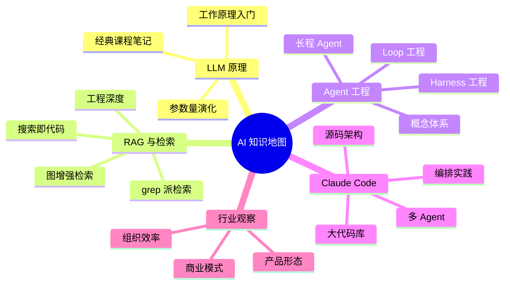

  
🧠 AI 板块 · 现状速览

  <table>
    <tr><th>文章规模</th><td>40+ 篇（<a href="/ai/">完整时间流</a>）</td></tr>
    <tr><th>知识线</th><td>5 条（见下图）</td></tr>
    <tr><th>阅读重心</th><td>LLM 原理 → RAG → Agent 工程</td></tr>
    <tr><th>最新落点</th><td>知识管理：LLM Wiki 模式</td></tr>
    <tr><th>开放问题</th><td>4 个（见文末）</td></tr>
  </table>

> 这是一页 **wiki 概念页**。AI 板块的文章散落在时间流里，本页按知识线重组——每条线先给“当前理解”（跨文章蒸馏的判断），再给文章锚点。本 wiki 集合本身就是“知识管理”那条线的实践产物。

## 知识线全景

## 五条线路的当前理解

### LLM 原理：地基线，已封顶

[LLM工作原理](/ai/2025/07/29/LLM%E5%B7%A5%E4%BD%9C%E5%8E%9F%E7%90%86/) 和 [GPT 参数量的故事](/ai/2026/08/04/gpt-parameter-count/) 构成主干，早期还有一批课程笔记（[机器学习概念](/ai/2019/08/12/%E6%9C%BA%E5%99%A8%E5%AD%A6%E4%B9%A0%E6%A6%82%E5%BF%B5/)、[Stanford ML](/ai/2020/10/20/Stanford-ML/)、[Stanford CNN](/ai/2020/11/25/Stanford-CNN/) 等）。

**当前理解**：原理层的认知已经足够支撑工程判断，继续在这个方向投入的边际收益递减。除非出现架构级变革（超越 Transformer），这条线进入维护状态。

### RAG 与检索：从“怎么检索”到“要不要检索”

主干是 [RAG 的工程深度](/ai/2026/06/13/rag-core-knowledge/)（切分、检索、排序、评估、幻觉防护），延伸出 [GraphRAG vs LightRAG](/ai/2026/06/13/graphrag-vs-lightrag/) 的图增强路线。但更有张力的反而是两篇“反 RAG”文章：[Claude Code 为什么用 grep 而不是 RAG](/ai/2026/05/27/claude-code-grep-vs-rag/) 和 [把搜索当代码来写](/ai/2026/06/26/search-as-code/)。

**当前理解**：检索范式正在分化——对静态文档集合，embedding RAG 仍是主力；对代码和活文件系统，“agent 直接 grep + 按需阅读”被证明更简单有效；而 [Karpathy 的 LLM Wiki 模式](/ai/2026/08/24/karpathy-llm-wiki-knowledge-base/) 提出了第三条路：不检索原文，而是让 LLM 把知识预先编译成 wiki。三条路线的适用边界是本板块最活跃的思考点（见开放问题）。

### Agent 工程：本板块当前的主线

从概念（[Hello-Agents](/ai/2026/08/04/hello-agents-from-llm-to-agent-system/)）到工程纪律：[Harness Engineering](/ai/2026/06/04/harness-engineering/)（agent 从能跑到跑稳）、[Loop Engineering](/ai/2026/06/14/loop-engineering/)（瓶颈从 prompt 迁移到 loop）、[Agent Loop 工程](/ai/2026/08/03/agent-loop-engineering/)，加长程任务的系列研究（[Anthropic](/ai/2026/06/05/anthropic-long-running-agent-engineering/)、[OpenAI](/ai/2026/06/05/openai-harness-engineering/) 的 harness 工程、[Context Engineering](/ai/2026/06/05/context-engineering-agents/)）。

**当前理解**：行业的瓶颈已经从“模型够不够聪明”迁移到“围绕模型的工程系统够不够稳”——harness、loop、context 三层工程纪律决定 agent 的实际产出。这条线直接影响本博客的维护方式：`AGENTS.md` 加 skills 的组合就是 harness 工程的个人实践。

### Claude Code 与工具链：从使用到编排

使用层（[powerup 教程](/ai/2026/05/27/claude-code-powerup-guide/)）→ 原理层（[源码架构](/ai/2026/05/27/claude-code-source-code-architecture/)、[大型代码库](/ai/2026/06/07/claude-code-large-codebases/)、[多 Agent](/ai/2026/05/28/claude-code-multi-agent/)）→ 编排层（[Multica 三 CLI 流水线](/ai/2026/08/20/multica-multi-agent-pipeline/)）。

**当前理解**：单个 coding CLI 的能力已经够用，下一个台阶是**多 agent 的编排与管理**——任务分派、进度追踪、互相复查。Multica 实验证明了三棒流水线可行，但 macOS GUI 环境和代理问题说明这条路还没铺平。

### 行业观察：低频但校准方向

[Manus 观察](/ai/2025/05/24/manus/)、[大模型公司的收入幻觉](/ai/2026/06/23/llm-company-revenue-illusion/)、[AI Coding 到组织效率](/ai/2026/08/04/ai-coding-to-org-efficiency/)。这条线文章少，作用是给技术判断加商业现实感：产品收入和项目收入要分开看，agent 落地最终是组织问题。

## 开放问题

  
个人知识库三条路线，哪条赢？进行中 · 本 wiki 即实验

  
embedding RAG / grep 派 / LLM Wiki 预编译——本博客的 wiki 集合就是第三条路线的实地实验。观察指标：枢纽页是否真的被持续更新、lint 能否闭环、三个月后开放问题是减少了还是积压了。

  
多 agent 编排会成为日常交付方式吗？待验证

  
Multica 实验跑通了流水线，但日常写作和维护目前仍是单 agent 会话。什么类型的任务值得付出编排开销？暂无稳定判断。

  
Context engineering 的哪些实践该固化进 AGENTS.md？持续沉淀

  
零上下文读者原则、frontmatter 约定已经固化了；长程任务系列里的更多实践（上下文压缩、子 agent 分工边界）还在观察哪些真正复用得上。

  
Harness 工程的下一站是不是“定时任务化”？进行中

  
blog-lint 的定时体检任务是一次试验：agent 从“随叫随到”变成“定期上岗”。如果体检报告持续有价值，更多维护工作（枢纽页更新、死链检查）可能跟进定时化。

## 维护约定

新 AI 文章发布时归入对应知识线：提供新判断就更新该线的“当前理解”，开新方向就考虑是不是该开第六条线。各线的“当前理解”必须有文章证据支撑，不允许写没有对应文章的推测。完整文章列表以 [AI 归档页](/ai/)为准，本页不追求穷举。
