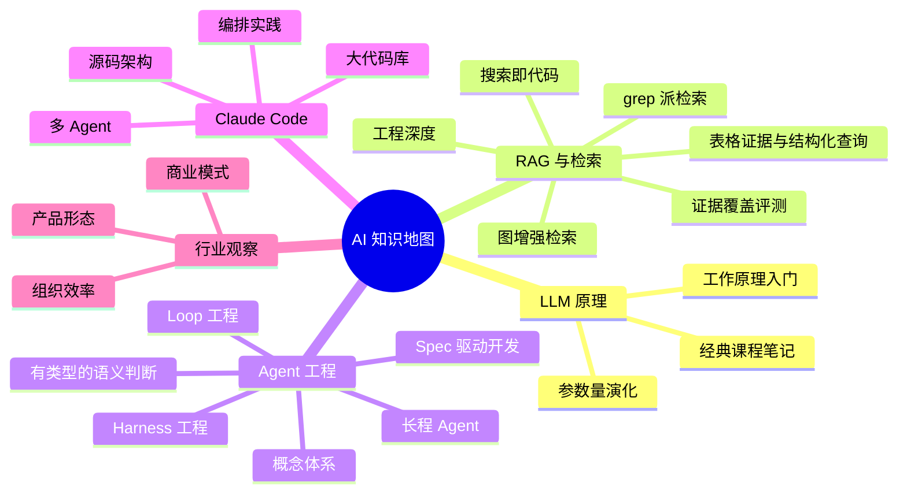

  
🧠 AI 板块 · 现状速览

  <table>
    <tr><th>文章规模</th><td>40+ 篇（<a href="/ai/">完整时间流</a>）</td></tr>
    <tr><th>知识线</th><td>5 条（见下图）</td></tr>
    <tr><th>阅读重心</th><td>LLM 原理 → RAG → Agent 工程</td></tr>
    <tr><th>最新落点</th><td>Jev 语义判断：接口、精排与工作流验收</td></tr>
    <tr><th>开放问题</th><td>4 个（见文末）</td></tr>
  </table>

> 这是一页 **wiki 概念页**。AI 板块的文章散落在时间流里，本页按知识线重组——每条线先给“当前理解”（跨文章蒸馏的判断），再给文章锚点。本 wiki 集合本身就是“知识管理”那条线的实践产物。

## 知识线全景

## 五条线路的当前理解

### LLM 原理：地基线，已封顶

[LLM工作原理](/ai/2025/07/29/LLM%E5%B7%A5%E4%BD%9C%E5%8E%9F%E7%90%86/) 和 [GPT 参数量的故事](/ai/2026/08/04/gpt-parameter-count/) 构成主干，早期还有一批课程笔记（[机器学习概念](/ai/2019/08/12/%E6%9C%BA%E5%99%A8%E5%AD%A6%E4%B9%A0%E6%A6%82%E5%BF%B5/)、[Stanford ML](/ai/2020/10/20/Stanford-ML/)、[Stanford CNN](/ai/2020/11/25/Stanford-CNN/) 等）。

**当前理解**：原理层的认知已经足够支撑工程判断，继续在这个方向投入的边际收益递减。除非出现架构级变革（超越 Transformer），这条线进入维护状态。

### RAG 与检索：从“怎么检索”到“要不要检索”

主干是 [RAG 的工程深度](/ai/2026/06/13/rag-core-knowledge/)（切分、检索、排序、评估、幻觉防护），延伸出 [GraphRAG vs LightRAG](/ai/2026/06/13/graphrag-vs-lightrag/) 的图增强路线。但更有张力的反而是两篇“反 RAG”文章：[Claude Code 为什么用 grep 而不是 RAG](/ai/2026/05/27/claude-code-grep-vs-rag/) 和 [把搜索当代码来写](/ai/2026/06/26/search-as-code/)。

**当前理解**：检索范式正在分化——对静态文档集合，embedding RAG 仍是主力；对代码和活文件系统，“agent 直接 grep + 按需阅读”被证明更简单有效；而 [Karpathy 的 LLM Wiki 模式](/ai/2026/08/24/karpathy-llm-wiki-knowledge-base/) 提出了第三条路：不检索原文，而是让 LLM 把知识预先编译成 wiki。三条路线的适用边界是本板块最活跃的思考点（见开放问题）。

**比较路线之前，先固定任务需要的知识。** [Ragas 与 TREC 的评测思路](/posts/2026/09/20/ragas-trec-evidence-recall/)把标准构建、覆盖判定和失败定位分开。用于比较上述三条路线时，评测单位应尽量独立于文档数量和切片方式：同一条必要知识可能由原文 chunk、代码片段或 wiki 页面提供，来源改变不应直接改变分母。先确认必要 Evidence，再维护各类来源的支持关系，才能检查不同路线是否把同一组知识交给了 Agent；固定映射适合高频回归，语义评判辅助发现新来源与复核争议，生成答案的完整性再单独验证。

**证据的完整性还取决于关系和数据范围。** [Excel 与 Markdown 表格 RAG 方案调研](/posts/2026/09/22/rag-excel-markdown-tables/)对照 Unstructured、Docling、RAGFlow、LangChain、LlamaIndex 和 Azure 的文档与源码，展示结构切块、行级文档、摘要引用和混合检索各自承担的环节。结合证据覆盖评测，检查单位不能停在“命中这一行”：表头、单位、适用范围和例外可能共同构成必要 Evidence；子块命中后是否补齐这些内容，应在最终交给模型的上下文中验证。对于全量筛选与统计，还必须验证查询覆盖范围和计算口径，相关性 top-k 无法证明集合完整。由此，检索路线的比较应同时考察证据语义、依赖关系和集合范围，分别定位解析损失、召回遗漏与计算错误。

**选型应逐层核对能力，再比较组合后的证据交付。** 支持输入格式、输出表格结构、保留业务上下文、执行完整集合计算，是四个不同承诺。比较解析器与检索框架时，应先固定各自负责的环节和实际版本，再以同一组必要证据检验完整链路；产品层的“支持表格”或摘要中的业务描述，不能直接证明上述承诺都已兑现。

### Agent 工程：本板块当前的主线

从概念（[Hello-Agents](/ai/2026/08/04/hello-agents-from-llm-to-agent-system/)）到工程纪律：[Harness Engineering](/ai/2026/06/04/harness-engineering/)（agent 从能跑到跑稳）、[Loop Engineering](/ai/2026/06/14/loop-engineering/)（瓶颈从 prompt 迁移到 loop）、[Agent Loop 工程](/ai/2026/08/03/agent-loop-engineering/)，加长程任务的系列研究（[Anthropic](/ai/2026/06/05/anthropic-long-running-agent-engineering/)、[OpenAI](/ai/2026/06/05/openai-harness-engineering/) 的 harness 工程、[Context Engineering](/ai/2026/06/05/context-engineering-agents/)）。

**当前理解**：行业的瓶颈已经从“模型够不够聪明”迁移到“围绕模型的工程系统够不够稳”——harness、loop、context 三层工程纪律决定 agent 的实际产出。这条线直接影响本博客的维护方式：`AGENTS.md` 加 skills 的组合就是 harness 工程的个人实践。

[Spec Kit 与 Codex 的开发流程](/posts/2026/09/09/spec-kit-codex-workflow/)把这条线推进到需求与验收：Spec 确定行为，Plan 设计方案，Tasks 拆解并推进实现，Validation 核对证据。虚构相册案例将同一组验收标准贯穿四步，并演示规则变化后怎样修订与复验；独立 reviewer 是验证阶段的可选增强。

**跨主题的维护原则**：LLM Wiki 解决“当前知识放在哪里”，Spec 驱动开发解决“当前承诺是什么”，独立验证解决“承诺是否兑现”。三者都需要区分历史材料、当前依据和执行证据；增加文档或 agent 数量，不能替代这三个边界。选择自动化范围时，优先固化有明确验收场景、能够取得证据的步骤，再扩大编排。

**并行协作还需要明确引用对象**：Spec Kit 的递增编号可能在不同工作区重复，时间戳命名可以减少碰撞；团队应使用完整需求路径或关联 Issue 定位工作，并用代码版本关联验证证据。目录前缀帮助组织材料，不能单独证明任务唯一、先后依赖或验收结果适用于当前实现。

**工具接入要区分协议约定、业务契约和客户端策略**：[MCP 与 REST 对比](/posts/2026/09/09/mcp-vs-rest-wire-format/)以 `2026-07-28` 规范串起 `server/discover`、`tools/list` 和 `tools/call`：每个请求独立声明版本与客户端能力，发现方法是否调用由客户端需求决定，工具定义同时描述输入与可选的结构化输出。[Memos 自托管实录](/life/2026/09/01/memos-docker-upgrade-api-mcp/)则展示适配层如何复用业务 API。接入时应分别确认协议版本、工具 schema 和 Host 的使用策略；程序读取业务结果依赖输出契约，不能从一次响应样本推断固定结构，也不能把某个客户端的启动流程当成所有实现的协议要求。

**流式交互需要分别验证传输和消息处理**：同一个 HTTP 响应可以陆续承载多个 SSE 事件，MCP 再定义事件中的进度通知和最终结果。界面迟迟不更新时，应分别检查服务端与代理是否及时刷新、客户端是否增量解析、Host 是否消费了进度通知；HTTP 已经收到字节，并不等于用户已经看到业务进展。

**操作发现与业务决策应分别验收**：[HATEOAS 与 MCP 的对照](/posts/2026/09/09/mcp-vs-rest-wire-format/#番外hateoas-与-mcp发现操作之后由谁决定下一步)说明，服务端提供当前可用动作或工具目录，可以减少客户端硬编码，却不会自动赋予调用方业务目标。结合 Harness 的验收思路，应分别验证“能发现并正确调用”“当前对象允许执行”和“所选动作符合用户目标”；前一项通过不能替代后两项。传统程序依赖预先约定的语义，模型可以从描述推断用途，但推断结果仍需在实际任务中验证。

**有类型的判断把验收进一步拆成三层**：[Jev 的接口与精排实践](/ai/2026/09/22/jev-system-one-software-rerank/)展示了自然语言材料如何变成代码可直接消费的选项、概率和分数。结合工具契约与证据覆盖评测，平台应分别检查返回结构是否合法、局部语义判断是否正确、组合后的工作流是否交付了必要证据或完成了目标。精排分数改善只能说明固定候选中的顺序变化，无法单独证明召回完整或答案完整；同样，工具选择合法也无法证明动作得到授权。将这三层的失败分别记录，才便于判断应调整接口、问题定义，还是召回与控制流程。

**模型级效率要换算成工作流的实际代价**：Jev 的 SciFact 对照案例中，排序质量更高，却因逐候选调用等实现条件付出更长等待与更高估算费用；绝对阈值过滤又带来证据损失。结合证据覆盖评测，平台选型应在相同候选与覆盖目标下比较整次业务请求，并把排序收益、证据保留和调用预算分别记录。一个局部接口更易消费，不能代替这三项业务验收。

### Claude Code 与工具链：从使用到编排

使用层（[powerup 教程](/ai/2026/05/27/claude-code-powerup-guide/)）→ 原理层（[源码架构](/ai/2026/05/27/claude-code-source-code-architecture/)、[大型代码库](/ai/2026/06/07/claude-code-large-codebases/)、[多 Agent](/ai/2026/05/28/claude-code-multi-agent/)）→ 编排层（[Multica 三 CLI 流水线](/ai/2026/08/20/multica-multi-agent-pipeline/)）。

**当前理解**：单个 coding CLI 的能力已经够用，下一个台阶是**多 agent 的编排与管理**——任务分派、进度追踪、互相复查。Multica 实验证明了三棒流水线可行，但 macOS GUI 环境和代理问题说明这条路还没铺平。

### 行业观察：低频但校准方向

[Manus 观察](/ai/2025/05/24/manus/)、[大模型公司的收入幻觉](/ai/2026/06/23/llm-company-revenue-illusion/)、[AI Coding 到组织效率](/ai/2026/08/04/ai-coding-to-org-efficiency/)。这条线文章少，作用是给技术判断加商业现实感：产品收入和项目收入要分开看，agent 落地最终是组织问题。

## 开放问题

  
个人知识库三条路线，哪条赢？进行中 · 本 wiki 即实验

  
embedding RAG / grep 派 / LLM Wiki 预编译——本博客的 wiki 集合就是第三条路线的实地实验。观察指标：枢纽页是否真的被持续更新、lint 能否闭环、三个月后开放问题是减少了还是积压了。

  
多 agent 编排会成为日常交付方式吗？待验证

  
Multica 实验跑通了流水线；新的 <a href="/posts/2026/09/09/spec-kit-codex-workflow/">Spec Kit 开发流程</a>将需求、方案、实现与验收连成主线，并给出独立 reviewer 的可选分工。下一步应在同一需求上记录 reviewer 新发现的问题、未验证项和额外成本，据此判断哪些任务值得固定启用多 agent。常态化编排的收益仍待验证。

  
Context engineering 的哪些实践该固化进 AGENTS.md？持续沉淀

  
零上下文读者原则、frontmatter 约定已经固化了；长程任务系列里的更多实践（上下文压缩、子 agent 分工边界）还在观察哪些真正复用得上。

  
Harness 工程的下一站是不是“定时任务化”？进行中

  
blog-lint 的定时体检任务是一次试验：agent 从“随叫随到”变成“定期上岗”。如果体检报告持续有价值，更多维护工作（枢纽页更新、死链检查）可能跟进定时化。

## 维护约定

新 AI 文章发布时归入对应知识线：提供新判断就更新该线的“当前理解”，开新方向就考虑是不是该开第六条线。各线的“当前理解”必须有文章证据支撑，不允许写没有对应文章的推测。完整文章列表以 [AI 归档页](/ai/)为准，本页不追求穷举。
