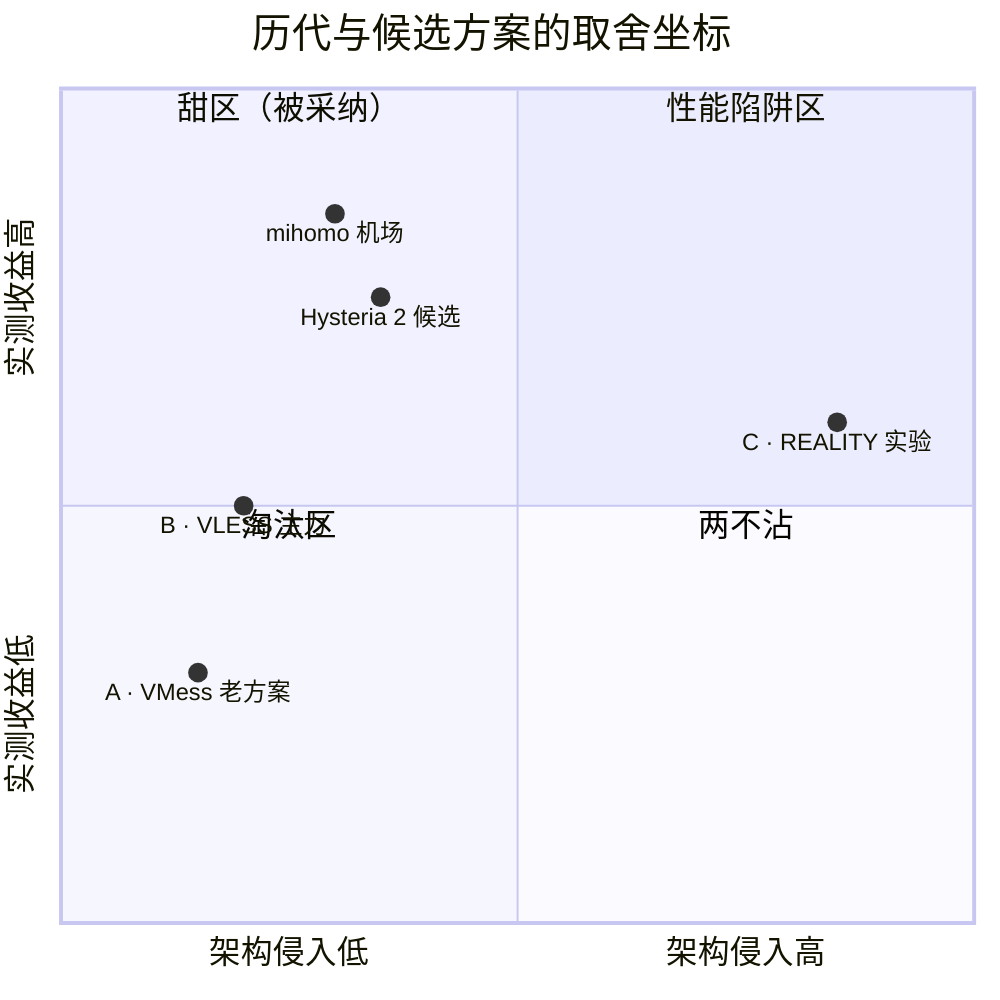
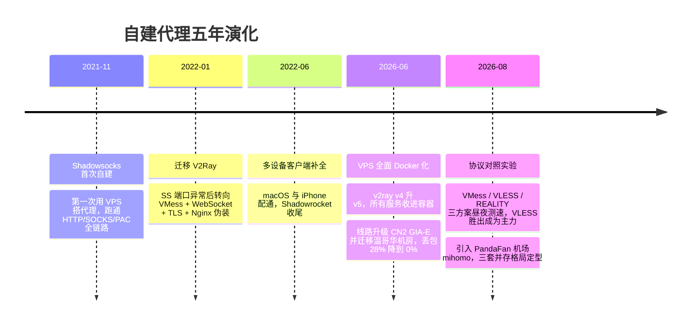

  
📡 代理格局 · 现状速览

  <table>
    <tr><th>当前形态</th><td>三套异构代理并存</td></tr>
    <tr><th>主力出口</th><td>自建 VPS · VLESS（xray）</td></tr>
    <tr><th>备份/分流</th><td>PandaFan 机场（mihomo）</td></tr>
    <tr><th>架构底线</th><td>Nginx 统一 443 + 全容器化</td></tr>
    <tr><th>最近变化</th><td>2026-08 引入机场，三足鼎立定型</td></tr>
    <tr><th>开放问题</th><td>4 个（见文末）</td></tr>
    <tr><th>状态数据</th><td><a href="/wiki/raspberry-pi/">树莓派 Homelab 全景</a></td></tr>
  </table>

> 这是一页 **wiki 概念页**。`_life/` 里的八篇代理实录各自记录“当时发生了什么”，本页回答一个任何单篇都不回答的问题：**折腾五年之后，对“自建代理”这件事的完整结论是什么。** 端口表等当前状态归树莓派全景页维护，本页只管演化与认知。

## 当前结论

**没有最快的代理，只有当下不拥塞的线路。** 优化的重心五年里迁移了三次——协议层（Shadowsocks → VMess → VLESS）→ 线路层（CN2 GIA、机房迁移）→ 冗余层（三套并存），每次迁移都是因为上一层的收益被榨干。终局形态不是某个“最优方案”，而是**多套异构代理并存、应用改个端口就完成切换**。

三个支撑判断，各自来自实测而非推测：

1. **协议名不值钱。** 同一台 VPS 同一条线路上，VLESS 夜间只比 VMess 快 1.8%，可以视为相同；被捧上天的 VLESS + REALITY + Vision 也只快约一成。“换协议数倍提速”在同线路对照实验下不成立。
2. **线路才值钱，但线路是波动的。** 升级 CN2 GIA-E 让丢包从 28% 降到 0%，是五年单笔收益最大的优化；但 CN2 GIA 白天拥塞时速度照样腰斩，高峰时段甚至被机场节点快出近两个数量级。任何单线路方案都有失效时段。
3. **维护简单优先于极限性能。** REALITY 方案性能最好，但它要求 Xray 接管 443 成为所有 HTTPS 流量的前置网关，破坏现有架构——被明确放弃。

### 实测对照：换协议救不了拥塞的线路

2026-08 三方案昼夜测速的 10 MiB 持续吞吐。三套方案白天同时大幅下降（A 降 63%、B 降 52%、C 降 54%），说明瓶颈在线路而非协议：

```mermaid
xychart-beta
    title "10 MiB 持续吞吐实测（Mbps）：夜间 vs 白天"
    x-axis ["A · VMess", "B · VLESS", "C · REALITY"]
    y-axis "Mbps" 0 --> 45
    bar [34.26, 34.89, 38.78]
    bar [12.62, 16.80, 17.80]
```

上排（夜间）三者几乎拉平，下排（白天）全线腰斩——这张图就是“协议名不值钱”的物证。

### 方案取舍全景

把历代和候选方案放到“实测收益 × 架构侵入”的坐标系里，甜区一目了然：**左上（高收益、低侵入）的方案被采纳，右上（高收益但伤架构）的 REALITY 被放弃**——这正是“维护简单一票否决”的空间表达：

## 演化脉络

对应的实录文章（按时间序）：

- [代理 - shadowsocks](/life/2021/11/09/proxy/) — 起点：第一次自建
- [代理 - v2ray](/life/2022/01/03/proxy-v2ray/) — 流量伪装架构定型，Nginx + WebSocket 形态沿用至今
- [RIP shadowsocks](/life/2022/06/03/proxy-rip-ss/) 与 [汇总：代理](/life/2022/06/03/proxy-summary/) — 客户端侧的折腾
- [VPS Docker 服务全景与 V2Ray v4 到 v5 升级方案分析](/life/2026/06/08/vps-docker-panorama-v2ray-v4-to-v5-upgrade/) — 架构容器化
- [从 28% 丢包到 0%，再从洛杉矶迁到温哥华](/life/2026/06/22/v2ray-bandwagon-cn2-gia-upgrade/) — 单笔收益最大的线路优化
- [VMess、VLESS 与 REALITY 对比：架构、理论与昼夜测速](/life/2026/08/05/vmess-vless-docker-nginx-benchmark/) — “协议名不值钱”结论的来源
- [树莓派部署 PandaFan mihomo 代理](/life/2026/08/07/pandafan-mihomo-raspberry-pi-proxy/) — 冗余层落地，三套并存

## 蒸馏：五年沉淀下来的决策原则

跨文章反复生效的判断，比任何单篇的具体配置都长寿：

- **优化按层级推进，不在错误的层级上努力。** 协议层的天花板是线路质量，线路层的天花板是时段波动；到了冗余层，“切换成本”才是唯一指标——三套代理端口两两错开、改端口即切换，比任何一套的内部配置都重要。
- **对照实验要有，解读要克制。** 有效设计都是同机同线路同时段、多轮交错；mihomo 的 Rule 分流会把 Cloudflare 判成直连，不看日志确认路径，测出来的就是假数据。每篇实测都标注“这只是快照”，单晚数据不外推长期比例。
- **验证以端口监听加实际请求为准。** mihomo 出现过 systemd 显示 `active (running)` 但端口没绑上的“假活”；这条原则写进了所有代理变更的收尾流程。
- **架构简单性是一票否决项。** 凡要求打破“Nginx 统一入口、服务各自容器化”模型的方案，不管性能收益多少都先判负——五年里从未为性能让过路。

## 开放问题

本页等待生长的地方。后续文章回答其中任何一个，就该把结论编回本页并划掉对应问题：

  
WebSocket Early Data 对短请求体验改善多少？未实施 · 优先级最高

  
客户端路径改为 <code>/xray?ed=2560</code>，把首包放进 WebSocket 升级请求，成本极低，预期改善 Twitter 图片、GitHub 页面、对话流式输出这类短请求。

  
Hysteria 2 走 UDP 443 旁路值不值得上？未实施

  
Brutal 拥塞控制对丢包补偿，是白天拥塞链路最有希望拉开 10%+ 差距的候选；QUIC 用户态的 CPU 开销在树莓派 5 上是否可接受也未验证。UDP 443 目前空闲，可与 Nginx 并行。

  
XHTTP 何时接替 WebSocket？待前置条件

  
Xray 官方已建议新部署转向 XHTTP，但需要 Nginx 升级（HTTP/2/3、专用 location）配合，当前 Nginx 1.23.3 撑不起。等 Nginx 版本升级后再单独搭建对照组。

  
机场和自建的主力/备份角色会对调吗？持续观察

  
目前定位“自建主力 + 机场备份”，但高峰快照里机场快了两个数量级。若自建线路可用时段持续收窄，角色可能对调——取决于 PandaFan 长期稳定性和自建 VPS 的续费决策。

## 维护约定

本页遵循 wiki 页骨架：**信息卡 → 当前结论（含图）→ 演化脉络 → 决策原则 → 开放问题**。新的代理相关文章发布时：提供新实测结论就更新“当前结论”和图；开启或完成某候选方案就更新对应开放问题的状态徽章；改变整体格局（如下线某套代理）就在 timeline 补节点。端口、容器名等状态事实以[树莓派 Homelab 全景](/wiki/raspberry-pi/)为准，本页不重复维护。
