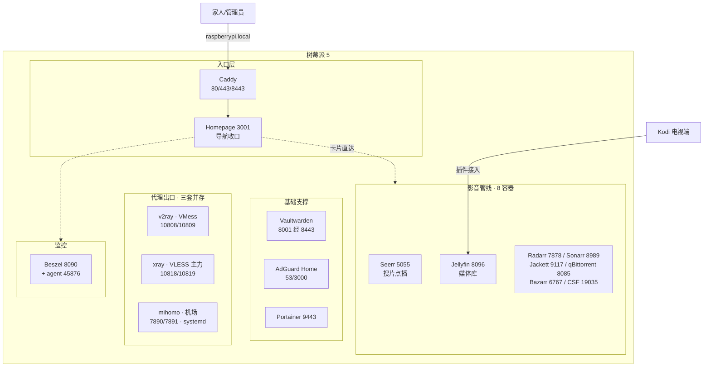

  
🥧 树莓派 · 现状速览

  <table>
    <tr><th>硬件</th><td>Pi 5 + 主动散热器（<a href="/life/2026/08/09/pi5-active-cooler-fan-test/">实测</a>）</td></tr>
    <tr><th>服务规模</th><td>19 个容器 + 1 个 systemd 服务</td></tr>
    <tr><th>统一入口</th><td><code>https://raspberrypi.local/</code></td></tr>
    <tr><th>配置中枢</th><td><code>~/docker/compose.yml</code> 单文件</td></tr>
    <tr><th>媒体存储</th><td><code>/share</code> 全链路统一</td></tr>
    <tr><th>最近变化</th><td>2026-08 新增 Beszel 监控</td></tr>
    <tr><th>开放问题</th><td>4 个（见文末）</td></tr>
  </table>

> 这是一页 **wiki 状态页**：树莓派“现在是什么样”的单一事实源。`_life/` 里的实录文章记录每次折腾的过程，本页只登记现状、边界和悬而未决的问题。代理演化的来龙去脉另有一页概念页：[代理演化：从 Shadowsocks 到三套并存](/wiki/proxy-evolution/)。

## 服务拓扑

除 mihomo（systemd 用户服务）外全部容器化，集中在 `~/docker/compose.yml` 一个文件里，统一 `restart: unless-stopped`：

日常使用只需要记住 `https://raspberrypi.local/`；Vaultwarden 因客户端强制 HTTPS 单独保留 8443。

## 代理端口地图

给应用挂代理时按出口需求直接选端口，无需额外提醒。三套端口两两错开、互为备份：

| 代理 | SOCKS5 | HTTP | 出口 | 托管方式 |
|------|--------|------|------|---------|
| v2ray（VMess，老方案） | `10808` | `10809` | 自建 VPS | Docker |
| xray-client（VLESS，主力） | `10818` | `10819` | 自建 VPS | Docker |
| mihomo（PandaFan 机场） | `7891` | `7890` | 机场节点 | systemd 用户服务 |

**操作铁律**：改完任何代理配置，以端口监听（`ss -tlnp`）加实际请求验证为准，不能只看 systemd 的 `active (running)`——mihomo 有过“服务活着但端口没绑上”的假活状态。mihomo 是 Rule 分流，验证要用 `google.com` 这类明确走代理的站点。

## 能力边界（蒸馏结论）

跨多篇文章沉淀下来的判断：

- **算力边界**：Hailo NPU 能跑本地视觉推理，但实用级本地 LLM 超出树莓派能力圈（[能力边界实测](/life/2026/07/02/raspberry-pi-ai-hailo-npu-llm-capabilities/)）；AI 功能的正确姿势是“树莓派做执行层、云端 API 做大脑”，Codex CLI 和 Hermes 都是这个模式。
- **架构纪律**：所有服务收进单个 `compose.yml` 加统一 restart 策略，改配置前先 `compose.yml.bak.<时间戳>` 备份；有 WebUI 的服务必须在 Homepage 挂卡片（配置热加载）。这套纪律让 19 个服务的维护成本可控。
- **散热结论**：Pi 5 主动散热器在风扇合理调速策略下满载温度可控，持续高负载（编译、转码）不构成瓶颈（[实测](/life/2026/08/09/pi5-active-cooler-fan-test/)）。
- **停用服务要登记**：Hermes Agent 容器已移除、xray-reality-client 已停止——历史服务在清单里留痕，避免“这个容器还在不在”成为悬案。

## 折腾实录索引

- **影音管线三部曲**：[自动化下载管线](/life/2026/06/17/raspberry-pi-docker-radarr-jackett-qbittorrent-bazarr/) → [点播与统一入口](/life/2026/07/20/raspberry-pi-homelab-mediacenter-and-entry/) → [Kodi 接入 Jellyfin](/life/2026/08/04/raspberry-pi-jellyfin-kodi-tv-guide/)
- **代理**：[mihomo 部署与三套并存](/life/2026/08/07/pandafan-mihomo-raspberry-pi-proxy/) · [VMess/VLESS/REALITY 测速](/life/2026/08/05/vmess-vless-docker-nginx-benchmark/) · [v2ray v4→v5](/life/2026/06/08/vps-docker-panorama-v2ray-v4-to-v5-upgrade/) · [Codex CLI 代理配置](/life/2026/07/24/raspberry-pi-codex-cli-proxy/)
- **网络**：[AdGuard Home DNS](/life/2026/06/05/adguard-home-raspberry-docker-dns-filter/) · [家庭网络解剖](/life/2026/07/05/anatomy-of-home-network/)
- **系统与硬件**：[服务清单登记](/life/2026/08/09/raspberry-pi-service-inventory/) · [散热器实测](/life/2026/08/09/pi5-active-cooler-fan-test/)
- **AI**：[Hailo NPU 能力边界](/life/2026/07/02/raspberry-pi-ai-hailo-npu-llm-capabilities/) · [Hermes 微信远程下载](/life/2026/07/04/hermes-agent-wechat-radarr-remote-download/)（已停用）

## 开放问题

  
Hysteria 2 的 QUIC 用户态开销，Pi 5 扛得住吗？未实施

  
<a href="/wiki/proxy-evolution/">代理演化页</a>的头号候选方案，但它把 CPU 压力放在树莓派客户端侧。上线前需要先在 Pi 5 上实测 CPU 占用和白天吞吐收益。

  
Vaultwarden 数据备份落地了吗？待确认

  
<code>~/docker/vaultwarden/data</code> 是全站密码的命门，清单里标注了“务必纳入备份”，但目前没有文章记录备份方案是否真的跑起来了。

  
Hailo NPU 有没有实际用起来的场景？持续观察

  
能力边界探明了，但还没有一个服务真正把 NPU 用上（比如本地视觉识别联动影音库）。它是“能力储备”还是会变成“实际生产力”？

  
Hermes Agent 这类微信入口还恢复吗？已停用

  
容器已移除。微信远程下载的需求如果复现，替代方案是走 Telegram bot 还是恢复 Hermes？暂无结论，先标记停用留档。

## 维护约定

新服务上架走四步（写进 `compose.yml` 并备份 → 对照本页端口地图选端口 → Homepage 挂卡片 → 更新本页拓扑）；服务停用要在“实录索引”上方留痕。端口、容器名等事实与 `AGENTS.md` 的代理服务表保持一致，blog-lint 体检会核对两处。
